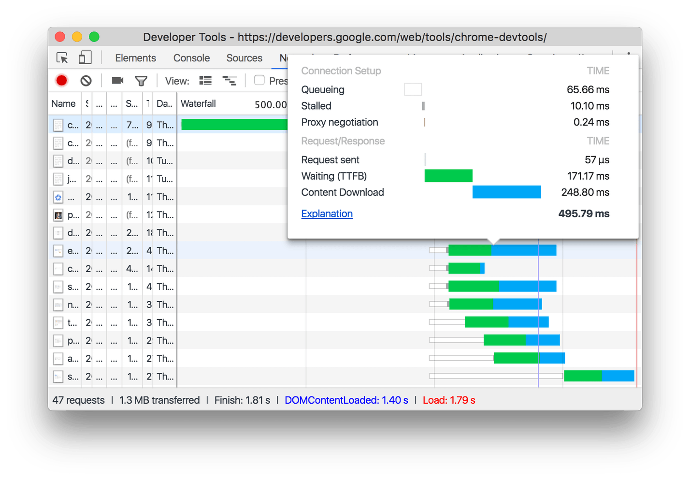
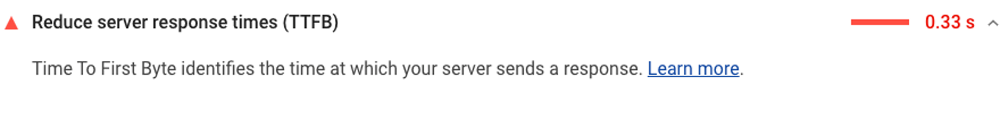
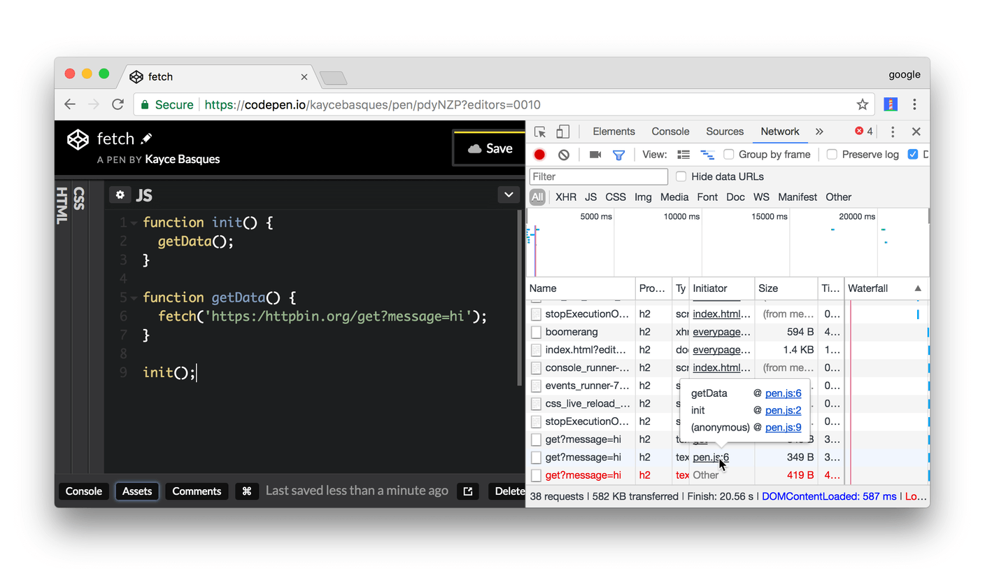
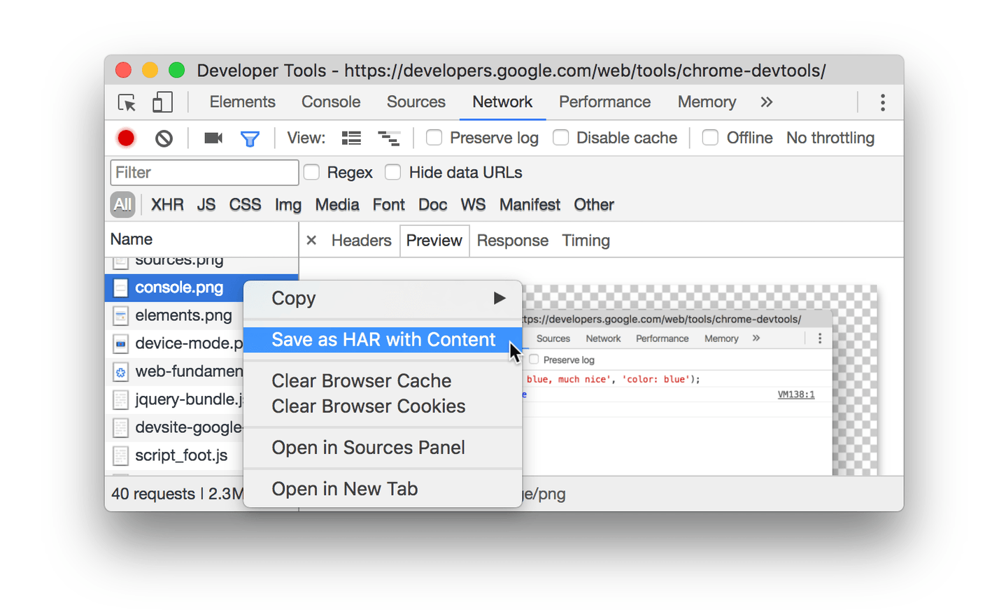

### 前言

最近在做性能检测工具时，发现跟Chrome浏览器接触很多，里面一些调试技巧，查看性能指标都离不来它。

看了下官方的教程，**推荐一下地址:https://developer.chrome.com/** 里面有很多的干货，这次分享的是Network相关的小技巧。

### 一些小技巧

#### 查看加载事件

网络面板上，对于事件DOMContentLoaded和load事件，分别是蓝线和红线，如图

可以看出，基本上每个事件执行完成后，什么资源在它加载完成，上面的瀑布图很明显。

#### 查看请求Timing细节

当我们具体点击一个资源时，我们点开Timing选项卡，可以看到具体一下信息，具体这些信息啥意思呢？

- **Queueing**
- **Stalled**：由于排队中描述的任何原因，可以停止该请求。
- **DNS Lookup**： 浏览器正在解析请求的IP地址。
- **Initial connection**： 浏览器正在建立连接，包括TCP握手/重试和协商SSL。
- **Proxy negotiation**： 浏览器正在使用代理服务器协商请求。
- **Request sent**：请求正在发送。
- **Waiting (TTFB)**： 计算的是整个延迟的往返时间。 TTFB 不仅仅是在服务器上花费的时间，还包括设备请求发送到服务器，再从服务器返回到设备的时间。
- **Content Download**：浏览器正在接收响应。

这里面我们需要关注的一个点就是**TTFB**，它是很重要的一个指标，如果你玩过Lighthouse做性能检测的话，你会发现，Lighthouse会发送一个报告，里面有个信息就是它,类似于

至于对TTFB相关的，可以阅读这篇文章：https://web.dev/time-to-first-byte/

#### 查看请求对堆栈跟踪

当JavaScript语句导致请求资源时，将鼠标悬停在“启动器”列上以查看导致请求的堆栈跟踪。有些时候，可以查看哪些请求是多余的，毕竟能减少请求次数还是十分有必要的。

#### 导出请求的数据

有些时候，我们需要一份数据的报告，那么应该这么做呢？

有了请求的数据报告后，那么我们如何分析它呢，就需要借助这个HAR分析器了。可以参考：https://toolbox.googleapps.com/apps/har_analyzer/

----

#### 显示更多信息

网络日志的列是可以配置的。您可以隐藏您不使用的列。还有许多默认情况下隐藏的列，您可能会发现它们很有用。

右键单击 "网络日志 "表头，选择 "域"。现在会显示每个资源的域。

#### 模拟较慢的网络连接

你用来建站的电脑的网络连接可能比用户的移动设备的网络连接要快。通过节制页面，你可以更好地了解一个页面在移动设备上加载所需的时间。

下面的选项，可以选择Fast 3G，Slow 3G, Offline,或者自己来设置，如图

#### 过滤请求

DevTools提供了许多工作流程，用于过滤掉与手头任务无关的资源。

过滤文本框支持许多不同类型的过滤，可以按字符串，正则表达式或属性过滤。

举个例子下

### 参考资料

[1] Network features reference: https://developer.chrome.com/docs/devtools/network/reference/

[2] GitHub-[developer.chrome.com]: https://github.com/GoogleChrome/developer.chrome.com/tree/main/site/en/docs/devtools/network

[3] 如何记录 HAR 文件: https://toolbox.googleapps.com/apps/har_analyzer/

[4]Proxy server: https://web.dev/progressive-web-apps/

[5] Chrome Developers: https://developer.chrome.com/

[6]Inspect network activity: https://developer.chrome.com/docs/devtools/network/

[7]Reduce server response times (TTFB): https://web.dev/time-to-first-byte/

[8] Adaptive serving based on network quality: https://web.dev/adaptive-serving-based-on-network-quality/

