## 前言

CS可视化。实用的Git命令

我想这将是一个完美的使用案例，来创建一些最常见和最有用的命令的可视化例子！我正在涵盖的许多命令有可选的参数，你可以使用它来改变它们的行为。 我所涵盖的许多命令都有可选的参数，你可以使用这些参数来改变它们的行为。在我的例子中，我将涵盖这些命令的默认行为，而不需要添加（太多）配置选项。

## 一些指令

### Merge

拥有多个分支是非常方便的，可以让新的变更相互分离，并确保你不会意外地将未经批准或损坏的变更推送到生产中。一旦变更被批准，我们就想把这些变更放到生产分支中去。

从一个分支到另一个分支的方法之一是执行 git 合并。Git 可以执行两种类型的合并：一种是快进，一种是不快进。
这可能现在还不是很明白，那我们就来看看两者的区别吧!

#### Fast-forward (`--ff`)

**快进（--ff）**

当前分支与我们要合并的分支相比，没有额外的提交时，就会发生快进式合并。

Git 是个......懒惰的家伙，会先尝试执行最简单的选项：快进！这种类型的合并并不创建新的提交，而是合并当前分支上的提交。

这种类型的合并并不创建新的提交，而是将当前分支上的提交合并到当前分支上。

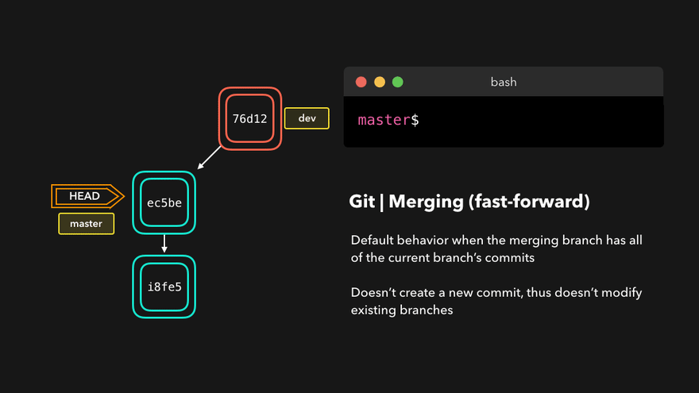

完美！我们现在已经将开发分支上的所有修改都放到了主分支上。现在，我们已经将开发分支上所做的所有改动都放到了主分支上。那么，这个 "不快进 "是怎么回事呢？

#### No-fast-foward (`--no-ff`)

如果你的当前分支与你要合并的分支相比，没有任何额外的提交，那是很好的，但不幸的是，这种情况很少！如果我们在当前分支上提交了改动，而我们要合并的分支却没有，那么git就会执行不快进式合并。如果我们在当前分支上提交了一些变化，而我们要合并的分支却没有，那么 git 就会执行不快进合并。

在进行无快进合并时，Git 会在当前分支上创建一个新的合并提交。该提交的父提交同时指向活动分支和我们要合并的分支。

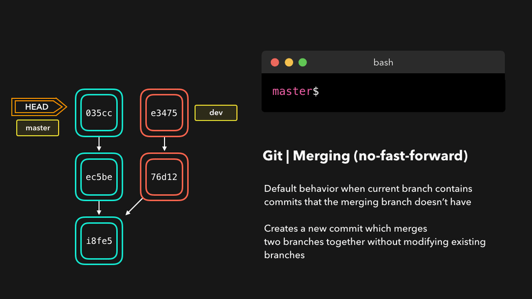

没什么大不了的，一个完美的合并！主分支现在包含了我们在开发分支上的所有改动。 

### Merge Conflicts

合并冲突也是我们日常开发中不可避免的一个过程。

虽然Git很擅长决定如何合并分支和添加文件的修改，但它并不总是能自己做出决定。这可能发生在我们试图合并的两个分支在同一文件的同一行有修改，或者一个分支删除了另一个分支修改的文件，等等。

在这种情况下，Git会让你帮忙决定我们要保留这两个选项中的哪一个! 假设在两个分支中，我们都编辑了 README.md 中的第一行。

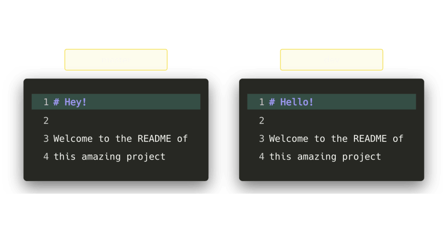

如果我们要把dev合并成master，这将最终导致合并冲突：你希望标题是Hello?还是Hey？

当尝试合并分支时，Git会告诉你冲突发生在哪里。我们可以手动删除我们不想保留的改动，保存改动，再次添加改动后的文件，然后提交这些改动:

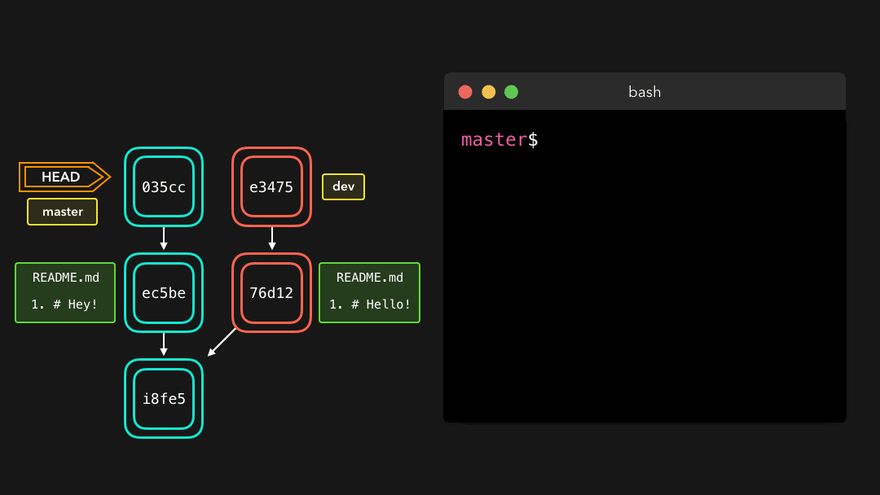

虽然合并冲突往往很烦人，但它完全有道理。Git不应该只是假设我们想保留哪一个变化。

### Rebasing

开发中，**变基**也是我们通常需要做的。

我们刚刚看到了如何通过执行 git merge 将一个分支的更改应用到另一个分支。另一种将一个分支的修改添加到另一个分支的方法是执行 git rebase。

git rebase 会复制当前分支的提交，并将这些复制后的提交放在指定分支之上。

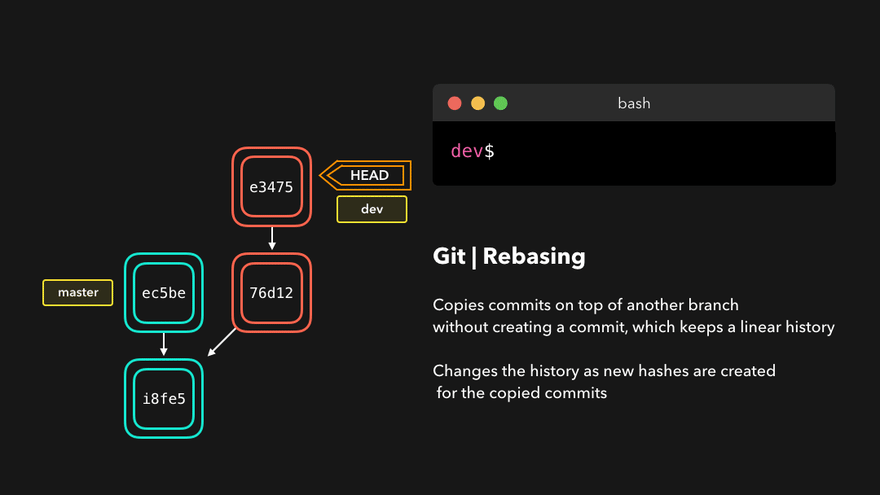

很好，我们现在可以在开发分支上看到所有在主分支上做的修改了！我们可以在开发分支上看到所有在主分支上做的修改。

与合并相比，最大的不同是，Git不会试图找出哪些文件要保留，哪些文件不要保留。我们要重新归类的分支总是有我们想保留的最新改动！这样一来，就不会有任何合并冲突，而且还能保持良好的线性 Git 历史。这样一来，您不会遇到任何合并冲突，而且还能保持良好的线性 Git 历史。

这个例子显示了在主分支上的重归类。然而，在大型项目中，你通常不希望这样做。git重归会改变项目的历史，因为新的哈希会被创建在复制的提交上。

每当你在一个功能分支上工作，而主分支已经更新时，重命名是非常好的。你可以在你的分支上获得所有的更新，这将防止未来的合并冲突!

### Interactive Rebase

在对提交的内容进行重新归类之前，我们可以对它们进行修改！我们可以通过交互式的重新归类来实现。 我们可以通过交互式重基来实现。交互式重述也可以在你目前正在处理的分支上使用，并希望修改一些提交。

有6个动作我们可以对我们正在重定基的提交执行:

### Resetting

可能发生的情况是，我们提交了一些我们后来不想要的改动。也许是一个WIP提交，或者是一个引入了bug的提交！在这种情况下，我们可以用一个新的方法来解决这个问题。 在这种情况下,我们需要使用 **git reset**。

**git reset** 重置可以摆脱所有当前的阶段性文件，并让我们控制 HEAD 应该指向哪里。

#### Soft reset

**soft reset** 将 HEAD 移动到指定的提交（或与 HEAD 相比的提交索引），而不会删除之后提交中引入的变化！这就是**soft reset**。

假设我们不想保留添加了style.css文件的提交9e78i，也不想保留添加了index.js文件的提交035cc。然而，我们确实想保留新添加的style.css和index.js文件。这是一个完美的软复位案例。

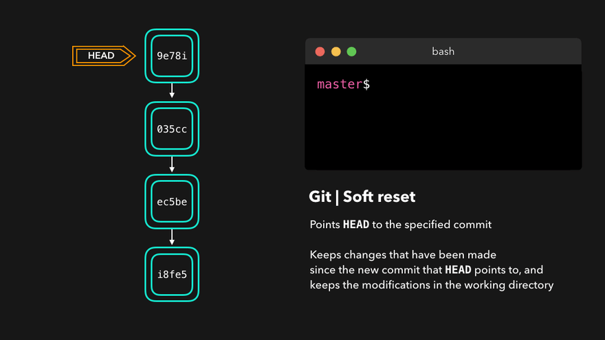

当输入 **git status** 时，你会发现我们仍然可以访问之前提交的所有更改。这很好，因为这意味着我们可以修正这些文件的内容，并在以后再次提交！这也是我们的一个优势。

#### Hard reset

有时，我们不想保留某些提交所带来的变化。与软重置不同，我们不需要再访问它们。Git 应该简单地将它的状态重置回指定提交时的状态：这甚至包括了工作目录和暂存文件中的变化！而不是像软重置一样，我们不应该再去访问它们。

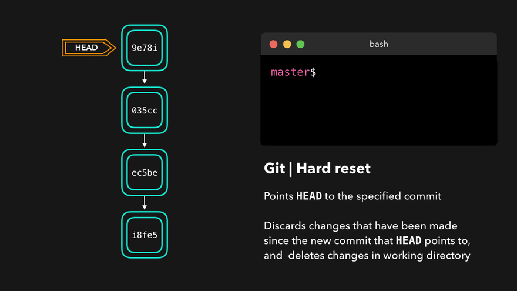

Git 抛弃了在 9e78i 和 035cc 上引入的改动，并将其状态重置为提交 ec5be 时的状态。

### Reverting

另一种撤销修改的方法是执行 git revert。通过还原某个提交，我们创建了一个新的提交，其中包含了被还原的更改！这就是我们的方法。

比方说，ec5be增加了一个index.js文件。后来，我们其实意识到我们不想要这个提交引入的这个变化了! 让我们恢复ec5be的提交。

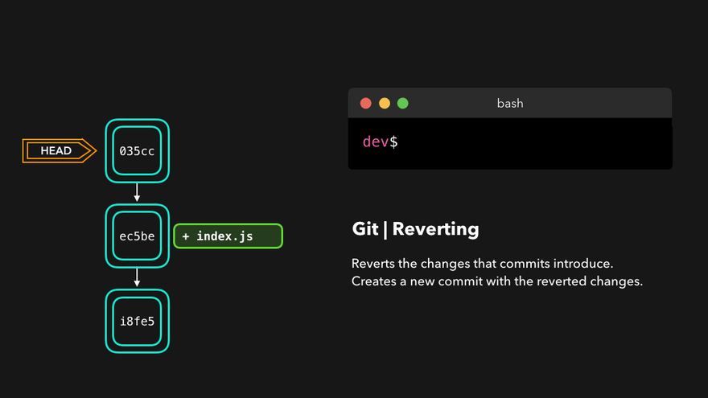

完美 提交 9e78i 还原了 ec5be 提交引入的修改。执行 git revert 非常有用，可以在不修改分支历史的情况下撤销某个提交。

### Cherry-picking

- 当某个分支包含了我们需要在活动分支上进行修改的提交时，我们可以使用 cherry-pick 命令！

- 通过 cherry-pick 命令，我们可以在活动分支上创建一个包含 cherry-pick 提交的修改的新提交。
- 通过cherry-pick命令，我们在活动分支上创建了一个新的提交，该提交包含了cherry-pick提交所引入的变更。

假设在开发分支上的提交76d12对index.js文件进行了修改，而我们希望把它放在主分支上。我们不需要整个分支，我们只需要这一个提交。

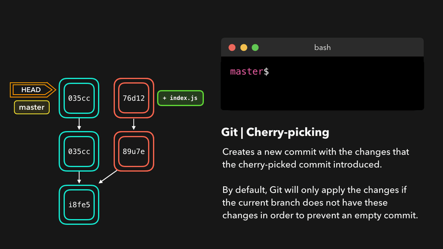

这样子操作过后，主干分支现在包含了76d12引入的变化!

### Fetching

如果我们有一个远程 Git 分支，比如 Github 上的一个分支，可能会发生远程分支的提交内容是当前分支没有的！可能是另一个分支合并了，你的同事推送了快速修复，等等。也许另一个分支被合并了，你的同事推送了一个快速修复，等等。

我们可以通过在远程分支上执行 git fetch 来获取这些变化！这不会影响你的本地分支：fetch 只是下载新数据。它不会以任何方式影响你的本地分支：获取只是下载新数据。

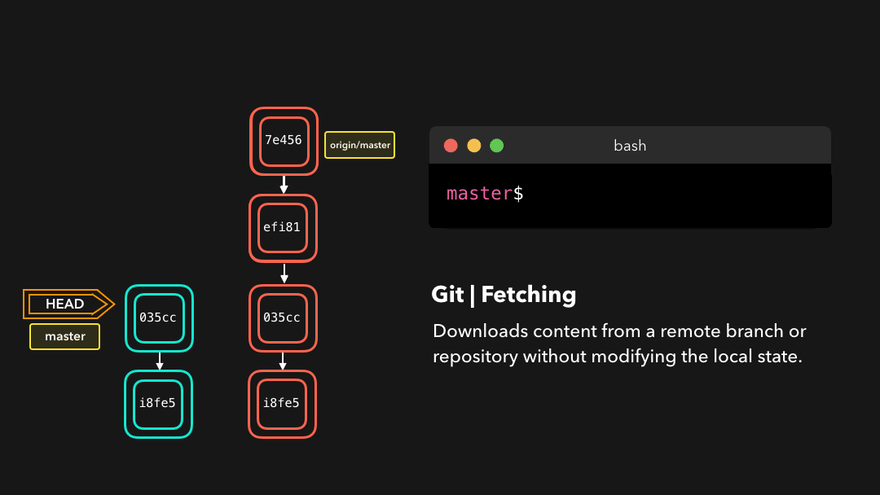

现在，我们可以看到自上次推送以来所做的所有更改！我们可以决定如何处理新的数据。我们可以决定我们想对新数据做什么，现在我们已经在本地拥有了它。

### Pulling

虽然git fetch对于获取分支的远程信息非常有用，但我们也可以执行git pull。

git pull实际上是两个命令合一：

- 一个是git fetch。
- 一个是git merge。

当我们从原点拉取变更时，我们首先要像git fetch那样获取所有数据，之后将最新的变更自动合并到本地分支中。

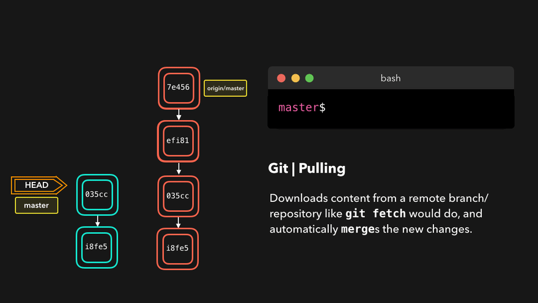

太棒了，我们现在与远程分支完全同步了，并且有了所有最新的变化。

### Reflog

每个人都会犯错，这完全没问题！有时候，你可能会觉得自己把git repo搞砸了，以至于想把它完全删除。有时候，你可能会觉得自己把git repo搞砸了，以至于你想把它完全删掉:

**git reflog** 是一个非常有用的命令，它可以显示所有已经进行的操作的日志！这包括合并、重置、还原：基本上所有对分支的修改。这包括合并、重置、还原：基本上是对你的分支进行的任何修改。

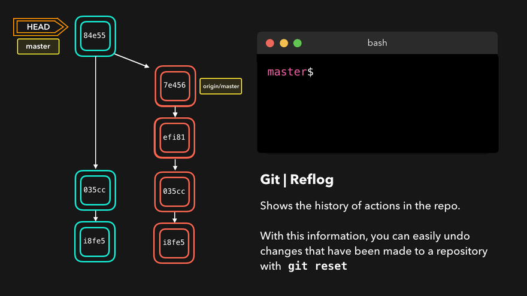

如果你犯了错误，你可以根据**reflog**给我们的信息重新设置head，轻松重做!

- 假设我们其实并不想合并原生分支，那么当我们执行git reflog命令时，会发现合并前的repo状态是在HEAD@{1}。

- 当我们执行 git reflog 命令时，我们看到合并前 repo 的状态是在 HEAD@{1}。

- 让我们执行 git 重置，把 HEAD 指向 HEAD@{1} 的位置吧!

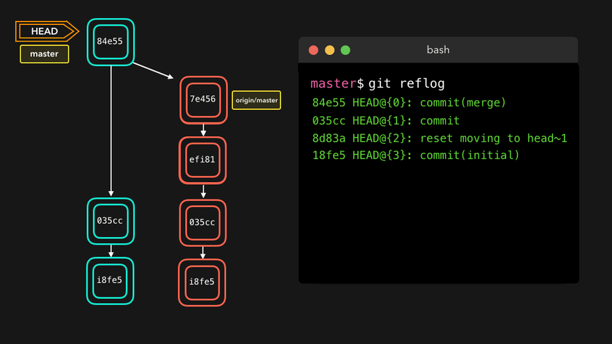

我们可以看到，最新的行动已经被推到了重新登录！

## 结束语

