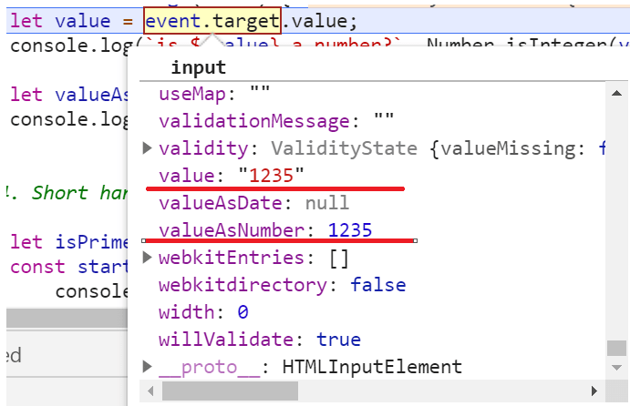
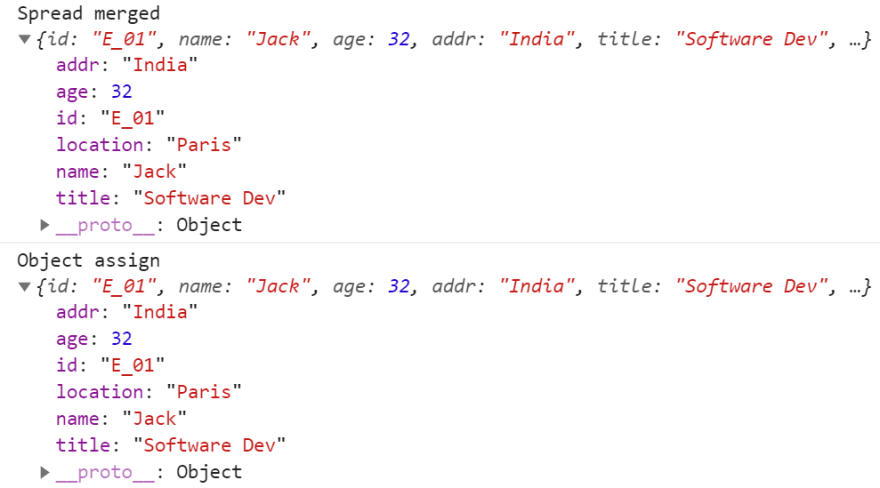
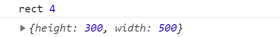

## 前言


大多数的编程语言都是足够开放的，允许程序员用多种方式来做类似的结果。

JavaScript也不例外。对于JavaScript，我们经常会发现，为了一个相似的结果，我们可以用多种方式来做事情，这有时会让人感到困惑。
有些用法比其他替代方法更好。

你如何改变你的JS代码，让它**更简单**，**更容易阅读**？

如果你在一个团队中工作，写出简单的代码是很重要的。因为你不是在真空中工作，所以你的程序必须容易被你的团队成员所遵循。每个人都喜欢干净的代码! 学习如何让JavaScript尽可能的不痛苦，是一项宝贵的技能，肯定会让你成为办公室的宠儿。


## JS-Tips


### 控制台提示

#### 代码执行时间⏲️

使用 console.time 和 console.timeEnd 来确定你的代码有多快（或多慢）？

这是一个例子：

```js
console.time('TEST')

//some random code to be tested

console.timeEnd('TEST')
```

#### 风格的Loggin

要获得自定义输出，我们将像下面那样添加％c，然后将实际的CSS作为第二个参数。

```js
console.log('%c AWESOME', 'color: indigo; font-size:100px')
```

#### Tables

当你想记录一个对象数组时，console.table将派上用场。

```js
// x,y,z are objects
console.table([x, y, z])
```

#### 堆栈跟踪日志

如果你想获得函数被调用的堆栈跟踪，你可以使用 console.trace。

```js
function foo(){
  function bar(){
    console.trace('test')
  }
  bar();
}

foo();
```


-----


### 动态键名

超级有用的提示！

```js
const key = 'dynamic'

const obj = {
  dynamic: 'hey',
  [key]: 'howdy'
}

obj.dynamic // hey
obj[key] // howdy
obj['dynamic'] //hey
obj.key // howdy
```


### 基于回调的API->promise

为了让事情变得更干净、更高效，你可以将回调(ourCallbackFn)转化为承诺是一个函数。

```js
// we start with this 
async function foo() {
  const x = await something1()
  const y = await something2()

  ourCallbackFn(){
    // ...
  }
}

// the transformation
async function foo() {
  const x = await something1()
  const y = await something2()

  await promiseCallbackFn() //👀
}

function promiseCallbackFn() {
  return new Promise((resolve, reject) => {
    ourCallbackFn((err, data) => { //👀
      if (err) {
        reject(err)
      } else {
        resolve(data)
      }
    })
  })
}
```


------

### 忘记字符串连接，使用模板

使用+操作符将字符串连接在一起以建立一个有意义的字符串是老式的。此外，用动态值（或表达式）连接字符串可能会导致挫折和错误。

```js
let name = 'Charlse';
let place = 'India';
let isPrime = bit => {
  return (bit === 'P' ? 'Prime' : 'Nom-Prime');
}

// string concatenation using + operator
let messageConcat = 'Mr. ' + name + ' is from ' + place + '. He is a' + ' ' + isPrime('P') + ' member.'
```

Template literals（或Template strings）允许嵌入表达式。

它有独特的语法，字符串必须用回车键包围。模板字符串可以包含动态值的占位符。这些值由美元符号和大括号（${expression}）标记。
下面是一个例子：

```js
let name = 'Charlse';
let place = 'India';
let isPrime = bit => {
  return (bit === 'P' ? 'Prime' : 'Nom-Prime');
}

// using template string
let messageTemplateStr = `Mr. ${name} is from ${place}. He is a ${isPrime('P')} member.`
console.log(messageTemplateStr);
```

-------


### isInteger

有一个更简单的方法可以知道一个值是否是一个整数。JavaScript的Number API提供了一个叫做，isInteger()的方法来达到这个目的。它是非常有用的，最好能知道。

```js
let mynum = 123;
let mynumStr = "123";

console.log(`${mynum} is a number?`, Number.isInteger(mynum));
console.log(`${mynumStr} is a number?`, Number.isInteger(mynumStr));
```

Output:

```js
123 is a number? true
123 is a number? false
```


-----


### Value as Number

你有没有注意到，event.target.value总是返回一个字符串类型的值，即使输入框的类型是数字？
是的，请看下面的例子。我们有一个简单的文本框，类型为数字。这意味着它只接受数字作为输入。它有一个事件处理程序来处理加键事件。

```html
<input type='number' onkeyup="trackChange(event)" />
```

在事件处理方法中，我们使用event.target.value取出值。但它返回的是一个字符串类型的值。现在，我将有一个额外的头痛问题，就是如何将它解析为一个整数。如果输入框接受浮动数(比如，16.56)，那么parseFloat()怎么办？啊，各种各样的困惑和额外的工作!

```js
function trackChange(event) {
   let value = event.target.value;
   console.log(`is ${value} a number?`, Number.isInteger(value));
}
```

使用event.target.valueAsNumber代替。它以数字的形式返回值。

```js
let valueAsNumber = event.target.valueAsNumber;
console.log(`is ${value} a number?`, Number.isInteger(valueAsNumber));
```




------


### && 运算符

让我们考虑一个情况，我们有一个布尔值和一个函数。

```js
let isPrime = true;
const startWatching = () => {
    console.log('Started Watching!');
}
```

这段代码太多，需要检查布尔条件并调用函数。

```js
if (isPrime) {
    startWatching();
}
```

使用(&&)运算符的简写呢？是的，完全避免使用if语句。酷吧？

```js
isPrime && startWatching();
```


### 默认值使用 ||

如果你想为一个变量设置一个默认值，你可以使用 ||

```js
let person = {name: 'Jack'};
let age = person.age || 35; // sets the value 35 if age is undefined
console.log(`Age of ${person.name} is ${age}`);
```

但是等等，它有一个问题。如果这个人的年龄是0（可能是刚出生的婴儿）。年龄将被计算为35，这是意想不到的行为。

进入空值凝聚运算符(??)。它是一个逻辑运算符，当其左手操作数为空或未定义时，返回其右手操作数，否则返回其左手操作数。

**要用??运算符重写上述代码。**

```js
let person = {name: 'Jack'};
let age = person.age ?? 35; // sets the value 0 if age 0, 35 in case of undefined and null
console.log(`Age of ${person.name} is ${age}`);
```

-----


### Randoms

生成一个随机数或从数组中获取一个随机项目是一个非常有用的方法，可以随身携带。在我的很多项目中，我都看到它们多次出现。
从一个数组中获取一个随机项目。

```js
let planets = ['Mercury ', 'Mars', 'Venus', 'Earth', 'Neptune', 'Uranus', 'Saturn', 'Jupiter'];
let randomPlanet = planets[Math.floor(Math.random() * planets.length)];
console.log('Random Planet', randomPlanet);
```

通过指定最小值和最大值从一个范围内生成一个随机数。

```js
 let getRandom = (min, max) => {
     return Math.round(Math.random() * (max - min) + min);
 }
 console.log('Get random', getRandom(0, 10));
```

-----


### 函数默认参数

在JavaScript中，函数参数（params）就像该函数的局部变量。在调用函数时，你可以为这些参数传值，也可以不传值。如果你不为param传值，它将是未定义的，可能会引起一些不必要的副作用。

在定义函数参数时，有一种简单的方法可以将默认值传递给函数参数。下面是一个例子，我们将默认值Hello传递给问候函数的参数信息。

```js
let greetings = (name, message='Hello,') => {
    return `${message} ${name}`;
}

console.log(greetings('Jack'));
console.log(greetings('Jack', 'Hola!'));
```

-----


### 所需函数参数

在默认参数技术的基础上进行扩展，我们可以将一个参数标记为强制性的。首先，定义一个函数来抛出一个带有错误信息的错误。

```js
let isRequired = () => {
    throw new Error('This is a mandatory parameter.');
}
```

然后为所需参数分配函数的默认值。记住，在调用时，当一个值作为参数传递时，默认值会被忽略。但是，如果参数值是未定义的，则会考虑默认值。

```js
let greetings = (name=isRequired(), message='Hello,') => {
    return `${message} ${name}`;
}
console.log(greetings());
```

在上面的代码中，name将是未定义的，并且将尝试为它设置默认值，即isRequired()函数。它将抛出一个错误。


----


### 逗号运算符

当我意识到逗号(,)是一个独立的操作符时，我感到很惊讶，而且从来没有注意到它的存在。我一直在代码中使用它，但是，从来没有意识到它的真正存在。

在JavaScript中，逗号(,)运算符用于从左到右评估每个操作数，并返回最后一个操作数的值。

```js
let count = 1;
let ret = (count++, count);
console.log(ret);
```

在上面的例子中，变量ret的值将是，2.同样的，下面代码的输出将把32的值记录到控制台。

```js
let val = (12, 32);
console.log(val);
```

我们用在哪里？有什么猜测吗？逗号(,)运算符最常见的用法是在for循环中提供多个参数。

```js
for (var i = 0, j = 50; i <= 50; i++, j--)
```

------


### 合并多个对象

您可能需要将两个对象合并在一起，并创建一个更好的信息对象来工作。你可以使用展开运算符......（是的，三个点！）。
考虑两个对象，分别是emp和job。

```js
let emp = {
 'id': 'E_01',
 'name': 'Jack',
 'age': 32,
 'addr': 'India'
};

let job = {
 'title': 'Software Dev',
  'location': 'Paris'
};
```

使用价差运算符将它们合并为:

```js
// spread operator
 let merged = {...emp, ...job};
 console.log('Spread merged', merged);
```

有另一种方法来执行这种合并。使用Object.assign()。你可以这样做。

```js
console.log('Object assign', Object.assign({}, emp, job));
```

结果:



注意，spread操作符和Object.assign都是执行浅层合并。在浅层合并中，第一个对象的属性会被覆盖到与第二个对象相同的属性值。
对于深合并，请使用类似于：_merge of lodash。

------


### 解构

将数组元素和对象属性分解为变量的技术称为，反结构。让我们通过几个例子来看看。

#### 数组

在这里，我们有一系列的表情符号，

```js
let emojis = ['🔥', '⏲️', '🏆', '🍉'];
```

要解构，我们将使用如下语法。

```js
let [fire, clock, , watermelon] = emojis;
```

这和做，让火=表情符号[0]是一样的；但多了很多灵活性。
你有没有注意到，我只是用中间的空位忽略了奖杯表情？那么这样做的输出会是什么呢？

```js
console.log(fire, clock, watermelon);
```

结果:


让我在这里也介绍一下叫做 rest 操作符的东西。如果你想对一个数组进行重构，将一个或多个项目赋值给变量，然后将其余的项目存入另一个数组，你可以使用......休息运算符来实现，如下图所示。

```js
let [fruit, ...rest] = emojis;
console.log(rest);
```

结果:


#### 对象

和数组一样，我们也可以对对象进行重构。

```js
let shape = {
  name: 'rect',
  sides: 4,
  height: 300,
  width: 500
};
```

破坏结构，我们得到一个名字，边在几个变量中，其余的在另一个对象中。

```js
let {name, sides, ...restObj} = shape;
console.log(name, sides);
console.log(restObj);
```

结果:




-----


### 获取查询参数

window.location对象有一堆实用的方法和属性，我们可以通过这些属性和方法来获取浏览器URL的协议、主机、端口、域名等信息。我们可以通过这些属性和方法从浏览器的URL中获取协议、主机、端口、域名等信息。

我发现非常有用的属性之一是，

```js
window.location.search
```

搜索属性从位置URL中返回查询字符串。下面是一个示例URL：https:/tapasadhiary.com?project=js。location.search将返回，?project=js。

```js
let project = new URLSearchParams(location.search).get('project');
```

结果:

```js
js
```


## 最后

我真的希望你能学到一些新的技巧。看你能把代码写得多小多清晰，是一件很有趣的事。
你喜欢我的文章吗？有问题吗？我是不是错过了什么或犯了错误? 请告诉我！！！