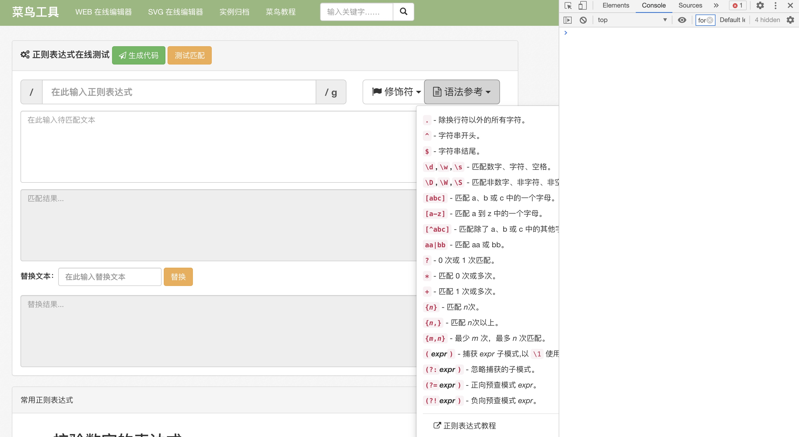

大家好，我是**TianTian**。

今天要分享的内容是正则**Regex**。

某天中午正要拿起手机打把王者荣耀，突然微信来了条消息！

某位网友来电，问我能不能帮忙看个字符串匹配的问题。

我硬着头皮答应了，可是，我看到题目的时候。

题目大概需要匹配检索的是:

> =A12/B14/D14..../H18
>
> =C12 * D12 * H16...*F19

嗯，我翻开了我多年没有碰的regex正则pdf手册。


## 初探Regex

首先，先简单介绍一下:

> 正则表达式（也称为regex或regexp）只是一种模式，可用于匹配字符的不同且通常是特定的组合。

我们可以使用这些模式来检查和处理字符串,如何检索呢，我们得知道如何构造,创建正则表达式可能看起来像这样：

```js
let dog;
rat = /dog/;
rat = new RegExp("dog");
```

有了表达式，那么我们如何匹配呢，当然正则表达式有自己的可用方法，也可以在某些字符串方法中使用它们。

例如，.test是可用于正则表达式的方法。它返回是否在字符串中找到正则表达式的布尔值：

```js
let rat = /dog/;
rat.test('I saw a dog!');  // returns true
/rat/.test('I saw a dog!');  // returns true
```

上面两种调用.test的方式是等效的：也就是说，可以使用分配给regexp的变量或直接使用regexp来调用它。对于正则表达式的任何使用都是如此。重要的是要注意，正则表达式匹配必须精确，包括任何换行符，大写字母和空白。例如：

```js
/dog/.test('I saw some dogs!');  // returns true
/dog/.test('Meet at the bad og 9');  // returns false
/dog/.test('Rats and doihs are not friends');  // returns false
```

看到这里，肯定不理解，为什么要使用它吧，不急，往下看。

------

## 特殊字符

特殊字符是用于修改或指定正则表达式的字符组合的字符。最有用的特殊字符之一是方括号。方括号允许您表示目标字符串中的字符可以是任意数量的字符！让我们看看它们的作用：

```js
const bt = /b[aeiou]t/;
bt.test('bat');  // returns true
bt.test('bet');  // returns true
bt.test('bit');  // returns true
bt.test('bot');  // returns true
bt.test('but');  // returns true
bt.test('bpt');  // returns false
```

想想看，括号里的一切都对应于你要搜索的字符串中的一个字符。在这个有用的能力之上，我们可以使用"-"字符来指定一个特定的字符范围!

```js
const nums = /[0-5]/;
nums.test('0');  //  returns true
nums.test('3');  //  returns true
nums.test('7');  //  returns false
```

再者，比如，要指定所有的字母，你会做这样的事情:

```js
const letters = /[A-Za-z]/;
letters.test('M');  // returns true
letters.test('y');  // returns true
letters.test('5');  // returns false
```

另一个需要记住的特殊字符是 "+"字符。这表明一个特定的元素可以重复任何次数。让我们看看它的作用。

```js
const bomb = /boo+m/;  
bomb.test('boom!');  // returns true
bomb.test('Boom!');  // returns false
bomb.test('boooooooooooom!');  // returns true
```

如果你想忽略大小写怎么办，可以在后面加个i。

```js
const bomb = /boo+m/i;  
bomb.test('boom!');  // returns true
bomb.test('Boom!');  // returns true
bomb.test('boooooooooooom!');  // returns true
bomb.test('BOOOOOOOOOOOOM!');  // returns true
```

比如我们常见的"？"字符也是一个有用的特殊字符。这个字符表示前面的字符可以包括也可以不包括。

```js
const color = /colou?r/; 
color.test('color');  // returns true
color.test('colour');  // returns true
```

你可能还需要关注的特殊字符是". "字符。这是个通配符。一个". "可以代表任何其他字符，不包括换行。

```js
const anything = /./; 
anything.test('a');  // returns true
anything.test('1');  // returns true
anything.test('[');  // returns true
```

嗯，先提这么几个基础的，我们再来看看其他的语法。

-----


## 其他语法

\w "字符指的是任何字母数字字符。它的反义词，"\W"，指任何非字母数字字符。

```js
const alphaNumber = /\w/;  
alphaNumber.test('a');  // returns true
alphaNumber.test('1');  // returns true
alphaNumber.test('&');  // returns false

const notAlphaNumber = /\W/; 
notAlphaNumber.test('a');  // returns false
notAlphaNumber.test('1');  // returns false
notAlphaNumber.test('&');  // returns true
```

再介绍一个，"\s "字符指的是任何空白字符，而"\S "字符指的是任何非空白字符。

```js
const whitespace = /\s/;  
whitespace.test('a');  // returns false
whitespace.test('1');  // returns false
whitespace.test('&');  // returns false
whitespace.test(' ');  // returns true
whitespace.test('\n');  // returns true

const notWhitespace = /\S/; 
notWhitespace.test('a');  // returns true
notWhitespace.test('1');  // returns true
notWhitespace.test('&');  // returns true
notWhitespace.test(' ');  // returns false
notWhitespace.test('\n');  // returns false
```

嗯，不能全部介绍完滴，还得自己查，那么有没有总结性的图呢，这个时候，当然有。

-----


## 一图解千愁




这是一个第三方网站，推荐结合这个，右边的语法参考，基本上是上面的内容。

> https://c.runoob.com/front-end/854

左边调试，中间是语法参考，右侧是控制台，岂不美哉。

-----


## 解题

匹配的格式是=A12/B12/C12.../K23中间是乘法也行。

想了很久，首先，我们是不是可以拆成三部分呢，一头一尾和中间部分。

开头，我们是不是可以这么匹配:

```js
reg = /^=[A-Z]+\d+/i;
```

首先的是=开头，然后是字母，接着是数字，考虑到可能是一个或者是多个,得用“+”特殊字符。

然后我们看看预期:

```js
reg.test('=b12')  // true
reg.test('=C12') //  true
reg.test('=CC3') // true
reg.test('=CDdd35') //  true
reg.test('=CDdd 35')  // false
```

嗯，我们在来看看，尾巴部分怎么写:

```js
// 尾巴部分，应该都是 /CC12, /B234,这样子滴
reg = /(\/|\*)[A-Z]+\d+$/i
```

首先，考虑到可能是乘法和除法，于是有这样子的**(\/|\*)**，需要注意的是，需要转义一下，然后以$结尾。

```js
reg.test('/cc')  // false
reg.test('/cc12') // true
```

剩下的就是中间的部分了，也就是剩下多个形如: /B231这样子的结构，于是:

```js
reg = /((\/|\*)[A-Z]+\d+$)*/i
```

最后组合一下，就是这样子的:

```js
const multiplicationAndDivisionReg = /^=[A-Z]+\d+((\/|\*)[A-Z]+\d*$)*(\/|\*)[A-Z]+\d+$/i;
```


简单入门后，留一个思考题，之前面试看过一个有趣的题目，**数字千分位**。

> '100000000.00'
>
> // 输出 '100,000,000.00'

赶紧来实战一下吧。


## 最后 

今天的分享，简单的介绍了如何入门Regex，赶紧动手学起来吧。

面试题交流群持续开放，已经分享了近 许多 个面经。

加我微信: DayDay2021，备注面试，拉你进群～

我是 **TianTianUp**，我们下篇见~

