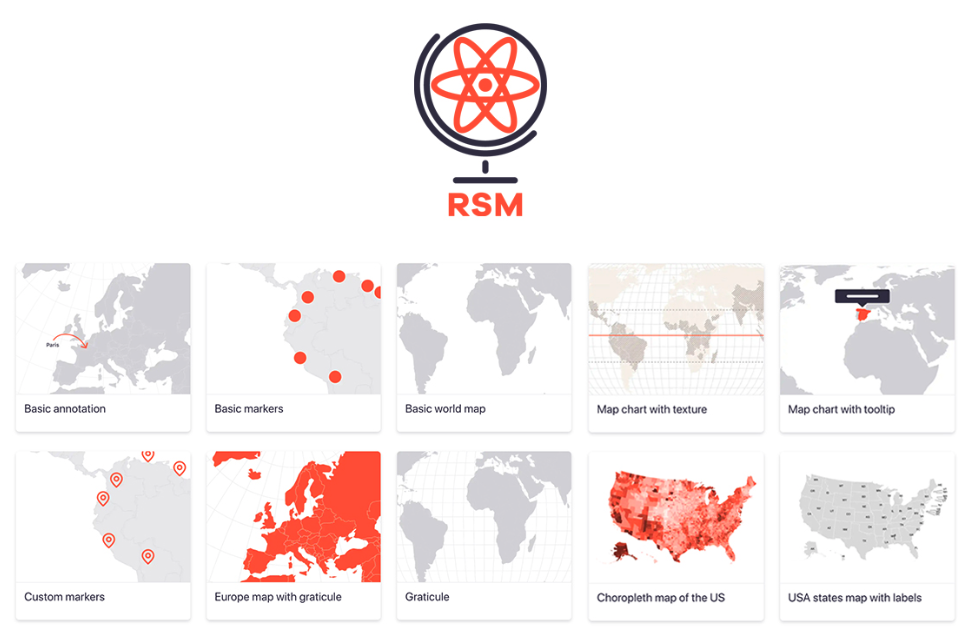

## 2021 年 React 的 5 大地图库

当你的项目需要使用地图库试，应该如何选择呢？

接下来就推荐一些能帮助您为您的项目选择最好的**地图库**。


实施用户友好、有效的地图功能可能是一项具有挑战性的任务。但是，如果你知道正确的工具，你可以让它变得更容易。

因此，在本文中，我将介绍 React 的 5 个最佳地图库，并进行功能比较，以帮助您为下一个项目选择最佳地图库。


主要推荐的库如下：

- React Simple Maps
- Google Map React
- Deck.gl
- React Leaflet
- Pigeon Maps

每个库都有自己的优缺点，下面简单介绍一下。


----


## React Simple Maps

满足基本需求的轻量级简单地图




这个 React 库允许快速创建 SVG 地图，同时由库本身负责平移、缩放和渲染功能。

> React Simple Maps 不依赖于整个 d3 库，而是围绕着 d3-geo 和 topojson 库，使得 React Simple Maps 非常轻量级。


**优点**

- 该库将地图呈现为 SVG，这使得使用 HTML 处理起来非常容易。
- 可与其他 React 组件一起扩展。
- 一个轻量级的库。

**缺点**

- 处理大量地图数据时的性能问题。
- 较小的开发者社区。

> 这是一个维护良好的库，每周 NPM 下载量超过 44,000 次，GitHub 星数超过 23,000。


假设您是初学者并尝试添加一个简单的 React 地图组件以满足基本需求。在这种情况下，我会为您推荐 React Simple Maps。

您可以使用 npm 或 yarn 轻松安装它：

```bash
npm install --save react-simple-maps
yarn add --save react-simple-maps
```


-----

## Google Map React

用谷歌地图 API 来实现地图功能。


Google Map React 库是可用于 React 的最流行的地图库之一。这个库是完全同构的，可以从服务器端渲染。

> Google Map React 拥有超过 5000 颗 GitHub 星，每周大约有 184,000 次 NPM 下载。


**优点**

- 支持带有悬停效果的自定义地图标记。
- 使用内容丰富的 Google Map API 来获取地图数据。
- 同构渲染——客户端和服务器端的地图渲染支持。
- 如果 API 没有响应，Google Map React 可以在浏览器中本地渲染基本地图组件。

**缺点**

- 需要设置 Google 开发者帐户和 API 密钥。
- 对于生产和广泛使用，您需要购买[Google Map Service](https://cloud.google.com/maps-platform/pricing/)。

如果您正在寻找一个轻松的地图组件来与您的 React 应用程序集成，Google Map React 是完美的解决方案，它可以使用 npm 或 yarn 安装。


```bash
npm install --save google-map-react
yarn add google-map-react
```


----


## Deck.gl

这是一个带有带有动画的强大地图库。


Deck.gl 是免费提供的最先进的高性能 React 地图库之一。这是基于 WebGL 的，能够可视化大比例尺的地图数据。

> Deck.gl 是一个高度可定制的地图库，几乎可以满足任何地图需求，因为它的架构易于扩展。

**优点**

- 高度可扩展和可定制的库。
- 大型数据集的高性能渲染和更新。
- 交互式事件处理，例如拾取、突出显示和过滤。
- 内置支持不同的图层类型，如图标、多边形、文本；以及不同的视图，例如第一人称、正字法。
- 支持与主要基本地图提供商的集成，包括 Mapbox、Google Maps 等。

**缺点**

- 客户端机器渲染地图的大量内存需求。
- 较少的浏览器兼容性和较少的跨平台支持。


> Deck.gl 每周下载量超过 45,000 次，在 GitHub 上拥有超过 8,000 颗星。它提供了良好的[文档](https://deck.gl/docs/get-started/using-with-react)，包括有关其功能和安装的所有详细信息。

如果您打算设计一个 React 应用程序来处理和显示大量地图数据，这可能是您的最佳选择。

您可以使用 NPM 或 Yarn 轻松安装 Deck.gl：

```bash
npm install deck.gl --save
yarn add deck.gl
```

**注意：**建议在集成此库后对应用程序进行性能测试和可用性测试。


------


## React Leaflet

满足基本需求的移动响应式地图。


> React Leaflet 是一个简单的地图库，具有开箱即用的图层自定义支持。

该库将现有的 javascript [Leaflet](https://leafletjs.com/)库包装为 React 组件，使其简单且适合移动设备。

**优点**

- 具有微调基本功能的简单库。
- 跨浏览器和平台支持。
- 图层自定义。
- 移动响应能力。

**缺点**

- 不支持服务器端渲染。
- 直接 DOM 调用是在加载阶段进行的，这对于处理大量地图数据来说可能会很麻烦。

> React Leaflet 每周有超过 149K 的 NPM 下载量和 37K 的 GitHub 星数。

你可以使用 NPM 或 Yarn 来安装 React Leaflet：

```bash
npm install react react-dom leaflet
npm install react-leafletyarn add react react-dom leaflet
yarn add react-leaflet
```


----


## Pigeon Maps

这是性能优先的地图库。


Pigeon Maps 是一个轻量级的地图库，其主要目标是提供一个性能第一、以 React 为中心的可扩展地图引擎。

> Pigeon Maps 附带 Open Street Maps (OSM)、MapTiler 和更多地图图块提供商。但它也允许您与自定义地图图块提供程序集成。

**优点**

- 轻量级和快速的地图渲染。
- 自定义地图图块提供程序支持。
- 移动优化的地图控件。

**缺点**

- 与其他组件的可扩展性较差。
- 无法进行高级地图自定义。

> Piegon Map 拥有 3100 颗 GitHub 星，每周在 GitHub 上的下载量超过 3000 次。

如果您正在寻找响应式、移动性和性能优化的地图库，Pigeon Map 是您的不二之选。

您可以使用 NPM 或 Yarn 轻松安装 Pigeon Map：

```bash
npm install —-save pigeon-map
yarn add pigeon-maps
```

----


## 小结

上面的地图库只是 React 可用的许多地图库的一个子集。但是，我展示了 5 个精心挑选的库以及它们的优缺点。您可以在下表中找到它们在 GitHub 上的流行度。


我希望我的建议能帮助您为您的项目选择最好的地图库。

**感谢阅读！！！**

