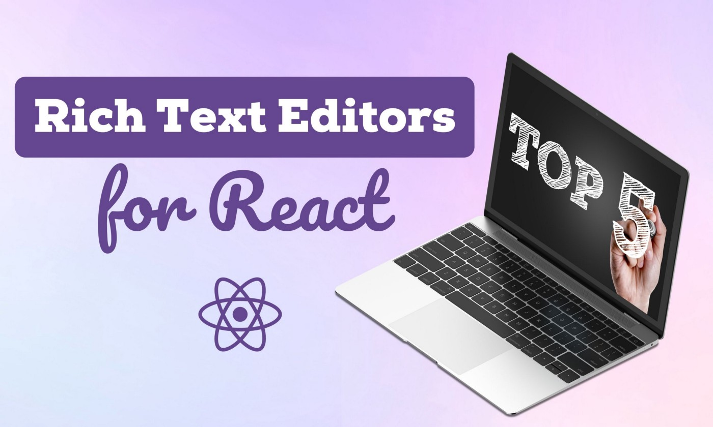
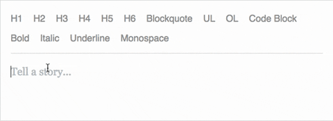
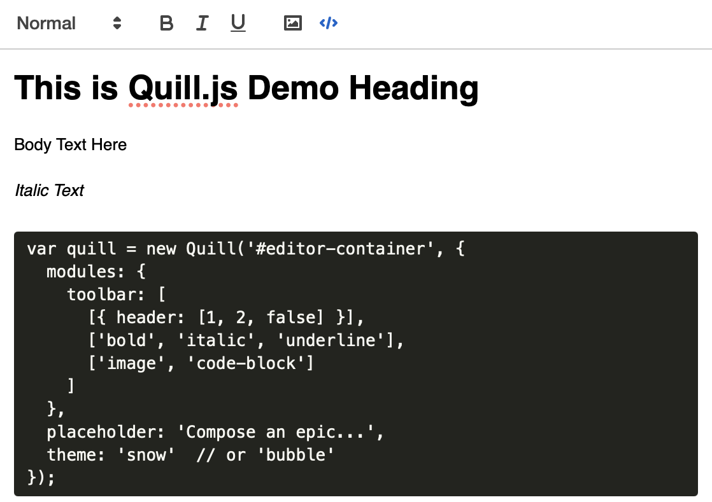
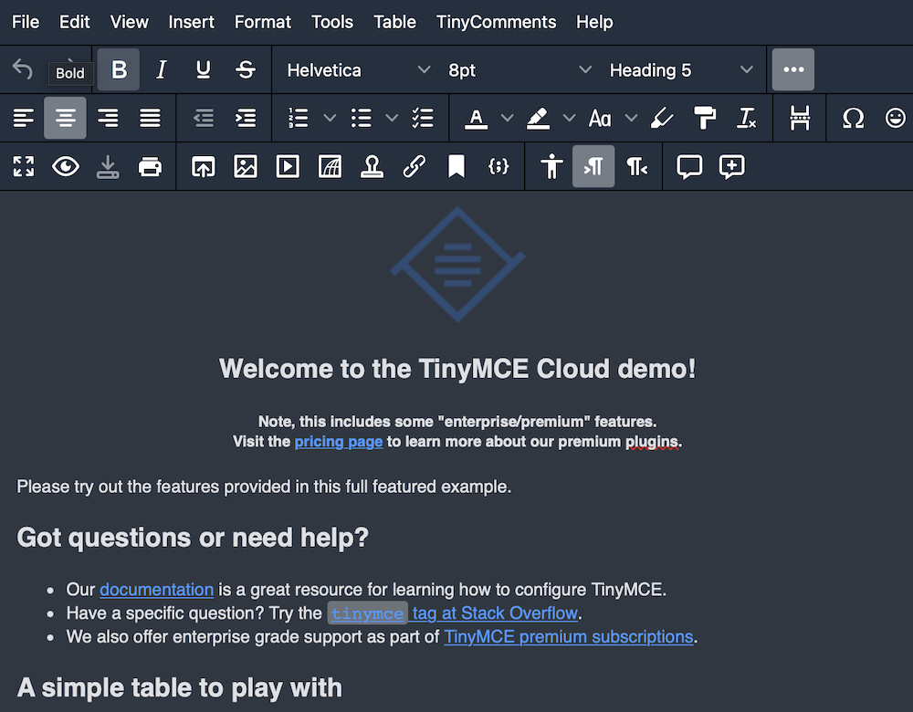
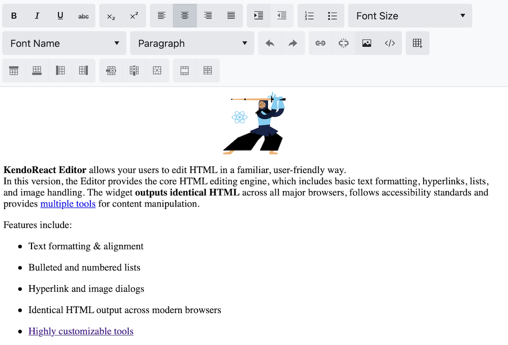
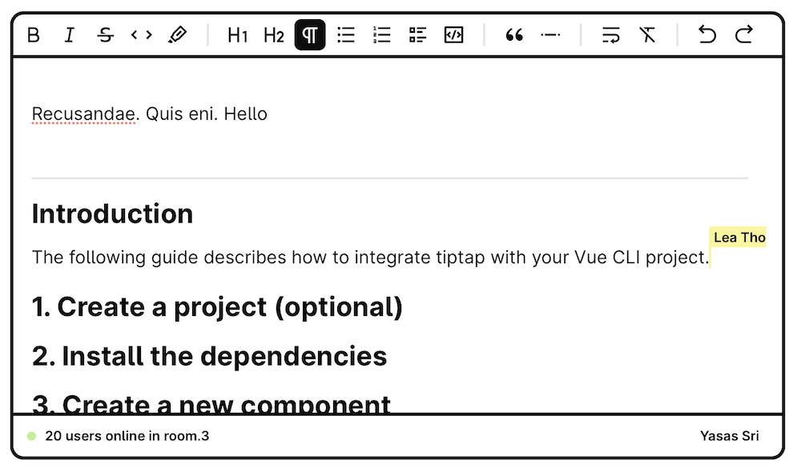

## 2021 年 React 的 5 大富文本编辑器

通过评估不同的React富文本编辑器的功能，来选择一款适合你的。



今天，富文本编辑器被用于许多应用中，包括简单的博客和复杂的内容管理系统。然而，选择一个并不容易，因为有很多具有不同功能的编辑器。


因此，在这篇文章中，我将评估5个React的富文本编辑器的功能，以帮助你选择最适合你的要求。


### 一. Draft.js



这是一款最受欢迎的，能够满足基本需求的免费编辑器。


**Draft.js**是Facebook的一个开源项目，为React构建。这是一个强大的、可扩展的、可定制的框架，它在React开发者中非常受欢迎。

> 根据Facebook的说法，这个库被用于Facebook的状态、评论和messenger.com。


**优点：**

- 扁平化内容模型很容易理解。
- 高度可扩展和可定制的插件构建在 Draft.js 之上。
- 自 2016 年以来，由于 Facebook 支持的庞大且不断增长的开源开发者社区，提供了许多教程和支持。


**缺点：**

- 当需要像表格这样的复杂内容结构时，编辑器会变慢，代码也会变得复杂。
- 没有官方的移动支持。
- OSX 自定义键绑定问题。


> Draft.js 拥有超过 20,000 个 GitHub star 和大约 620,000 次每周 NPM 下载。


如果你是一个初学者，并希望实现一个满足基本需求的文本编辑器，我为你推荐Draft.js，你可以使用npm或yarn轻松安装它。


```bash
npm install draft-js 
yarn add draft-js 
```


### 二. Slate.js

这是一款支持复杂内容的免费编辑器。


Slate.js是另一个令人兴奋的React富文本编辑器，灵感来自Draft.js。你可以用它来构建像**Medium Editor**、**Dropbox Paper**或**Google Docs**那样的漂亮编辑器。


> 虽然Slate.js仍处于测试阶段，但它在GitHub上有超过20K颗星。


**优点：**

- 产生JSON输出，使其更容易与其他模块集成。
- 它的嵌套文档模型支持更复杂的内容结构，如表格、分页符和其他自定义功能。
- 可通过使用插件进行扩展。
- 有很好的描述性文档和互动演示。
- 受到**Salesforce**和**Airtable**的信任。


**缺点：**

- 仍处于测试阶段（截至2021年5月），这对于信任和在生产网站上实施可能是个坏消息。

- 需要更多的初始UI设置以适应编辑器控制。

  

即便如此，如果你想实现一个具有自定义功能的内存优化的富文本编辑器，**Slate.js**是你最好的选择之一，它可以使用**yarn**或**npm**轻松安装。

```bash
yarn add slate slate-react
npm install slate slate-react
```


### 三. Quill.js

这是一款带有主题的免费API驱动的编辑器。




排名第三的是**Quill.js**，富文本编辑器具有跨平台和跨浏览器支持。
因此，这是你在台式机、平板电脑和手机的所有现代浏览器上寻找流畅功能的最佳选择。


> Quill.js在GitHub上有29.9万个星星，在NPM上每周有超过57万次下载。


**优点：**

- 由于其API驱动的设计，不需要像其他文本编辑器那样解析HTML或不同的DOM树。
- 支持自定义内容和格式，有预设的编辑器样式。
- 跨平台和浏览器支持。
- 易于设置,容易配置。


**缺点：**

- 可能存在XSS安全漏洞。
- 功能的定制是有限的。
- 较少的更新和补丁。


你可以使用NPM安装Quill.js或者使用CDN版本。

```bash
npm install quill@1.3.6
<!-- or use the bellow CDN -->
<!-- Main Quill library --> 
<script src="//cdn.quilljs.com/1.3.6/quill.js"></script> 
<script src="//cdn.quilljs.com/1.3.6/quill.min.js"></script>  
<!-- Theme included stylesheets --> 
<link href="//cdn.quilljs.com/1.3.6/quill.snow.css" rel="stylesheet"> 
<link href="//cdn.quilljs.com/1.3.6/quill.bubble.css" rel="stylesheet">  
<!-- Core build with no theme, formatting, non-essential modules --> <link href="//cdn.quilljs.com/1.3.6/quill.core.css" rel="stylesheet"> 
<script src="//cdn.quilljs.com/1.3.6/quill.core.js"></script>
```


### 四. TinyMCE

这是一款商业功能的富文本编辑器。




这个编辑器是一个**商业库**。如果你有一些额外的钱，并希望拥有一个不令人头痛的强大的文本编辑器，**TinyMCE**是一个不错的选择。


**优点：**

- 支持实时协作。
- 支持提及和评论。
- 先进的表格和复杂内容支持。
- 增强的媒体嵌入支持。
- 自动链接检查器。


**缺点：**

- 需要购买订阅才能使用高级功能。


> **TinyMCE**为你提供了核心（免费计划，功能有限）、基本（每月25美元）、专业（每月75美元）和灵活（自定义定价）等定价计划。


在做出决定之前，您可以随时尝试免费版本或试用版。TinyMCE 提供了很好的[文档](https://www.tiny.cloud/docs/)，包括有关其功能和安装的所有详细信息。


> 文档：https://www.tiny.cloud/docs/


### 五. KendoReact

这是一个商业生产就绪的编辑器。



**Kendo**可能是市场上最著名的商业UI组件库。


> 它是一个高度稳定的、可用于生产的库，无疑具有最好的客户支持服务。


**优点：**

- 闪电般的性能。
- 高度的可定制性。
- 可用于生产应用。
- 全球化支持。

**缺点：**

- 需要购买，极其昂贵。


与免费编辑器相比，**Kendo**有一些奇妙的功能。如果你对文本编辑器有高度竞争性的业务需求，并且正在寻找一个无忧无虑的未来解决方案，那么这个编辑器是为你准备的。


> Kendo有3种不同的计划：KendoReact.  KendoUI和DevCraft，每个开发者的永久许可证从899美元到1499美元不等。

与**DevCraft**相比，前两个套餐有一些限制，你可以在他们的网站上找到完整的比较。


### 六. TipTap

这是一款免费的现代文本编辑器。



这是一款非常推荐的编辑器。尽管这个编辑器还在测试阶段，但有许多令人兴奋的功能。

TipTap是一个**无头编辑器**，它允许你完全自定义。这个编辑器也支持实时协作。


**优点：**

- UI 可定制性。
- 键盘快捷键。
- 移动支持。
- 协同编辑。

**缺点：**

- 仍处于测试版（但稳定并由快速增长的开发人员社区支持）。


> 尽管相当新，TipTap 拥有超过 1 万个 GitHub 星和每周 93,000 多次 NPM 下载。


如果你正在寻找一个免费的、功能丰富的、来自React的现代文本编辑器？在这种情况下，我强烈推荐**TipTap**供你试用。


```bash
# 使用 npm
安装 npm install @tiptap/core @tiptap/starter-kit
# 使用 Yarn 安装
yarn add @tiptap/core @tiptap/starter-kit
```


## 总结


以上的富文本编辑器只是众多React可用编辑器的一个子集。介绍了6个不同的编辑器，它们的优点和缺点，以挑选出适合你的理想编辑器。

我希望我的建议能帮助你为你的项目选择最好的富文本编辑器。

**谢谢您的阅读！!  !**


## 参考

https://blog.bitsrc.io/top-5-rich-text-editors-for-react-in-2021-628fecf0f7e0