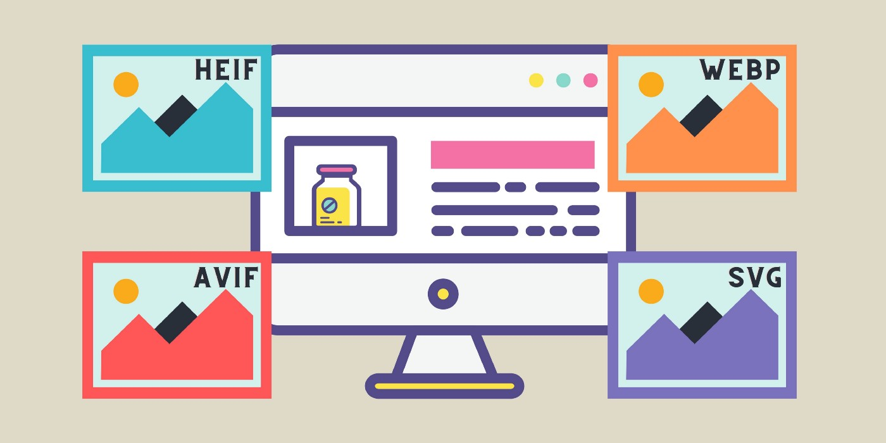
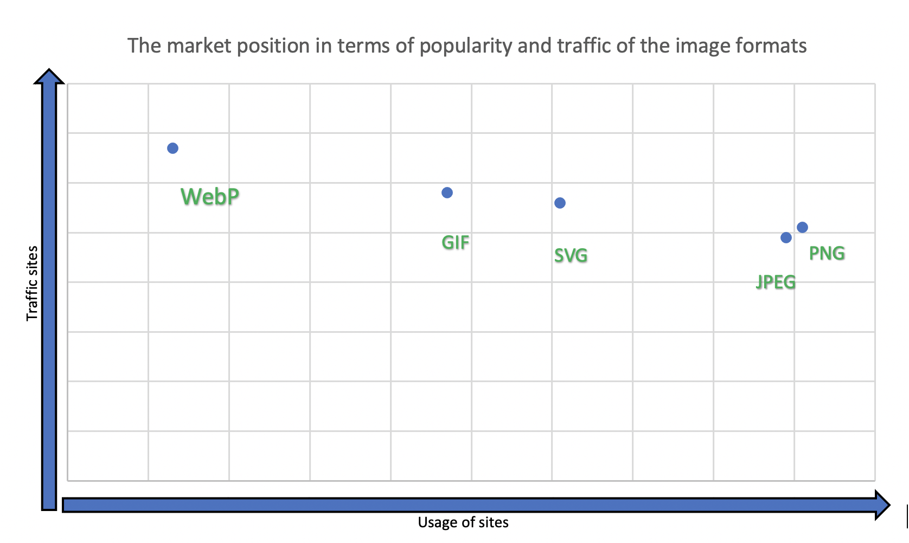
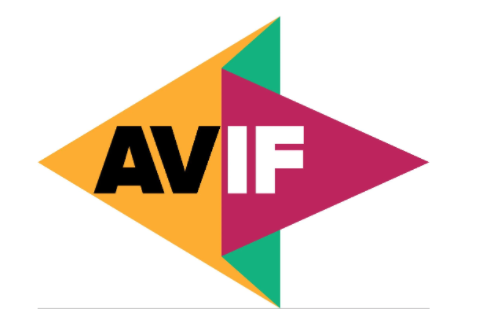
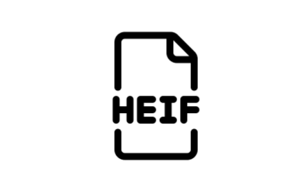
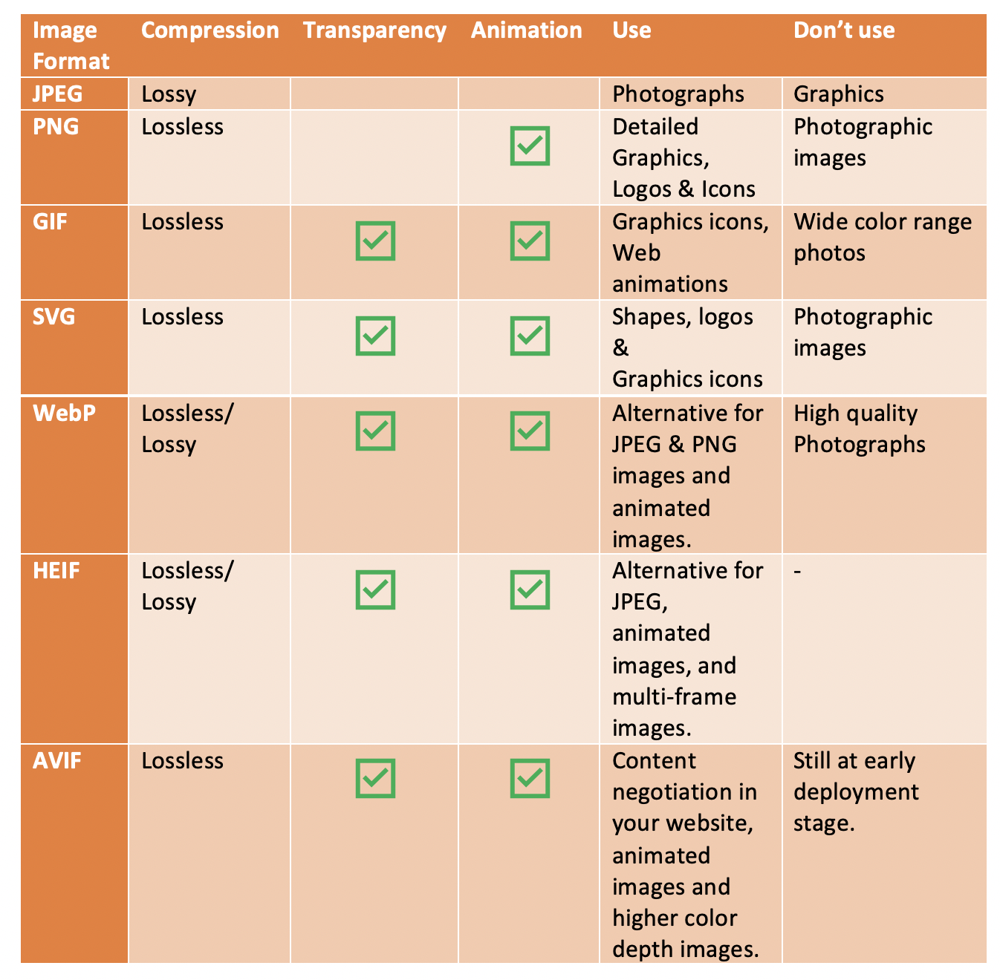

导语：了解最新的图像格式以及何时使用它们。

## 写在前面

在本文中，我将介绍 4 种最新的图像类型，以帮助您为下一个项目选择最佳的图像类型。

### WebP

这个应该是JPEG 和 PNG 令人兴奋的替代品。

> [WebP](https://developers.google.com/speed/webp)是谷歌在2010年开发的一种开源图片格式，虽然不是很流行，但是知名组织都在使用WebP。

例如，[Facebook](https://engineering.fb.com/2014/06/19/android/improving-facebook-on-android/)在 Android 应用程序中[使用 WebP](https://engineering.fb.com/2014/06/19/android/improving-facebook-on-android/)，将图像尺寸缩小了:

- 25–35% 与 JPEG 相比。
- 80% 与 PNG 相比。

根据[Google 的 WebP 研究](https://developers.google.com/speed/webp/docs/webp_study)，在有损压缩方面，WebP 比 JPEG 小 25-34%。

此外，当[谷歌](https://blog.chromium.org/2014/03/webp-improves-while-rolling-out-across.html)将 Youtube 缩略图移动到 WebP 时，他们观察到页面速度提高了 10%。

**WebP的优点如下：**

- 支持无损和有损压缩。
- 与其他图像格式相比，图像文件大小大大减小。
- 支持无损透明。
- 支持网页动画。

> 网站WebP使用统计：https://w3techs.com/technologies/details/im-webp

**浏览器支持方面的话**，您可能想知道，为什么它还没有在开发人员中流行？

主要原因在于其**浏览器支持**。尽管 Chrome、Firefox、opera mini 和 Edge 支持 WebP，但 Safari 直到最近才支持它。有了 safari 的支持，我们可以期待在未来几年内快速采用 WebP。

> 更多内容点击链接：https://caniuse.com/?search=webP

### AVIF

这种格式将会是下一代图像编码格式。

AV1 图像文件格式 (AVIF) 是一种由开放媒体联盟 (AOM) 开发的免版税开源文件格式。在某些情况下，AVIF 可以将图像尺寸缩小：

- 50% 与 JPEG 相比。
- 30% 与 WebP 相比。

**AVIF图像类型的优点如下：**

- 支持网页动画。
- 支持透明。
- 支持无损压缩。
- 支持任何图像编解码器。
- 在全分辨率下支持 10 位和 12 位颜色。

**浏览器支持方面上**，虽然 Chrome85、Opera 和 Firefox（仅基础）支持 AVIF，但它的浏览器支持比 WebP 少。

### SVG

这是一种可扩展的高质量图像。

> SVG（可缩放矢量图形）是一种用于二维图形的基于 XML 的矢量文件类型。

**SVG图像类型的优点如下：**

- 可以搜索、索引、缩放和压缩 SVG 图像。
- 支持使用 CSS 和 JavaScript 的网络动画。
- 在任何分辨率或尺寸下都保持清晰。
- 支持透明。

但是，SVG 图像尺寸比其他图像格式大，而且大多数人都知道，它不适合摄影图像。

### HEIF

该图像的特点是快速编码和解码。（**注意**：目前*仅*支持*原生 **MacOS** 和 **iOS***）

HEIF（高效图像文件格式）是 JPEG 图像格式的另一个主要竞争对手。HEIF 图像格式由运动图像专家组 (MPEG) 于 2015 年开发。

> HEIF 压缩尺寸较小但图像质量高于 JPEG 的图像。

**HEIF图像类型的优点如下：**

- 与 JPEG 图像相比大小减半，但保留了相同或更好的图像质量。
- 采用高效视频压缩格式压缩和快速编解码。
- 支持网页动画。
- 支持有损和无损压缩。
- 支持透明度和 16 位颜色。

对于浏览器支持方面来说，HEIF 支持 macOS Sierra 和 iOS 11 及更高版本的原生应用程序。目前，没有可用的浏览器支持。

因此，如果您正在考虑将 HEIF 用于 Web 应用程序，我们必须等到适当的浏览器支持公告才能继续。

## 如何选择一个？

除了以上 4 种之外，一些常见的图像格式如 JPEG、PNG 和 GIF 也经常用于 Web 应用程序中。因此，我准备了一个决策树来帮助您根据您的要求选择合适的格式。

另外，为了便于比较，我总结了这些图像格式的属性如下。

### 关键要点

**JPEG**：这是彩色照片的理想图像格式。

**PNG**：这是一种理想的图像格式，可以保留精细的细节、最高分辨率图形的透明度以及颜色较少的屏幕截图。

**GIF**：这是动画图形的理想图像格式。

**SVG**：这是高质量图像的理想图像格式，可以缩放到任何大小。

**WebP**：WebP 图像格式是 JPEG 和 PNG 的一种更新的令人兴奋的替代方案，支持无损和有损压缩。

**HEIF：** HEIF 图像格式是 JPEG 的替代品，具有快速编码和解码。

**AVIF：** AVIF 是即将推出的图像格式，它是 JPEG 和 WebP 的最佳替代品

----

## 小结

现阶段有许多图像选项，至于哪一款需要你去考虑。很明显目前还没有完美的图像格式选项，您需要根据自己的要求选择类型，同时考虑好处和浏览器支持。

随着最新的发展，WebP 的使用量稳步增加，随着浏览器支持的增加，AVIF 可能是一个不错的选择。

是否还有其他**领先的图像格式**没有在此处展示？欢迎在下方**发表评论**。

**感谢阅读!!!**

## 参考

https://blog.bitsrc.io/best-image-formats-for-web-applications-in-2021-39d0c91c7013