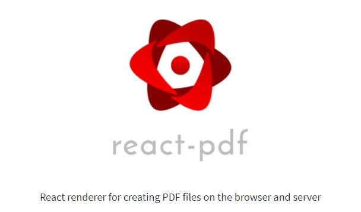
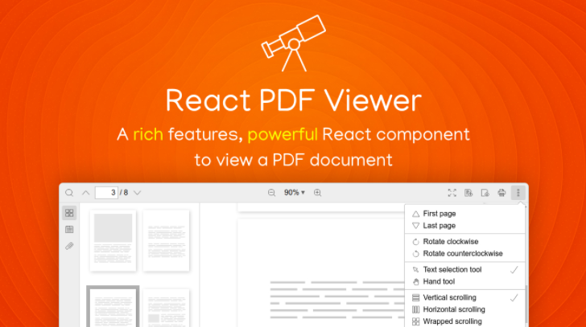
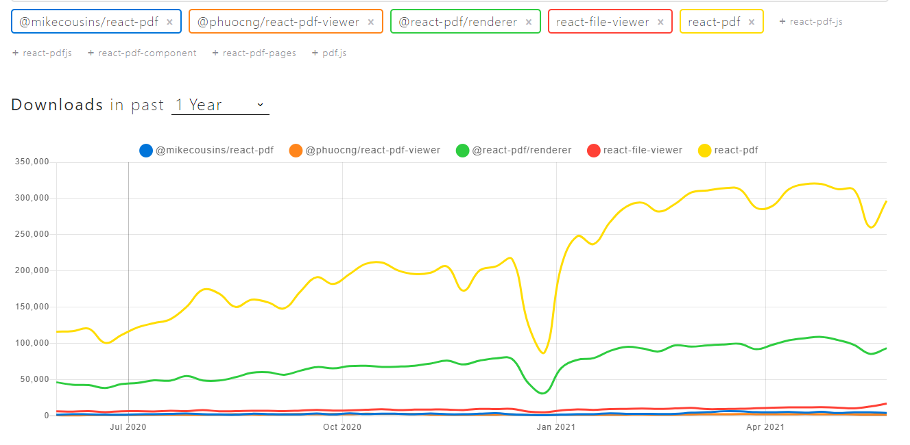
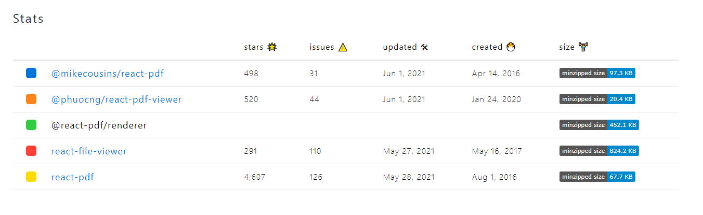

## 2021 年顶级 React PDF 库

今天，许多网络应用程序为其用户提供内置的PDF浏览选项。然而，选择一个并不容易，因为它们的功能远远超过显示PDF。

因此，在这篇文章中，我将评估5个React的PDF浏览器库，并进行功能比较，以帮助你选择最适合你要求的。

主要介绍下面5个库：

- react-pdf/renderer
- react-pdf
- @phuocng/react-pdf-viewer
- react-file-viewer
- @mikecousins/react-pdf


-----


## react-pdf/renderer



专门用于渲染和创建PDF。

> React-pdf/renderer是一个广泛使用的库，用于在浏览器和服务器上创建PDF文件。
>
> 地址： https://www.npmjs.com/package/@react-pdf/renderer


这个库提供了一些基本的组件来开始工作，随着你的熟悉，你可以定制它们来提出更吸引人的设计:

- <Document> :这是一个PDF文件的根。
- <Page> :单页是由这个标签描述的。它需要有一定的尺寸（如A4）。
- <View> : 一个通用的容器，用于样式和格式化PDF。你可以使用StyleSheet.create() API，用Flexbox和CSS属性的全部功能来设计你的视图，以布局PDF，类似于它在React Native中的使用方式。
- <Text> : 用于显示文本。
- <Image> :可用于在PDF文档中插入图片。
- <Link> : 可用于生成超链接注释。

---


另外，React-pdf/renderer带有一些惊人的功能，可以用来生成令人惊叹的文档。我可以很容易地列出其中的一些功能:

- 支持各种样式和CSS属性。
- 通过**usePDF** hook API对文档进行更多控制。
- 提供一个Node API。
- 快速和高效。
- 高度可定制&易于使用。


> 除了这些，React-pdf/renderer库每周有大约93,000次下载，GitHub上有超过9.3k颗星星。


你可以使用**npm install - save @react-pdf/renderer**命令轻松地将这个库安装到你的项目中，下面的代码显示了一个使用React-pdf/renderer的简单例子。


```jsx
import React from 'react';
import { Document, Page, Text, View, StyleSheet } from '@react-pdf/renderer';

// Create styles
const styles = StyleSheet.create({
  page: {
    flexDirection: 'row',
    backgroundColor: '#C0C0C0'
  },
  section: {
    margin: 10,
    padding: 10,
    flexGrow: 1
  }
});

// Create Pdf Component
const MyPdf = () => (
  <Document>
    <Page size="A4" style={styles.page}>
      <View style={styles.section}>
        <Text>Heading #1</Text>
      </View>
      <View style={styles.section}>
        <Text>Heading #2</Text>
      </View>
    </Page>
  </Document>
);
```


------


## react-pdf

像显示图片一样显示PDF。


> 我们之前讨论过的React-pdf/renderer是专门用于创建PDF的。但如果你正在寻找一个只显示PDF的库，React-pdf是最佳选择。
>
> 地址：https://www.npmjs.com/package/react-pdf


React-pdf提供了一个React组件API，允许打开PDF文件并使用PDF.js渲染。虽然这是一个专门用于查看PDF的简单库，但它有一些惊人的功能，比如:

- 易于使用 - 插入Document组件并给它一个文件道具。React-pdf会把它整理出来，不管它是一个URL，一个文件，还是base64。
- 支持自定义事件。
- 多种渲染方法。
- 支持文本选择和注释。
- 跨浏览器兼容性。
- 可访问性 - React-pdf不仅将PDF渲染成图像。还可以作为屏幕阅读器可以掌握的可见文本层，使你的内容对视力障碍者来说更可用。
- 免费和开源。


>除此以外，每周有超过296,000次的下载和4.6K颗GitHub星，这表明这个库在React社区是多么受欢迎。


你可以使用**npm i react-pdf**命令来安装它，下面的例子显示了React-pdf的基本用法。


```jsx
import React, { useState } from 'react';
import { Document, Page } from 'react-pdf';

function MyPdf() {
  const [numPages, setNumPages] = useState(null);
  const [pageNumber, setPageNumber] = useState(1);

  function onDocumentLoadSuccess({ numPages }) {
    setNumPages(numPages);
  }

  return (
    <div>
      <Document
        file="myfile.pdf"
        onLoadSuccess={onDocumentLoadSuccess}
      >
        <Page pageNumber={pageNumber} />
      </Document>
      <p>Page {pageNumber} of {numPages}</p>
    </div>
  );
}
export default MyPdf;
```


## @phuocng/react-pdf-viewer





> React-pdf-viewer是一个完全由React钩子驱动的React组件，用TypeScript编写。

尽管是新的，React-pdf-viewer有一些令人兴奋的功能，让你为之倾倒。为了更好地理解，我将把它们列举如下：

- 支持受密码保护的文件。
- 缩放：支持自定义级别，如实际尺寸、页面合适和页面宽度。
- 页面之间的导航。
- 搜索文本。
- 预览页面缩略图。
- 查看和浏览目录。
- 列出和下载附件。
- 旋转和许多滚动模式。
  文本选择和手动工具模式。
- 全屏模式。
- 可以打开本地文件（例如，拖放一个本地文件来查看它。
- 下载文件和打印。
- 查看文件属性。
- 支持SSR。

另外，它的插件集合是完全可定制的，并以优秀的文档帮助用户。

文档：https://react-pdf-viewer.dev/docs/

从它首次发布到现在只有一年时间，它已经有超过2000次的每周下载和519颗GitHub星。

> 注意：你需要有React 16.8以上版本和TypeScript 3.8以上版本才能使用React-pdf-viewer。


你可以使用**npm i @phuocng/react-pdf-viewer**命令来安装它，下面的例子展示了React-pdf-viewer的基本用法。

```jsx
// Core viewer
import { Viewer } from '@react-pdf-viewer/core';

// Plugins
import { defaultLayoutPlugin } from '@react-pdf-viewer/default-layout';

// Import styles
import '@react-pdf-viewer/core/lib/styles/index.css';
import '@react-pdf-viewer/default-layout/lib/styles/index.css';

// Create new plugin instance
const defaultLayoutPluginInstance = defaultLayoutPlugin();

<Viewer
    fileUrl='/my Documents/sample_doc.pdf'
    plugins={[
        // Register plugins
        defaultLayoutPluginInstance,
        ...
    ]}
/>
```


----


## react-file-viewer

> React-file-viewer是一个可扩展的文件查看器，用于Web应用程序，支持PDF、图片、csv、xslx和docx。


这个库提供了一个名为FileViewer的组件，用来显示内容，它接受几个props:

- fileType String: 要显示的资源类型。如果你使用一个不支持的文件类型，将出现一个不支持的文件类型通知。
- filePath String: FileViewer将显示的资源的URL。
- onError Function [optional]:如果文件查看器无法获取或呈现所请求的资源，该函数将被调用。在这里你可以指定一个日志工具的回调。
- errorComponent react element [optional]: 一个在发生错误时渲染的组件，而不是 react-file-viewer 默认的错误组件。
- unsupported Component react element [Optional]:在文件格式不被支持的情况下要呈现的组件。

除此以外，它还有一些特殊的功能，比如:

- 用Jest或Enzyme进行测试。
- 通过使用make lint运行linter，在我们运行代码之前发现错误，从而节省时间。
- 可扩展性--添加支持的文件类型很容易。


此外，这也是最受欢迎的pdf查看器库之一，每周有17348次下载和291个GitHub Stars。

> 注意：这个库在React 16以上版本中功能良好。如果你使用React< 16版本，你很可能需要安装React-file-viewer 0.5版本。


React-file-viewer可以用**npm i react-file-viewer**命令安装，下面的例子显示了React-file-viewer的一个简单例子:

```jsx
// MyApp.js
import React, { Component } from 'react';
import logger from 'logging-library';
import FileViewer from 'react-file-viewer';
import { CustomErrorComponent } from 'custom-error';

const file = 'http://mysite.com/sampledoc.pdf'
const type = 'pdf'

class MyDocComponent extends Component {
  render() {
    return (
      <FileViewer
        fileType={type}
        filePath={file}
        errorComponent={CustomErrorComponent}
        onError={this.onError}/>
    );
  }

  onError(e) {
    logger.logError(e, 'error in file-viewer');
  }
}
```

---


## @mikecousins/react-pdf

> @mikecousins/react-pdf是一个使用PDF.js来渲染PDF文档的组件。

这个库使用一个叫做usePdf的Hook来渲染PDF，我们需要用这个Hook传递几个props:

- file:PDF文件的URL。
- Page: 表示你要显示的页面。默认=1。
- scal： 允许你对PDF进行缩放。默认=1。
- onDocumentLoadSuccess： 你可以定义一个回调函数，在PDF文档数据被完全加载后被调用。
- onDocumentLoadFail：让你定义一个回调函数，当发生PDF文档数据加载错误时被调用。
- onPageLoadSuccess：让你定义一个回调，它将在PDF页面数据加载完毕后被调用。
- onPageRenderSuccess： 让你定义一个回调，在PDF页面被完全渲染到DOM后执行。

如果你认为这工作太多，你可以简单地直接使用Pdfcomponent，它在内部利用usePdf钩子。


```jsx
import React, { useState } from 'react';
import Pdf from '@mikecousins/react-pdf';
 
const MyPdfViewer = () => {
  const [page, setPage] = useState(1);
 
  return <Pdf file="sampledoc.pdf" page={page} />;
};
```

npm软件包@mikecousins/react-pdf-js每周有2,646次下载，有497颗GitHub星。


你可以简单地用**yarn add @mikecousins/react-pdf**或**npm install @mikecousins/react-pdf**来安装@mikecousins/react-pdf。

-----


## 小结

我们来看看他们具体的下载量：

> Source: https://www.npmtrends.com/





> Source: https://www.npmtrends.com/



在分析了功能、流行度、安全问题和社区支持之后，我认为pdf查看器库的最佳选择是**React-pdf**。


考虑到发布版本的模式、软件库活动和其他相关数据，React-pdf的维护状况远远领先于其他所有库。

不过，库的选择可以根据你的要求来改变。我想这篇文章一定会帮助你更多地了解这些库。

**谢谢您的阅读!!!**


---


## 参考

https://blog.bitsrc.io/top-react-pdf-libraries-in-2021-d0cfbeccdbf8