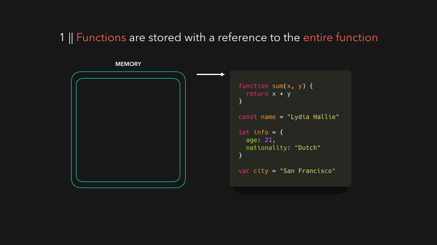

大家好，我是**TianTian**。

今天要分享的内容是JS中的**变量提升（Hoisting）**。

前几天，一个大二的学妹跑来问我，拿了到不简单的题目来质问我，发现里面正是有**变量提升**。

写这个的变量提升的文章，太多了，如何丰富有趣的介绍它，其实这样子的文章不多。

一个老生常谈的问题，之所以拿出来说，推荐的原因在于:

> 通过几张动图的形式，就把这个过程描述清楚了，太有趣了。

精力有限，图片并非本人制作，如有侵权，会删除滴～

## Hoisting的定义

首先，看看mdn对它的解读:

> 变量提升（Hoisting）被认为是， Javascript中执行上下文 （特别是创建和执行阶段）工作方式的一种认识。在 [ECMAScript® 2015 Language Specification](https://www.ecma-international.org/ecma-262/6.0/index.html) 之前的JavaScript文档中找不到变量提升（Hoisting）这个词。不过，需要注意的是，开始时，这个概念可能比较难理解，甚至恼人。

我们可以理解成，在编译的阶段，js引擎帮我们把**变量和函数的声明**放在最前面，但实际上变量和函数声明在代码里的位置是不会动的。

知道了个大概后，我们从流程上来说说吧。

## JS引擎执行

当JS引擎得到我们的脚本时，它做的第一件事就是为我们代码中的数据设置内存。在这一点上没有**执行任何代码**，它只是在为执行准备一切。函数声明和变量的存储方式是不同的。函数是以对整个函数的引用来存储的。

如果你是JavaScript的新手，你可能经历过一些 "奇怪 "的行为，即一些变量被随机地未定义，参考错误被抛出，等等。提升通常被解释为把变量和函数放到文件的顶部，但不，这不是正在发生的事情，尽管这种行为可能看起来很像

当JS引擎获取我们的脚本时，它要做的第一件事就是为代码中的数据设置内存。目前没有执行任何代码，只是准备要执行的所有内容。函数声明和变量的存储方式不同。函数是在引用整个函数的情况下存储的。

杭云琦,潘良,卢曦.

