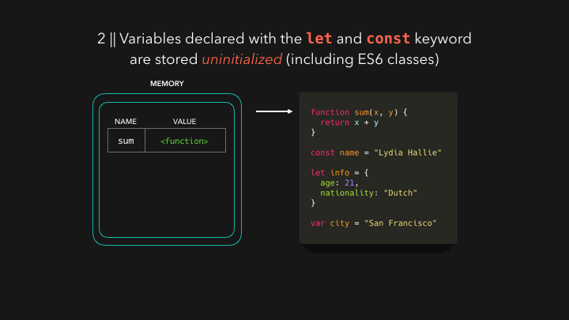
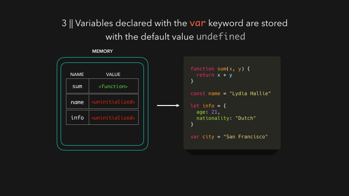
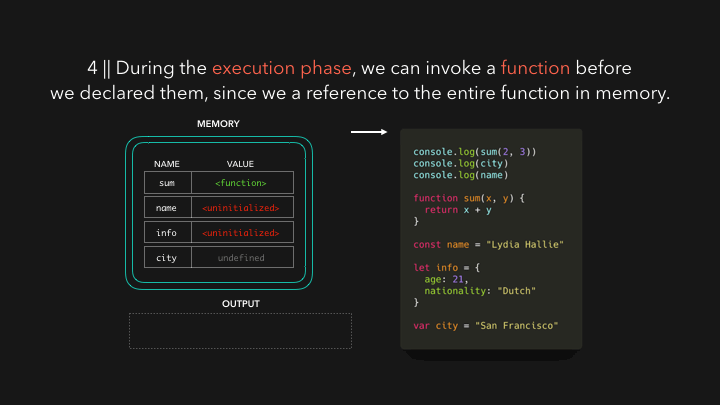
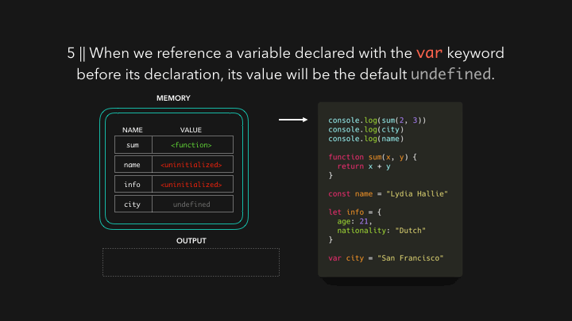
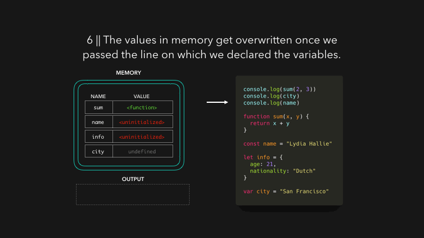

大家好，我是**TianTian**。

今天要分享的内容是JS中的**变量提升（Hoisting）**。

前几天，一个大二的学妹跑来问我，拿了到**不简单**的题目来质问我，发现里面正是有**变量提升**。

关于变量提升的文章，太多了，之所以拿出来说，推荐的原因在于:

> 通过几张动图的形式，就把这个过程描述清楚了，太有趣了。

精力有限，图片并非本人制作，如有侵权，会删除滴～

## Hoisting的定义

首先，看看mdn对它的解读:

> 变量提升（Hoisting）被认为是， Javascript中执行上下文 （特别是创建和执行阶段）工作方式的一种认识。在 [ECMAScript® 2015 Language Specification](https://www.ecma-international.org/ecma-262/6.0/index.html) 之前的JavaScript文档中找不到变量提升（Hoisting）这个词。不过，需要注意的是，开始时，这个概念可能比较难理解，甚至恼人。

我们可以理解成，在编译的阶段，js引擎帮我们把**变量和函数的声明**放在最前面，但实际上变量和函数声明在代码里的位置是不会动的。

知道了个大概后，我们从流程上来说说吧。

## 创建阶段

当JS引擎得到我们的脚本时，它做的第一件事就是为我们代码中的数据设置内存。在这一点上没有**执行任何代码**，它只是在为执行准备一切。函数声明和变量的存储方式是不同的。函数是以对整个函数的引用来存储的。

我们可以看到图中的内容，但是如果这个时候，遇到了变量会怎么样呢，尤其是ES6中的**const和let**,让我们接着往下看:

从图中我们可以总结出来，用let，const声明的变量以**uninitialized**来存储的。

> 这里就解释了，为什么我们用let和const声明的，不能在它之前使用，也就是**暂时性死区**。

那用var关键字来声明的话，结果你猜到了嘛，我们来看图:

很显然，我们发现，用var关键字声明的变量是以默认值**undefined**来存储的。

> 这里是平时面试会被问到的一个考点，现在看来不过如此。

小结一下,他们的区别:

- 用var关键字声明的变量是以默认值**undefined**来存储的。
- 用let，const声明的变量以**uninitialized**来存储的。

现在，**创建阶段已经完成**，我们可以实际执行代码了。

让我们看看，如果我们在声明函数或任何变量之前，在文件顶部有3个console.log语句，会发生什么。

------

## 执行阶段

由于函数是以对整个函数代码的引用来存储的，我们甚至可以在创建函数的那一行之前调用它们，我们来看看结果是怎么样的:

我们发现，输出的内容是5，也就是能够正常的运行，那么遇到var声明的变量呢，我们来看图:

我们从结果中可以看到，当我们引用一个在其声明前用var关键字声明的变量时，它将简单地返回其存储的默认值：**undefined**。

这就是我们说的怪异行为，所以我们尽可能的不去使用它，让代码更加的规范。

这个时候，ES6中引出了**const和let**。

它的提出，就是为了防止意外地引用未定义的变量，就像我们用var关键字一样，每当我们试图访问未初始化的变量时，我们希望它会抛出一个**ReferenceError**。

这也就是我们通常意义上所说的暂时性死区，我们引用const定义的变量，在声明前调用，就会出现**Error**。

接下来的步骤，就如我们看到的那样子,当引擎通过我们实际声明变量的那一行时，内存中的值会被我们实际声明的值所**覆盖**，如下图所示:

------

## 小结

看完整个流程后，是不是更加清晰这个过程啦～

做个小结:

- 在我们执行代码之前，函数和变量被存储在内存中，以获得一个执行环境。这就是所谓的**Hoisting**。
- 函数是以对整个函数的引用来存储的，带有var关键字的变量的值是未定义的，带有let和const关键字的变量是未初始化的。

-----

## 最后

今天分享的内容关于Hoisting（变量提升），或许对你有那么一点点帮助。

面试题交流群持续开放，已经分享了近 **许多** 个面经。

加我微信: **DayDay2021**，备注面试，拉你进群～

我是 **TianTian**，我们下篇见~

