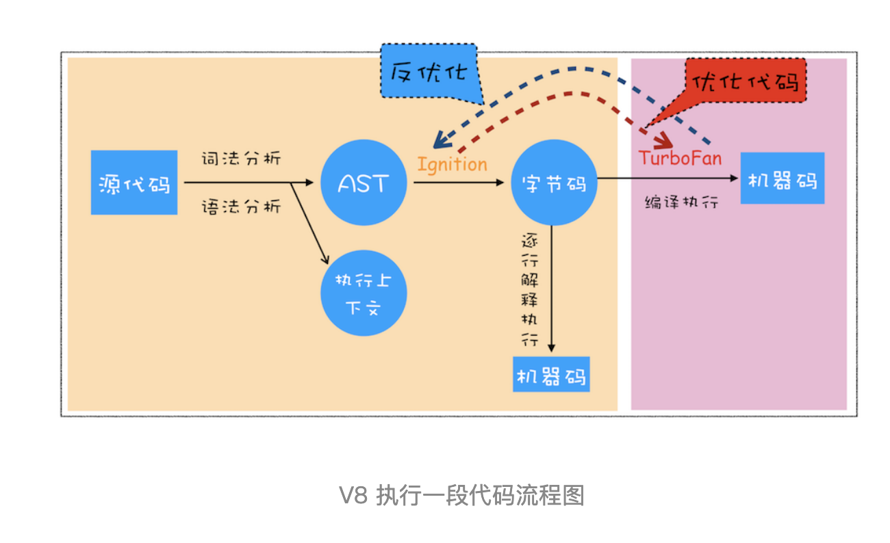
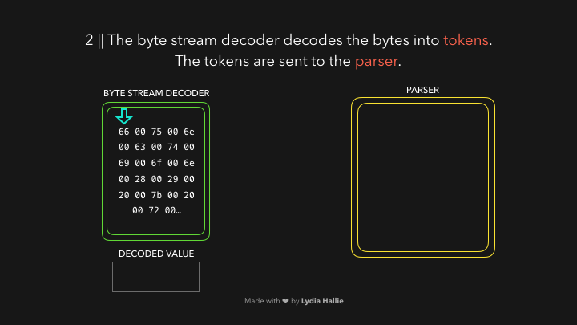
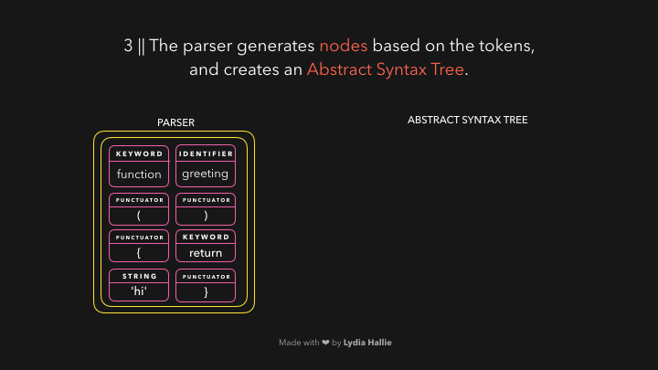
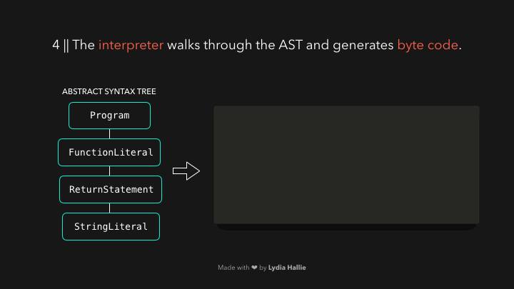

## 前言

这是一篇不错的文章，我强烈推荐的原因在于:

> 在用**动图的形式**生动形象的讲述了**JavaScript引擎基本原理**。

图片制作并非本人，如有侵权，会删除。

接触了前端这么久以来，你每天跟JS打交道，你肯定也和我一样认为JavaScript很酷。但机器怎么能真正**理解**你写的代码呢？

由上面的思考点,才引出此文:

带你了机一下JavaScript引擎的基本原理，看看它是如何处理我们对人类友好的JS代码，并将其转化为机器所能理解的东西。

作为JavaScript的开发者，清楚明白它的过程，绝对是一件好事情。

## 基本概念

在这之前，我们得了解一些JS引擎的基础知识。

什么是JS引擎，它帮我们做了什么事情呢？

我们都知道，我们写得代码，经过处理，交给CPU，它是不认识的，无法去执行。而CPU认识的是**自己的指令集**，指令集对应的是汇编代码。我们不可能去编写这些指令集，于是乎，它出现了:

**JavaScirpt引擎可以将JS代码编译为不同CPU(Intel, ARM以及MIPS等)对应的汇编代码**，这样我们才不要去翻阅每个CPU的指令集手册。

当然了，编译代码不是它的唯一功能，比如代码的执行，分配内存，垃圾回收机制都是它工作的。

对它有了一个大致的认识，那我们常见的JS引擎有哪些呢？我发现，最知名的肯定是**V8**，至于一些其他的，感兴趣的可以去查一查资料，

比如还有:

- [SpiderMonkey](https://developer.mozilla.org/en-US/docs/Mozilla/Projects/SpiderMonkey) (Mozilla)
- [JavaScriptCore](https://developer.apple.com/documentation/javascriptcore?language=objc) (Apple)
- [Chakra](https://github.com/microsoft/ChakraCore) (Microsoft)
- IOT：[duktape](https://github.com/svaarala/duktape)、[JerryScript](https://github.com/jerryscript-project/jerryscript)

V8的内容太多了，篇幅有限，后续再出一篇文章聊一聊。

太出名了，所以这篇文章介绍的知识主要基于 Node.js 和基于 Chromium 的浏览器所用的 V8 引擎。

## 主要流程图

细节很多，所以主要分析的是主要的流程，如图:

从图上，我们可以总结一下几个点:

- 生成抽象语法树
  - 词法分析
  - 语法分析
- 生成字节码
- 执行代码
  - 即时编译
  - 内联缓存

-------

### 生成抽象语法树

HTML解析器遇到了一个带有源的脚本标签。这个源的代码会从**网络**、**缓存**或**已安装**的服务工作者那里加载。响应是请求的脚本作为字节流，由字节流解码器来处理。字节流解码器对正在下载的字节流进行解码。

#### 词法分析

生成抽象语法树的 **第一个阶段是分词（tokenize），又叫词法分析**。

字节流解码器会先从代码字节流中创建 **令牌 （token）**。

> 注：令牌可以理解为语法上不可能再分的，最小的单个字符或字符串)。

例如，**0066**解码为**f**，**0075**解码为**u**，**006e**解码为**n**，0063解码为**c**，**0074**解码为**t**，**0069**解码为**i**，**006f**解码为o，**006e**解码为**n**，接着后面是一个空格。然后你会发现，他们组合起来就是 **function**。

> 这是JavaScript中的一个保留关键字。

一个令牌被创建，并被发送到**解析器（parser）**。其余的字节流也是如此,具体如下图:

#### 语法分析

**第二个阶段是解析（parse），也叫语法分析**。

该引擎使用两个解析器：**预解析器和解析器**。为了减少加载网站的时间，该引擎试图避免解析那些不需要立即使用的代码。

> 预解析器处理以后可能会用到的代码，而解析器则处理立即需要的代码! 

如果某个函数只有在用户点击某个按钮后才会被调用，那么就没有必要为了加载网站而立即编译这段代码了。

如果用户最终点击了按钮，需要那段代码，它就会被送到解析器中。

解析器根据它从字节流解码器收到的标记创建节点。通过这些节点，它创建了一个**抽象语法树**或**AST**，如图:

值得思考的是，**AST**到底是什么呢？(到底是怎么样的一个数据结构呢,babel里面是不是也有这些概念呢)

接下来，是解释器的时间了，解释器浏览AST，并根据AST包含的信息生成字节代码。一旦字节码被完全生成，AST就会被删除，从而清除内存空间。最后，我们有了一个机器可以工作的东西。

--------

### 生成字节码

刚刚我们提到，解释器浏览AST，并根据AST包含的信息生成字节代码，那么它的过程是怎么样的呢？

大致上，你可以这么理解:

AST交给**解释器（interpreter）**，遍历整个AST，就会生成**字节码**。当字节码生成后，AST 便会被删除以节省内存空间。最终我们得到了更贴近 **机器码** 的 **字节码**。

> 这里的 **字节码** 是介于 **AST** 和 **机器码** 之间的一种代码，它还是需要通过 **解释器** 将其转换为 **机器码** 后才能执行

那我们通过一个图来看看它的过程吧:

### 代码执行

我们有了字节码后，就可以进入执行阶段了。

## 参考链接