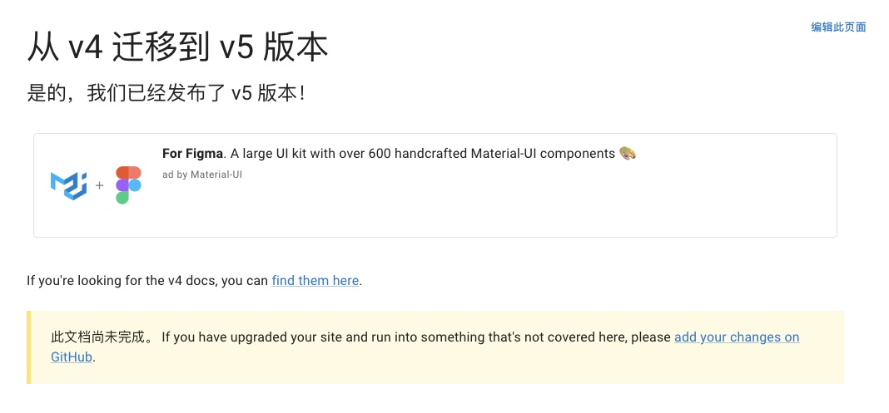
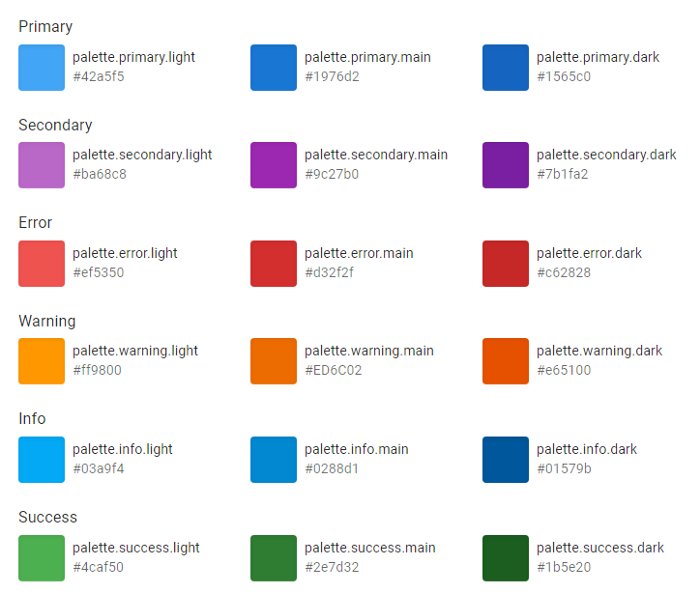
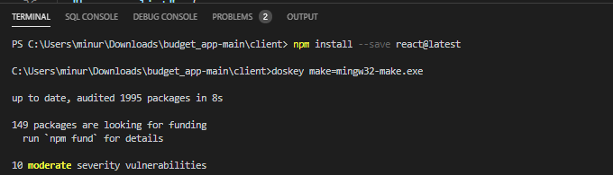
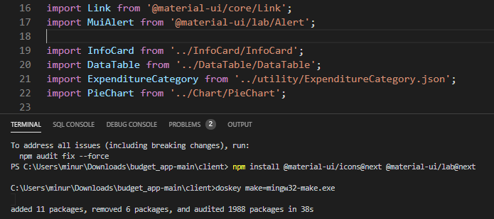
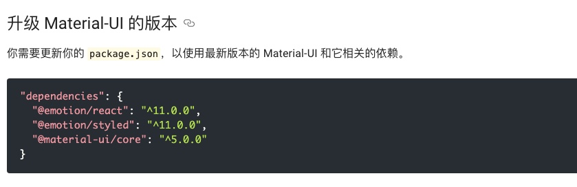
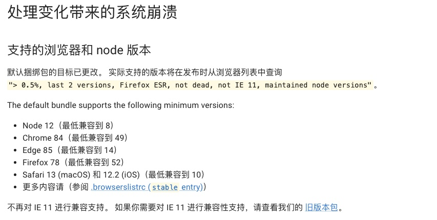

# Material-UI 5 即将推出


从官网我们可以看到此次版本的更新：




当你将 Material-UI 的 v4 版本升级到 v5 版本时，你应该参考哪些文章呢，这里肯定推荐的是官网的链接：

> https://next.material-ui.com/zh/guides/migration-v4/


Material-UI 4 发布已经快两年了，终于，Material-UI 5 来了。

我们今天来看看，到底推出哪些值得我们关注的信息。


## Material-UI 5 Prerelease 的新功能


### Codemod CLI的改进

它可以自动将Material-UI 4代码库迁移到最新的版本。它可以自动将Material-UI 4代码库迁移到最新的版本。

**codemod-cli**使用Codemod脚本与jscodeshift来帮助更新Material-UI的APIs。这个版本结合了将v4迁移到v5的所有基本转化器。


codemod只需要使用以下命令运行一次:

```bash
npx @material-ui/codemod@next v5.0.0/preset-safe <path|folder>
```

要了解有关 的更多信息`codemods-cli`，可以查看这个视频：

> https://www.youtube.com/watch?v=H9qtLutnT_g


### Switch Component

Material-UI团队推出了一个新的非风格化的组件，叫做Switch。这个Switch支持打开或关闭状态的切换，使其成为移动UI的理想选择。

这个Switch组件有两个版本。

- **Unstyled Switch**
- **useSwitch Hook**


对于**Unstyled Switch**组件的非风格化版本提供了大量定制的自由，同时保留了最小的捆绑尺寸。当你使用Unstyled Switch组件时，它可以使用任何造型方法，如基本的CSS类、CSS框架、Emotion库等来定制其外观和感觉。


同时我们来看看代码：


对于第二种方式，useSwitch Hook来说，也具有可定制性，它具有与**Switch Unstyled**组件相同的功能集，但没有组件、部件和组件Props道具。

我们如何使用它呢：

```js
import { useSwitch } from '@material-ui/unstyled/SwitchUnstyled';
```


### **更改默认颜色值**

Material-UI团队已经更新了信息、成功、和警告的默认颜色值，使之更容易被接受。你可以在文档中找到新的默认值。




### **Slider**的改变


如果你很想把你的Material-UI 4实现升级到这个较新的版本，让我们看看我们需要遵循的步骤。


## 遵循的点


###  更新React & TS

首先，将React升级到现有的最新版本，即React 17，因为它是Material-UI 5的最低要求。




### 更新Material-UI

然后，将 material-UI 版本升级到最新的 Material-UI 5 prerelease。下面的命令完成了这项工作:

```bash
npm install @material-ui/core@next @emotion/react @emotion
```


当你有`@material-ui/lab` 或 `@material-ui/icons`时，你需要将它们都更新到最新版本。




为了暂时过渡到版本5的prerelease版本，你需要安装或者更新@material-ui/styles（JSS），作为这个迁移过程的一部分。你可以通过使用下面的命令来完成它。

```bash
npm install @material-ui/styles@next
```

然后，package.json将看起来如下：




### 执行Codemode脚本

你可以在 "codemods-cli "中使用的脚本:

```bash
npx @material-ui/codemod@next v5.0.0/preset-safe <folder>
```

这是预设安全脚本,大多数有利于迁移的转换器都包含在这个`codemod`.

`codemod`建议每个文件夹只执行一次。有关更多详细信息，请参阅[Codemods](https://next.material-ui.com/guides/migration-v4/#variant-prop)指南。

> 指南：https://next.material-ui.com/guides/migration-v4/#variant-prophttps://next.material-ui.com/guides/migration-v4/#variant-prop)


完成 codemod 阶段后，尝试重新运行应用程序。它应该运行顺利，没有任何错误。


## 迁移makeStyles

从源代码中删除@material-ui/styles包是迁移过程的最后阶段。有2个推荐选项。

### 第一种：Use styled or sx API

尽管我们给出了一个codemod来帮助JSS样式迁移到styled API，但这种方法增加了CSS的特殊性，我们可以使用下面的命令：

```
npx @material-ui/codemod v5.0.0/jss-to-styled <folder|file>
```

### 第二种：Use tss-react

我们可以去npm上安装这个：

```bash
yarn add tss-react @emotion/react
```


> 注意：在完成所有样式的迁移过程后，使用下面的命令删除了所有不必要的@material-ui/styles。

```bash
npm uninstall @material-ui/style
```


通过这些步骤，您应该能够完成从 Material-UI 4 到 5 的迁移。


## 支持的浏览器

默认包支持以下最小版本：



默认情况下它不再与 Internet Explorer 11 兼容。如果您需要 Internet Explorer 11 支持，请查看带有 Material-UI的[旧包](https://next.material-ui.com/guides/minimizing-bundle-size/#legacy-bundle)。

> 旧包地址：https://next.material-ui.com/guides/minimizing-bundle-size/#legacy-bundle


根据[发布时间表](https://material-ui.com/versions/#release-schedule)，我们可以大致预计 Material-UI 第 5 版将在 2021 年 9 月左右发布。您最喜欢 Material-UI 的哪些新功能？在评论中告诉我。

**感谢阅读！！！**


