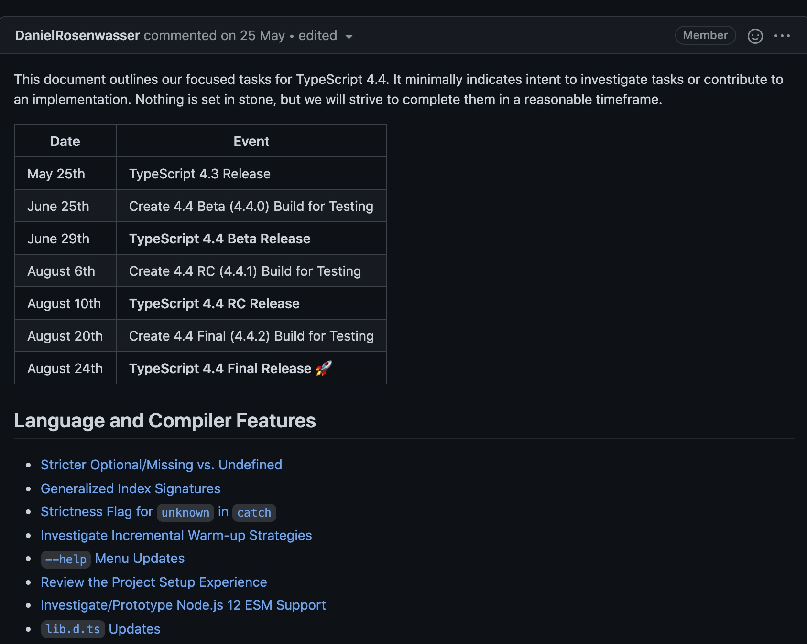
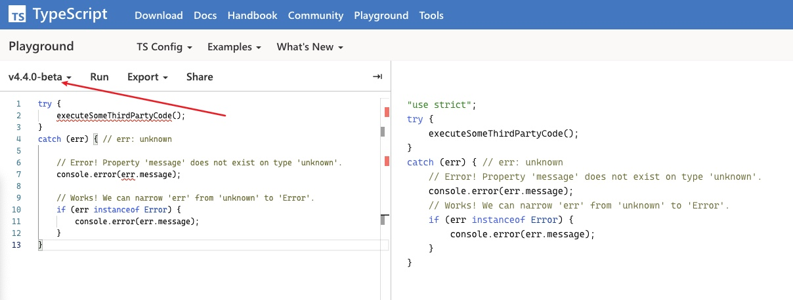

你好，我是**TianTian**。

前不久TS发布4.4的beat版本：


到底4.4的版本中有哪些features,我们可以参考下面的:

> 链接：https://github.com/microsoft/TypeScript/issues/44237



里面大致描述4.4版本发布的流程，预计8月底发布正式版本。


主要更新内容：

- 提供针对 Aliased Conditions 的控制流分析 (Control Flow Analysis)
- 增加 symbol 类型和模板字符串模式的索引签名
- Catch 语句中默认使用 `unknown` 类型 (`--useUnknownInCatchVariables`)
- 新增 Exact Optional Property 类型 (--exactOptionalPropertyTypes)
- 针对 `tsc --help` 的升级和改进
- 性能改进
- 添加针对 JavaScript 的拼写建议
- 新增实验性的 Inlay 提示
- 破坏性变更


比如，我们拿出一个例子来看。

### Catch 语句中默认使用 `unknown` 类型

经常写JavaScript都知道，任何类型的值都可以通过throw抛出后，在catch语句中捕获到，那么TypeScript中是如何做统一的呢，

其实经常写TS的都知道，很早的版本中，ts会将变量转化为any：

```tsx
try {
    // Who knows what this might throw...
    executeSomeThirdPartyCode();
}
catch (err) { // err: any
    console.error(err.message); // Allowed, because 'any'
    err.thisWillProbablyFail(); // Allowed, because 'any' :(
}
```

但是，有时候我们知道`unknown`类型会是更加的选择，所以我们可以在catch语句的时候使用`unknown`。

ts团队为了考虑到效率，还是其他的原因，我们可以通过设置为默认值，也就是说，类似于`--useUnknownInCatchVariables`将默认类型切换成`unknown`。

比如下面代码：

```js
// @useUnknownInCatchVariables: true

try {
  // ...
}
catch (e) {
  e.toUpperCase(); // error
}

```

或者，选择一个更加股广泛的标志？这些我们都期待正式版本的到来。


那么你是不是想来试一试TS4.4测试版本的功能呢，我们可以借助这个TS中的Playground来体验下：




选择对应的版本即可。


至于其他的更新以及优化，比如**更快的构建**，会在构建上做优化，让开发体验更佳。比如`lib.d.ts`的修改等等

更多的信息，赶紧去看看吧:

> https://github.com/microsoft/TypeScript/issues/44237

