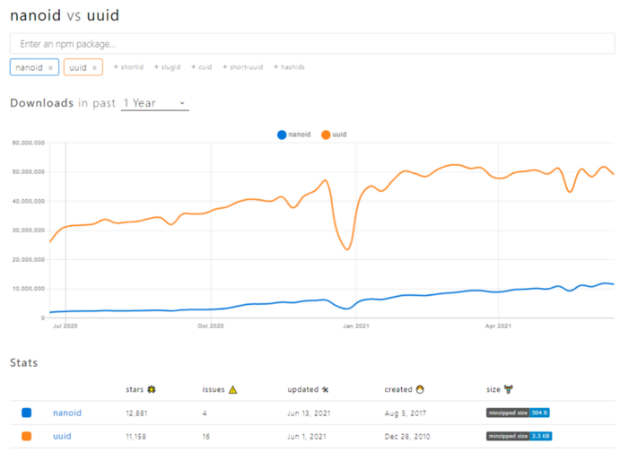
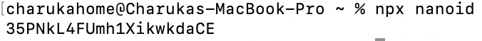
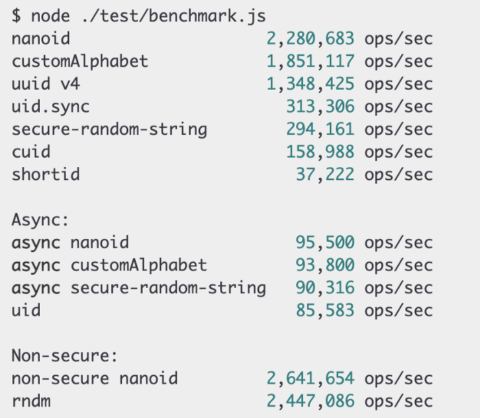

一个微小的、适合于URL的唯一字符串生成器，用于JavaScript。


UUID是软件开发中最常用的通用标识符之一。然而，在过去的几年里，其他的替代品挑战了它的存在。
其中，NanoID是接替UUID的主要竞争者之一。
因此，在这篇文章中，我将讨论NanoID的特点，它的闪光点，以及它的局限性，让你更好地了解何时使用它。


## 了解NanoID和它的用法

当涉及到JavaScript时，生成UUID或NanoID是非常直接的。它们都有NPM包来帮助你完成。


你所需要做的就是使用**npm i nanoid**命令安装NanoID NPM库，并在你的项目中使用它。


```js
import { nanoid } from 'nanoid';
model.id = nanoid();
```


> 你知道NanoID每周有超过11,754K的NPM下载量，并且比UUID快60%吗？


此外，NanoID比UUID年轻了将近7年，而且它的GitHub星级已经超过了UUID。


下图显示了这两者之间的npm趋势对比，我们可以看到NanoID的上升趋势，而UUID的进展则很平缓。




我希望这些数字已经说服你尝试 NanoID。

但是，这两者之间的主要区别很简单，它归结为键使用的**字母表**。

由于 NanoID 使用比 UUID 更大的字母表，因此较短的 ID 可以用于与较长的 UUID 相同的目的。

那么具体有哪些区别呢？


## 六个区别

列举了六个区别，可以参考一下。


### NanoID 大小只有 108 字节

与 UUID 不同，NanoID 的大小要小 4.5 倍，并且没有任何依赖关系。此外，大小限制已将大小从另外 35% 减小。

大小减少直接影响数据的大小。例如，使用 NanoID 的对象小而紧凑，用于数据传输和存储。

随着应用程序的增长，这些数字变得可见。


### 更安全

在大多数的随机生成器中，他们使用不安全的Math.random()。但是，NanoID使用[crypto module](https://nodejs.org/api/crypto.html)和[Web Crypto API](https://developer.mozilla.org/en-US/docs/Web/API/Web_Crypto_API)，这是更安全的。

另外，NanoID在实现ID生成器的过程中使用了它自己的算法，称为**统一算法**，而不是使用随机%的字母表。


Web Crypto API ：https://developer.mozilla.org/en-US/docs/Web/API/Web_Crypto_API

crypto module： https://nodejs.org/api/crypto.html

统一算法：https://github.com/ai/nanoid/blob/main/index.js


### 快速紧凑

NanoID比UUID快60%。在UUID的字母表里有36个字符，而NanoID只有21个字符。

```
0123456789ABCDEFGHIJKLMNOPQRSTUVWXYZ_abcdefghijklmnopqrstuvwxyz-
```

此外，NanoID支持14种不同的编程语言，它们是：

```
C#, C++, Clojure and ClojureScript, Crystal, Dart & Flutter, Deno, Go, Elixir, Haskell, Janet, Java, Nim, Perl, PHP, Python with dictionaries, Ruby , Rust, Swift
```


### 兼容性

它还支持PouchDB、CouchDB WebWorkers、Rollup，以及React和Reach-Native等库。

你可以通过使用npx nanoid在终端获得一个唯一的ID。唯一的先决条件是要安装NodeJS。




此外，你也可以在Redux工具包内找到NanoID，并将其用于其他使用情况，如下所示。

```js
import { nanoid } from ‘@reduxjs/toolkit’
console.log(nanoid()) //‘dgPXxUz_6fWIQBD8XmiSy’
```


### 自定义字母

NanoID的另一个现有特点是它允许开发者使用自定义字母。你可以改变字面意思或ID的大小，如下所示:

```js
import { customAlphabet } from 'nanoid';
const nanoid = customAlphabet('ABCDEF1234567890', 12);
model.id = nanoid();
```

在上面的例子中，我定义了一个自定义字母ABCDEF1234567890，Id的大小为12。


### 没有第三方依赖性

由于NanoID不依赖于任何第三方的依赖，随着时间的推移，它变得更加稳定的自我管理。
从长远来看，这有利于优化包的大小，并使其不容易出现依赖性带来的问题。


## 局限性和未来


### 局限性

根据 StackOverflow 中的许多专家意见，使用 NanoID 没有明显的缺点或限制。

非人类可读是许多开发人员在 NanoID 中看到的主要缺点，因为它使调试变得更加困难。但是，与 UUID 相比，NanoID 更短且可读。

另外，如果你使用NanoID作为表的主键，如果你使用同一列作为聚类索引，就会出现问题。这是因为NanoID不是顺序的。





上述基准测试显示了 NanoID 与其他主要 id 生成器相比的性能。

> 它可以使用默认字母表每秒生成超过 220 万个唯一 ID，使用自定义字母表时每秒可以生成超过 180 万个唯一 ID。


根据我使用 UUID 和 NanoID 的经验，考虑到它的小尺寸、URL 友好性、安全性和速度，我建议在任何未来的项目中使用 NanoID 而不是 UUID。


**感谢阅读！！！**


## 参考

https://blog.bitsrc.io/why-is-nanoid-replacing-uuid-1b5100e62ed2