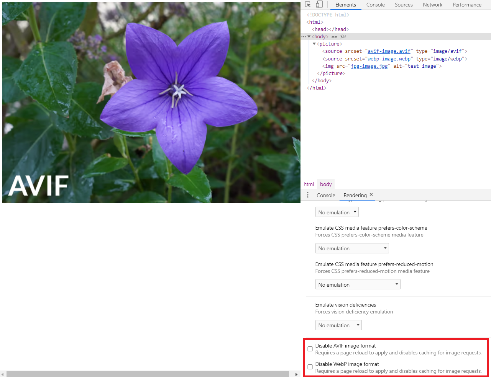

## 前言


在用户界面中使用图片和动画已经成为现代网络应用的一个普遍现象。尽管这些现代设计的重点是改善你的应用程序的用户体验，但如果这些图像对所有设备都没有响应，事情就会变得适得其反。


作为开发者，我们必须满足所有这些要求。但大多数时候，我们错过了一些小东西，而这些小东西可以带来巨大的差异，因为我们正在寻找更高层次的解决方案。


在**picture**标签和**img**标签之间做出选择可能是这样一个微小的决定，但如果你做出正确的选择，你将能够改善用户体验和性能。

本文将讨论**picture**和img标签的区别，以及是什么让**picture**标签比img标签更突出。


下次你创建一个React picture组件时，一定要在其中实现你即将学到的最佳实践。根据收到的prop返回正确的标签，并照顾到所有必要的回退。


## img标签存在的问题


众所周知，在相当长的一段时间内，Img标签一直是HTML的核心元素之一，它的简单性和可用性一直没有受到怀疑。

然而，随着各种屏幕尺寸、分辨率的设备的发展，以及复杂的用户需求，人们开始对它的响应能力和在多设备应用中的使用能力产生了疑问。

所有这些问题可以归纳为两个主要问题。

- 分辨率切换--为窄屏幕设备提供较小尺寸图像的问题。
- 艺术指导 - 在不同的屏幕尺寸上显示不同的图像的问题。

现在，让我们看看这些问题是如何被解决的以及**picture**标签的附加功能。


---


## 分辨率切换

> 使用srcset和 sizes属性进行分辨率切换。

正如我前面提到的，现代的网页设计师经常使用高分辨率的图片来增加用户的吸引力。但作为开发者，我们必须非常小心地选择正确的HTML元素。

假设你用一个简单的Img标签来处理高分辨率的图片。在这种情况下，在你的应用程序运行的每个设备中都会使用相同的图像，事实上，这将导致在屏幕分辨率较低的设备（如移动设备）中出现性能问题。


这可能导致更长的图像加载时间和从上到下的部分图像加载。


这个问题可以通过使用**srcset**和 **sizes**属性在**picture**标签上轻松解决。

```html
<picture>
   <source
      srcset="small-car-image.jpg 400w,
              medium-car-image.jpg 800w,
              large-car-image.jpg 1200w"
      sizes="(min-width: 1280px) 1200px,
             (min-width: 768px) 400px,
             100vw"
   >
   
</picture>
```


srcset属性接受多张图片，其各自的宽度为像素，浏览器使用这些值在所提供的图片中进行选择。

在上面的例子中，有3个不同尺寸的同一图像的版本。

sizes属性定义了图像在屏幕上所占的空间。在上面的例子中，如果屏幕的最小宽度是1280px，图像将占据1200px。

说到这里，我们建议不要仅仅为了分辨率切换而使用**picture**标签，因为同样的事情可以通过Img标签的更新版本来实现（它有更多的浏览器支持）。

```html

```

但是，在大多数情况下，我们需要同时处理分辨率切换和艺术指导，而**picture**标签是最好的解决方案。

因此，让我们看看如何使用**picture**标签来解决这些问题的。


---


## 使用media属性

主要想法是根据设备的屏幕尺寸来显示不同的图像。在大多数情况下，一张在大屏幕上看起来非常漂亮的图片，当你切换到移动端时，可能会被裁剪或看起来非常小。

我们可以通过为不同的屏幕尺寸提供不同版本的图像来解决这个问题。这些不同的版本可以是横向的，纵向的，或者是同一张图片的任何定制版本。

有了**picture**标签，我们可以通过在**picture**标签内使用多个源标签来轻松实现分辨率切换。


```html
<picture>
   
   <source ....>
   <source ....>
   <source ....>
</picture>
```

然后我们可以使用media属性来定义不同的媒体条件，这些来源将被使用。我们还可以像上一节讨论的那样，以类似的方式使用srcset和 sizes属性。


下面的例子显示了一个使用**picture**标签和分辨率切换的完整例子。


```html
<picture>
     
   <source media="(orientation: landscape)"
             
      srcset="land-small-car-image.jpg 200w,
              land-medium-car-image.jpg 600w,
              land-large-car-image.jpg 1000w"
             
      sizes="(min-width: 700px) 500px,
             (min-width: 600px) 400px,
             100vw">
     
   <source media="(orientation: portrait)"
             
      srcset="port-small-car-image.jpg 700w,
              port-medium-car-image.jpg 1200w,
              port-large-car-image.jpg 1600w"
             
      sizes="(min-width: 768px) 700px,
             (min-width: 1024px) 600px,
             500px">
     
   
</picture>
```

如果屏幕方向是横向，浏览器将显示第一组图片，如果方向是纵向，浏览器将使用第二组图片。除此之外，你还可以使用带有最大宽度和最小宽度参数的媒体属性。

```html
<picture>
     <source media="(max-width: 767px)" ....>
     <source media="(min-width: 768px)" ....>
</picture>
```

最后一个img标签是为了向后兼容那些不支持图片标签的浏览器。

-----


## 使用部分支持的图像类型

随着技术的快速发展，不同类型的现代图像类型被逐日引入。其中一些类型，如webp、svg和avif，提供了更高的用户体验水平。

另一方面，一些浏览器对这些现代图像类型有限制，如果我们不使用兼容的图像类型，事情就会适得其反。

但是，我们可以通过使用**picture**标签轻松地解决这个问题，因为它允许我们在其中包含多个来源。


```html
<picture>
  <source srcset="test.avif" type="image/avif">
  <source srcset="test.webp" type="image/webp">
  
</picture>
```

上面的例子包括avif、webp和png三种格式的图片。首先，浏览器将尝试avif格式，如果失败，它将尝试webp格式。如果浏览器不支持这两种格式，它将使用png图像。


> 当Chrome宣布 "DevTools将在渲染标签中提供两种新的模拟，以模拟部分支持的图像类型 "时，关于图片标签的事情变得更加有趣。

从Chrome 88开始，你可以使用Chrome DevTools来检查浏览器对图片类型的兼容性。





## 小结

尽管我们谈到了为什么图片标签比img标签更突出，但我必须坚持认为，img标签并没有死，也不会很快死。

如果我们明智地使用所提供的属性，如srcset和size，我们可以从img标签中获得最大的收益。例如，我们可以只使用img标签来解决分辨率切换问题。


另一方面，我们可以使用媒体查询和其他提供的属性，使用图片标签来轻松实现分辨率切换和艺术指导。

对部分支持的图片类型的处理能力和Chrome开发工具的支持可以被认为是图片标签的额外加分项。

然而，这两个元素都有其优点和缺点。因此，我们必须仔细考虑并根据我们的要求使用最合适的元素。

**谢谢您的阅读！！！**


## 参考

https://blog.bitsrc.io/why-you-should-use-picture-tag-instead-of-img-tag-b9841e86bf8b