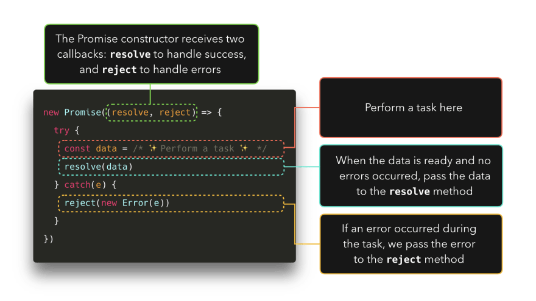
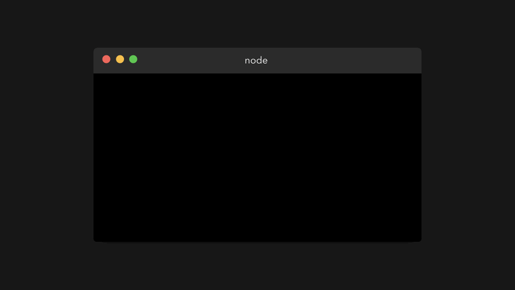
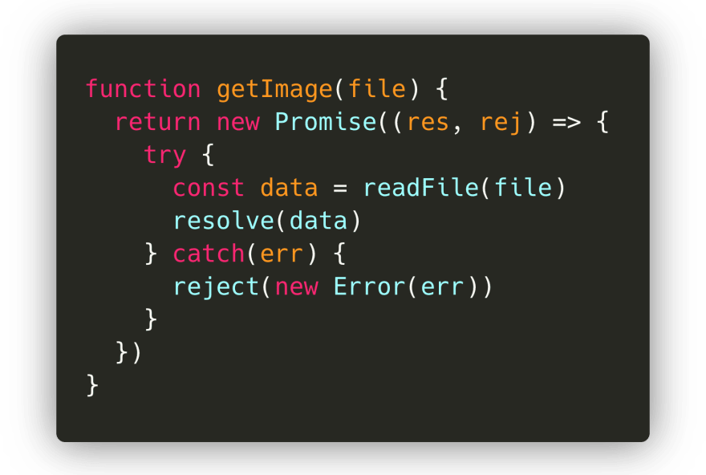
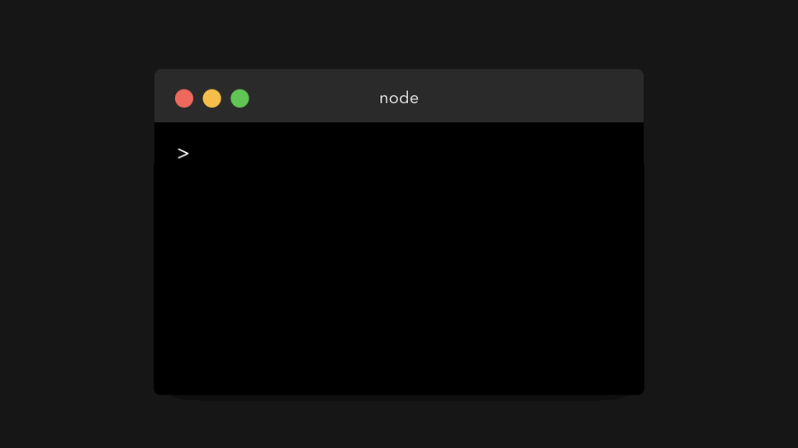
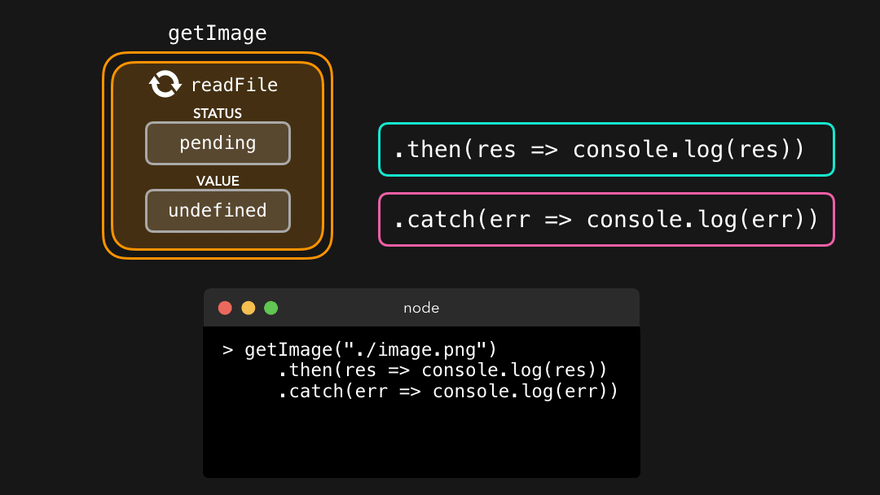
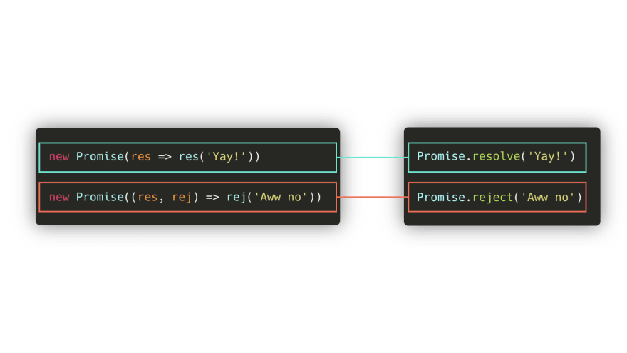
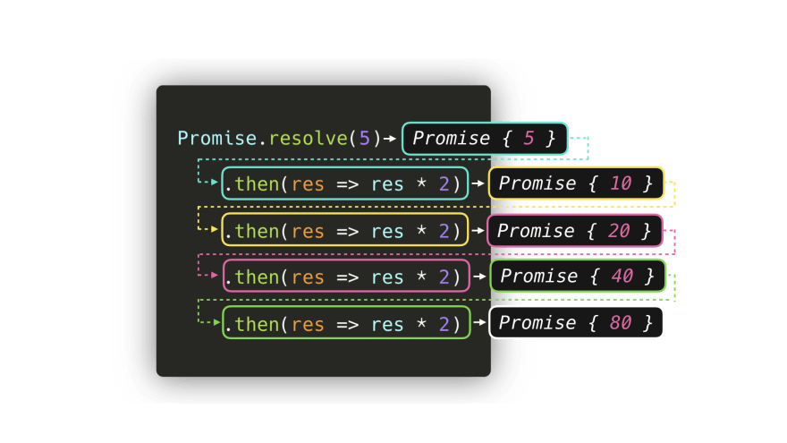
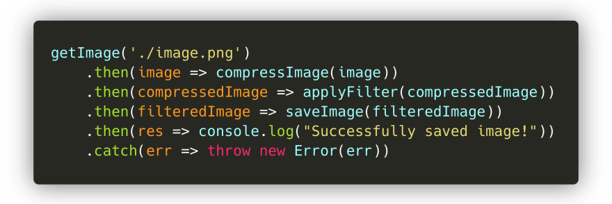
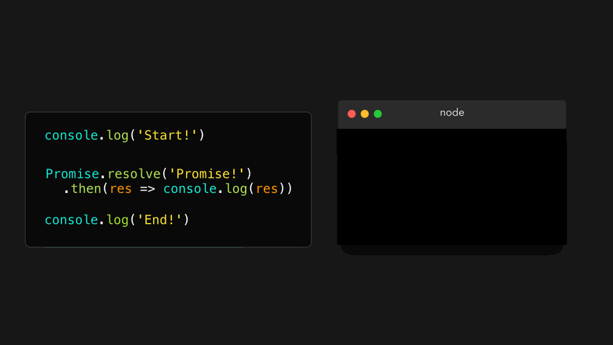

## Promise是什么

你还记得你是怎么接触异步编程的吗，从callback开始的呢，还是Promise，还是从async，await开始的。无论你接触哪一种，异步编程模式，在前端开发过程中，显得越来越重要。今天我们来说一说**Promise**。

本文需要探究的是:

你为什么要使用它们，它们在 "引擎 "下是如何工作的，以及我们如何以最现代的方式编写它们？

个人精力有限，借鉴了网上不错的动图，一定可以让你更加容易明白的，那我们开始吧。

## 介绍Promise

在编写JavaScript时，我们经常要处理一些依赖其他任务的任务。比方说，我们想得到一张图片，对它进行压缩，应用一个过滤器，然后保存它。

大致的流程如下:

我们需要做的第一件事，是获得我们想要编辑的图片。一个getImage函数可以解决这个问题。只有当图片被成功加载后，我们才能将该值传递给resizeImage函数。当图像被成功调整大小后，我们要在applyFilter函数中对图像应用一个过滤器。在图像被压缩并添加了一个过滤器后，我们要保存图像，并让用户知道一切工作都是正确的!

注意到这里有什么吗？虽然它......很好，但也不是很好。我们最终会出现许多嵌套的回调函数，这些函数依赖于前一个回调函数。这通常被称为回调地狱，因为我们最终会出现大量的嵌套回调函数，使代码相当难以阅读。

这个时候，Promise登场了。

## Promise语法

ES6引入了承诺。在许多教程中，你会读到这样的内容:

> "Promise是一个值的占位符，可以在未来的某个时间解决或拒绝"。

其实我是懵逼的，这解释得到底是啥玩意，抱着摸索的态度，决定继续往下看。

我们可以创建一个承诺，使用一个接收回调的**Promise**构造函数。好的，很酷，让我们试试吧:

可以看到送回来的内容，可以发现它是一个对象。里面包含了**状态**(`[[PromiseStatus]]`) 以及一个为定义的值(`[[PromiseValue]]`)。在上面的例子中，上面的例子中，你可以看到是**pending**状态以及**undefined**。

PromiseStatus的值，即状态，可以是三个值之一。
✅ fulfilled: 承诺已被解决。一切都很顺利，承诺中没有发生错误。
❌ rejected：承诺被拒绝。
⏳ pending: 承诺既没有解决也没有拒绝（还没有），承诺仍在等待。

在上面的例子中，我们只是把简单的回调函数（）=>{}传递给了Promise构造器。然而，这个回调函数实际上接收了两个参数。第一个参数的值，通常称为resolve或res，是Promise应该**成功**要调用的方法。第二个参数的值，通常被称为reject或rej，是当Promise应该**拒绝、出错**时要调用的值方法。

让我们试着看看，当我们调用resolve或reject方法时，会不会被记录下来! 在我的例子中，我调用了resolve方法res，和reject方法rej。

从图中可以发现，我们终于知道如何摆脱 "**pending** "状态和**undefined**的值了! 如果我们调用了resolve方法，承诺的状态就是 "履行"，如果我们调用了rejective方法，承诺的状态就是 "拒绝"。

Promise中的值，即[[PromiseValue]]的值，是我们传递给解决方法或拒绝方法作为其参数的值。

## Promise能干什么

好了，现在我们对如何控制Promise对象有了一点了解。但它是用来做什么的呢？

在介绍部分，我展示了一个例子，在这个例子中，我们得到了一张图片，对它进行了压缩，应用了一个过滤器，并将其保存起来！在这个例子中，我们可以看到，我们的图片被压缩了。最终，这变成了一个嵌套的回调混乱。

我们尝试用Promise来改造一下这个结果:

如果图片被加载并且一切正常，让我们用加载的图片来解决这个承诺吧。否则，如果在加载文件时某个地方出现了错误，让我们用发生的错误来拒绝承诺。

让我们看看在终端中运行它会发生什么！

返回的结果就是我们期待的值，并且把数据返回给我们了。

不过有个问题，我们需要注意，我们并不关心整个承诺对象，我们只关心数据的值。幸运的是，有一些内置的方法来获取一个承诺的值。对于一个承诺，我们可以附加3个方法。

- .then()。在一个承诺解决后被调用。
- .catch()。在一个承诺被拒绝后被调用。
- .final()。总是被调用，无论承诺是否被解决。

then方法接收传递给resolve方法的值。

最后，我们可以拿到我们想到的值，完成我们需要的工作。

顺便说一下，当你知道一个承诺将总是解决或总是拒绝时，你可以写Promise.resolve或Promise.reject ，并加上你想拒绝或解决该承诺的值。

在getImage的例子中，我们最终不得不嵌套多个回调，以便运行它们。幸运的是，.then处理程序可以帮助我们解决这个问题。
.then的结果本身是一个承诺值。这意味着我们可以根据自己的需要来链接多个.then：前一个then回调的结果将作为参数传递给下一个then回调。

在getImage的例子中，我们可以将多个then回调链接起来，以便将处理后的图像传递给下一个函数！而不是以许多嵌套的回调结束，我们得到一个干净的然后链。

写到这里后，我们已经发现这种语法看起来比嵌套回调更好。

## 微任务和（宏）任务

我们了解了Promise后，让我们来说说其他的，首先让我们在脚本中增加一些代码，并再次运行它。

