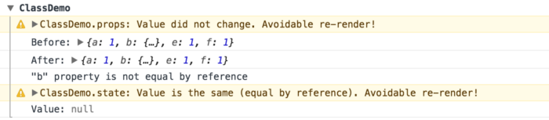
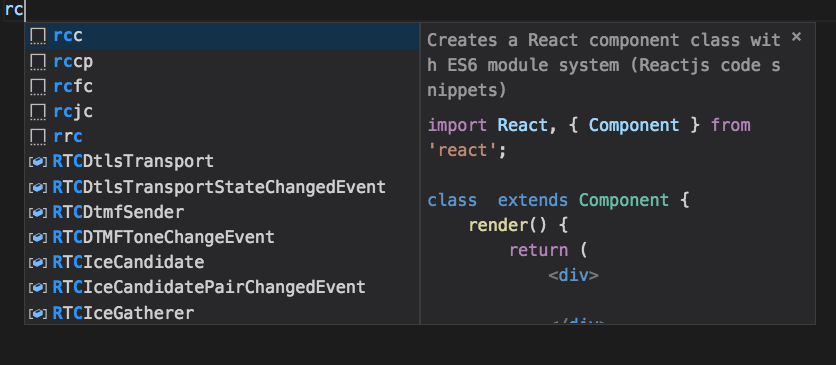
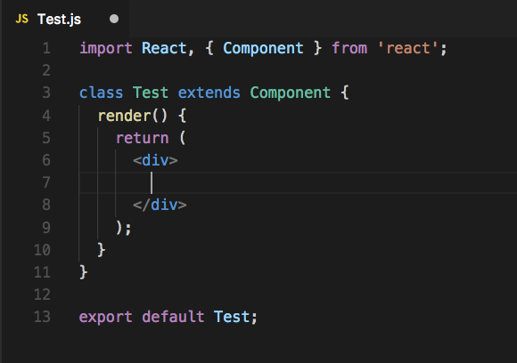

在React中编写更好的代码的9个有用的提示。了解关于Linting、propTypes、PureComponent和更多。


## 正文

React使创建交互式UI变得不费力。为你的应用程序中的每个状态设计简单的视图，当你的数据发生变化时，React会有效地更新和渲染正确的组件。

在这篇文章中，我将向你展示一些提示，以帮助你成为一个更好的React开发者。

我将涵盖从工具到实际代码风格的一系列东西，这可以帮助你提高你的React技能💪

主要有以下几个方面：

- 代码提示。
- 使用propTypes和defaultProps。
- 知道什么时候要创建新的组件。
- 知道何时编写Component、PureComponent和无状态功能组件。
- 使用React开发工具。
- 在你的代码中使用内联条件语句。
- 使用Snippet，代码片段库。
- 了解React如何工作。


-----


## 代码提示

对于编写更好的代码来说，有一件事是非常重要的，那就是良好的提示。

因为如果我们有一套好的**Linting规则**，你的代码编辑器将能够捕捉到任何有可能导致你的代码出现问题的东西。
但不仅仅是捕捉问题，你的ES Lint设置将不断使你了解React的最佳实践。

```react
import react from 'react';
/* Other imports */

/* Code */

export default class App extends React.Component {
  render() {
    const {userIsLoaded, user} = this.props;
    if (!userIsLoaded) return <Loader />;
    
    return (
      /* Code */
    )
  }
}
```

以上面的代码片段为例。假设你想在render()函数中引用一个名为this.props.hello的新属性。你的linter会立即变红并说：

```js
'hello' is missing in props validation (react/prop-types)
```

Linting将帮助你意识到React中的最佳实践，并塑造你对代码的理解。很快，你就会开始避免在写代码时犯错。

你可以去ESLint，为JavaScript设置一个品头论足的工具，或者你可以使用Airbnb的JavaScript风格指南。你也可以安装React ESLint软件包。

基本上这些代码提示都会帮助你纠正写代码时遇到的问题。

----


## propTypes and defaultProps

在前面的章节中，我谈到了当我试图传递一个未经验证的props时，我的linter是如何表现的：

```js
static propTypes = {
  userIsLoaded: PropTypes.boolean.isRequired,
  user: PropTypes.shape({
    _id: PropTypes.string,
  )}.isRequired,
}
```

在这里，如果我们说userIsLoaded不是必需的，那么我们就需要在代码中加入这个：

```js
static defaultProps = {
 userIsLoaded: false,
}
```

所以，无论何时我们的组件中使用了一个PropType，我们都需要为它设置一个propType。

例如，我们需要告诉React，userIsLoaded总是一个布尔值。

确保你在每一个使用props的组件上都设置了propTypes和defaultProps，将有很大的帮助。


当这些props没有得到它们所期望的数据时，你的错误日志会让你知道，你要么传入的东西不正确，要么期望的东西不存在，这使得错误的查找变得更加容易，特别是当你正在编写大量的可重复使用的组件时。这也使它们更有自我记录的能力。

**注意:**

与早期版本的React不同，**proptypes**不再包含在React内部，你必须将其作为一个依赖项单独添加到你的项目中。

点击这里了解更多:

> https://www.npmjs.com/package/prop-types


----


## 知道何时创建新组件

```js
export default class Profile extends PureComponent {
  static propTypes = {
    userIsLoaded: PropTypes.bool,
    user: PropTypes.shape({
      _id: PropTypes.string,
    }).isRequired,
  }

  static defaultProps = {
    userIsLoaded: false,
  }

  render() {
    const { userIsLoaded, user } = this.props;
    if (!userIsLoaded) return <Loaded />;
    return (
      <div>
        <div className="two-col">
          <section>
            <MyOrders userId={user.id} />
            <My Downloads userId={user._id} />
          </section>
          <aside>
            <MySubscriptions user={user} />
            <MyVotes user={user} />
          </aside>
        </div>
        <div className="one-col">
          {isRole('affiliate', user={user._id} &&
            <MyAffiliateInfo userId={user._id} />
          }
        </div>
      </div>
    )
  }
}
```

在这里，我有一个名为**Profile**的组件。在这个组件中还有其他组件，如**MyOrder**和**MyDownloads**。

现在我可以把所有这些组件都写在这里，因为我只是从同一个地方（用户）提取数据，把所有这些小组件变成一个巨大的组件。


虽然没有任何硬性规定何时将你的代码移到一个组件中，但是不是存在一些问题:

- 你的代码的功能是否变得笨重了？
- 它是否代表它自己的东西？
- 你是否打算重复使用你的代码？


如果这些问题中的任何一个答案是肯定的，那么你就需要把你的代码移到一个组件中去。

请记住，任何人都不希望在你的代码中看到一个巨大的200-300行的组件，里面充满了。。。


## 组件 VS 纯组件 VS 无状态功能组件

对于一个React开发者来说，知道什么时候在代码中使用Component、PureComponent和无状态功能组件是非常重要的。

你可能已经注意到在上面的代码片段中，我没有将Profile声明为Component，而是将其称为PureComponent。

首先，让我们来看看无状态功能组件。


### 无状态的功能组件

```react
const Billboard = () => (
  <ZoneBlack>
    <Heading>React</Heading>
    <div className="billboard_product">
      <Link className="billboard_product-image" to="/">
        
      </Link>
      <div className="billboard_product-details">
        <h3 className="sub">React</h3>
        <p>Lorem Ipsum</p>
      </div>
    </div>
  </ZoneBlack>
);
```

无状态功能组件是你库中最常见的组件类型之一。它们为我们提供了一种很好的、简洁的方式来创建不使用任何种类的状态或生命周期方法的组件。

无状态函数式组件的理念是，它是无状态的，只是一个函数。这样做的好处是，你将你的组件定义为一个返回一些数据的恒定函数。

简单地说，无状态的功能组件只是返回JSX的函数。


### 纯组件

通常情况下，当一个组件得到一个新的props时，React会重新渲染这个组件。但有时，一个组件得到的新props并没有真正改变，但React仍然会触发重新渲染。

使用**PureComponent**将帮助你防止这种浪费的重新渲染。例如，如果一个props是字符串或布尔值，并且它发生了变化，**PureComponent**就会识别出来，但如果一个对象内的属性发生了变化，PureComponent就不会触发重新渲染。

那么，你如何知道React何时会触发不必要的重新渲染？你可以看看这个神奇的React包，叫做**Why Did You Update**。这个包会在潜在的不必要的重新渲染发生时在控制台中通知你。




一旦你认识到一个不必要的重新渲染，你可以使用PureComponent而不是Component来防止事情发生不必要的重新渲染。

Why Did You Update 点这里：

> https://github.com/maicki/why-did-you-update


---


## 使用React Dev Tools

如果你真的想成为一个专业的React开发者，那么使用React开发工具应该是你开发过程中的常规做法。

React Dev Tools让你可以访问你的React应用的整个结构，让你看到应用中使用的所有道具和状态。

React Dev Tools是探索我们的React组件的一个很好的方法 组成部分，并帮助诊断你的应用程序中的任何问题。


---


## 使用内联条件语句

这个观点可能会引起一些人的不满，但我发现，使用内联条件语句可以大大清理我的React代码。


看一下这个代码片段：

```react
<div className="one-col">
  {isRole('affiliate', user._id) &&
    <MyAffiliateInfo userId={user._id} />
  }
</div>
```

在这里，我有一个基本的函数被调用，检查一个人是否是 "affiliate"，然后是一个名为 **< MyAffiliateInfo/ >** 的组件。


这一点的好处是:

- 我不需要写一个单独的函数。
- 我不需要在我的渲染函数中再写一个 "if "语句。
- 我不需要在组件中创建一个 "链接 "到其他地方。


编写内联条件语句是非常简单的。你首先要写出你的条件语句。你可以说 "true"，这样就会一直显示**< MyAffiliateInfo/ >**组件。


接下来，我们用&&将这个条件语句与**< MyAffiliateInfo/ >**连接起来。这样，只有当条件语句返回 "真 "时，该组件才会被显示出来。


---


## 使用代码片段库

打开一个代码编辑器（我使用VS Code），并创建一个.js文件。

在这个文件中，当你输入rc时，你会看到类似这样的东西。



点击进入，你会立即得到下面这段代码：



这些代码片段的好处是，它们不仅能帮助你潜在地保存错误，而且还能帮助你识别最新的语法。


有许多不同的代码片段库，可以安装在你的代码编辑器中。我在VS Code中使用的是ES7 React/Redux/React-Native/JS Snippets。


---


## 了解React如何工作

React Internals是一个由五部分组成的系列，它帮助我理解了React的最基本的知识，并最终帮助我成为一个更好的React开发者！它是一个很好的例子。


如果你遇到一些你可能没有完全理解的问题，或者你了解React是如何工作的，那么React Internals将帮助你理解在React中何时和如何正确做事。

这对那些有想法但不太知道在哪里执行代码的人特别有帮助。

了解React工作原理的基础知识将帮助你成为一个更好的React开发者。

点击链接：

> https://mattgreer.dev/articles/react-internals-part-one-basic-rendering/


## 参考

https://blog.bitsrc.io/how-to-write-better-code-in-react-best-practices-b8ca87d462b0