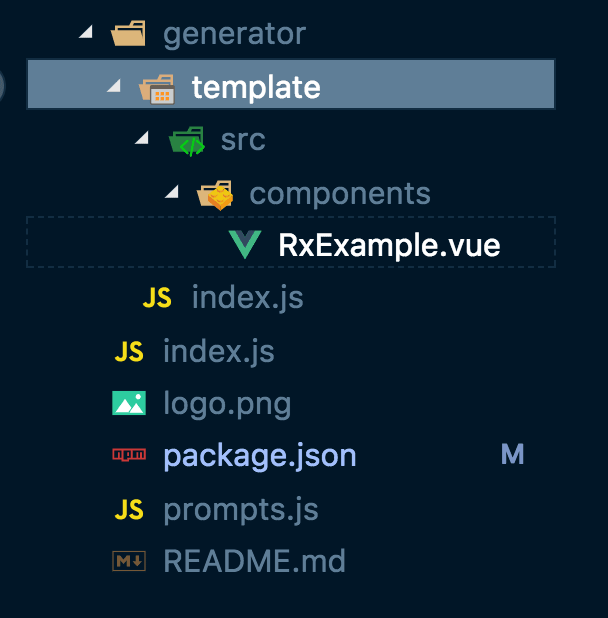

## 前言

如果你正在使用Vue框架，你可能已经知道什么是Vue CLI了。它是一个用于快速开发Vue.js的完整系统，提供项目脚手架和原型设计。

CLI的一个重要部分是**cli-plugins**。它们可以修改内部的webpack配置并向vue-cli服务**注入**命令。

一个很好的例子是**@vuecli-plugin-typescript**：当你调用它时，它会给你的项目添加一个**tsconfig.json**，并改变**App.vue**的类型，所以你不需要手动去做。

插件是非常有用的，但如果你想有一个用于某些特定库的插件而它不存在呢？嗯，当我们是这样子的情况时......我们决定自己建立它。

在这篇文章中，我们将建立一个**vue-cli-plugin-tiantian**。它允许我们将**vue-rx**库添加到我们的项目中，并在我们的Vue应用程序中获得RxJS支持。


## Vue-CLI插件结构

首先，什么是CLI插件？它只是一个具有**一定结构的npm包**。关于文档，它必须有一个**服务插件**作为其主要出口，并可以有额外的功能，例如生成器和提示文件。


> 目前，绝对不清楚什么是服务插件或生成器，但不用担心--以后会有解释的!

当然，像任何**npm软件包**一样，CLI插件在其根文件夹中必须具有**package.json**，并且最好具有一些说明的**README.md**。


因此，让我们从以下结构开始。

```markdown
.
├── README.md
├── index.js      # service plugin
└── package.json
```


现在让我们来看看可选部分。生成器可以在package.json中注入额外的依赖关系或字段，并向项目中添加文件。我们需要它吗？

当然，我们想把**rxjs**和**vue-rx**作为我们的依赖项。更确切地说，我们想创建一些示例组件，如果用户想在安装插件时添加它。

因此，我们需要添加 **generator.js** 或 **generatorindex.js**。我更喜欢第二种方式。现在的结构看起来是这样的:

```markdown
.
├── README.md
├── index.js      # service plugin
├── generator
│   └── index.js  # generator
└── package.json
```


还有一件事要添加，就是一个提示文件。我希望我的插件能够询问用户是否想拥有一个示例组件。我们将需要在根目录下有一个**prompts.js**文件来实现这一行为。所以，现在的结构是这样的:


## 服务插件(Service plugin)

一个服务插件应该输出一个函数，它接收两个参数：一个**PluginAPI实例**和一个包含项目本地选项的对象。

它可以针对不同的环境扩展修改内部的webpack配置，并向**vue-cli-service**注入额外的命令。

让我们想一想：我们是否想以某种方式改变webpack配置或创建一个额外的npm任务？

答案是否定的，我们只想在必要时添加一些依赖项和示例组件。因此，我们需要在**index.js**中改变的是:

```js
module.exports = (api, opts) => {}
```

如果您的插件需要更改Webpack配置，请阅读Vue官方CLI文档中的本节。

> https://cli.vuejs.org/dev-guide/plugin-dev.html#service-plugin


## 通过生成器添加依赖项

如上所述，CLI插件生成器可以帮助我们添加依赖性和改变项目文件。

因此，第一步我们需要做的是为我们的插件添加两个依赖项：**Rxjs**和**vue-rx**:

```js
module.exports = (api, options, rootOptions) => {
  api.extendPackage({
    dependencies: {
      'rxjs': '^6.3.3',
      'vue-rx': '^6.0.1',
    },
  });
}
```


一个生成器应该输出一个函数，该函数接收三个参数：一个GeneratorAPI实例，生成器选项和--如果用户使用某些预设创建一个项目--整个预设将作为第三个参数传递。


**api.extendPackage方法**扩展了项目的package.json。嵌套的字段会被深度合并，除非你把**{ merge: false }**作为一个参数。在我们的例子中，我们要添加两个依赖项到依赖项部分。


现在我们需要改变一个**main.js**文件。为了让RxJS在Vue组件中工作，我们需要导入一个VueRx并调用**Vue.use(VueRx)**。


首先，让我们创建一个我们想要添加到主文件的字符串:

```js
let rxLines = `\nimport VueRx from 'vue-rx';\n\nVue.use(VueRx);`;
```


现在我们要使用**api.onCreateComplete** 钩子函数。当文件被写入磁盘时，它被调用:

```js
api.onCreateComplete(() => {
    // inject to main.js
    const fs = require('fs');
    const ext = api.hasPlugin('typescript') ? 'ts' : 'js';
    const mainPath = api.resolve(`./src/main.${ext}`);
};
```


这里我们要找的是主文件：如果是TypeScript项目，会是main.ts，否则就是main.js文件。 fs这里是文件系统。

现在让我们更改文件内容:

```js
  api.onCreateComplete(() => {
    // inject to main.js
    const fs = require('fs');
    const ext = api.hasPlugin('typescript') ? 'ts' : 'js';
    const mainPath = api.resolve(`./src/main.${ext}`);

    // get content
    let contentMain = fs.readFileSync(mainPath, { encoding: 'utf-8' });
    const lines = contentMain.split(/\r?\n/g).reverse();

    // inject import
    const lastImportIndex = lines.findIndex(line => line.match(/^import/));
    lines[lastImportIndex] += rxLines;

    // modify app
    contentMain = lines.reverse().join('\n');
    fs.writeFileSync(mainPath, contentMain, { encoding: 'utf-8' });
  });
};
```


我们正在读取主文件的内容，将其分成几行，并恢复其顺序。然后，我们搜索带有导入(**import**)语句的第一行，并在那里添加我们的**rxLines**。在这之后，我们对行数组进行逆转，并保存文件。


## 在本地测试CLI插件

让我们在package.json中添加有关我们的插件的一些信息，然后尝试将其安装在本地进行测试。

最重要的信息通常是插件名称和版本（将插件发布到npm时将需要这些字段），随时可以添加更多信息！ **package.json字段**的完整列表可以在此处找到。以下是我的文件：


```json
{
  "name": "vue-cli-plugin-tiantian",
  "version": "xxx.1.5",
  "description": "Vue-cli 3 plugin for adding RxJS support XXXX",
  "main": "index.js",
  "keywords": [
    "vue",
    "vue-cli",
    "rxjs",
    "vue-rx"
  ],
  "author": "TianTian",
  "license": "MIT",
}
```

现在是时候检查我们的插件如何工作了！为此，我们创建一个由vue-cli支持的简单项目：

```bash
vue create test-app
```

转到项目文件夹，安装我们新创建的插件。

```bash
cd test-app
npm install --save-dev file:/full/path/to/your/plugin //填写路径
```

安装插件后，您需要调用它：

```bash
vue invoke vue-cli-plugin-rx
```

现在，如果你试图检查main.js文件，你可以看到它已经改变了。

```js
import Vue from 'vue'
import App from './App.vue'
import VueRx from 'vue-rx';

Vue.use(VueRx);
```

此外，你可以在你的测试应用package.json的**devDependencies**部分找到你的插件。


## 用生成器创建一个新组件

当你的插件可以工作的时候，也是时候对它的功能进行一些扩展，使它能够创建一个示例组件。现在是时候扩展其功能并使其能够创建示例组件了。 **Generator API**为此使用了**render**方法。

首先，让我们来创建这个示例组件。它应该是一个位于项目src/components文件夹下的.vue文件。在生成器文件夹内创建一个模板文件夹，然后在其中模拟整个结构:




假设一下,你的示例组件应该就是一个**Vue的单文件组件** , 篇幅有限，所以这篇文章中深入解释**RxJS**。

所以创建了一个简单的由RxJS驱动的有两个按钮的点击计数器,如图所示:


现在，我们需要指示插件在调用时呈现此组件。为此，我们将以下代码添加到generator / index.js中：

```js
api.render('./template', {
  ...options,
});
```

这将呈现整个模板文件夹。现在，当插件被调用时，一个新的**RxExample.vue**将被添加到src / components文件夹中。


## 通过提示处理用户选择


如果用户不希望有一个示例组件怎么办？让用户在插件安装过程中决定这一点不是很明智吗？这就是提示存在的原因!

之前我们已经在插件根目录下创建了**prompts.js**文件。这个文件应该包含一个**question**数组：每个**question**都是一个对象，有一定的字段，如名称、信息、选择、类型等。

> 名称很重要：我们稍后将在生成器中使用它来创建一个渲染示例组件的条件。

提示语可以有不同的类型，但在CLI中最广泛使用的是复选框和确认。我们将使用后者来创建一个有 "是 "的答案的问题。

因此，让我们将提示代码添加到**prompts.js**中！

```js
module.exports = [
  {
    name: `addExample`,
    type: 'confirm',
    message: 'Add example component to components folder?',
    default: false,
  },
];
```

我们有一个**addExample**提示，询问用户是否要将组件添加到components文件夹。默认答案为“no”。

让我们回到生成器文件中，做一些修正。将**api.render**的调用改为:

```js
if (options.addExample) {
    api.render('./template', {
      ...options,
    });
}
```

我们正在检查**addExample**是否有一个肯定的答案，如果有，该组件将被渲染。


> 不要忘了在每次改变后重新安装和测试你的插件!


## 发布

值得我们去注意点是：

发布插件之前，请检查其名称是否与模式**vue-cli-plugin- < YOUR-PLUGIN-NAME > **相匹配。这使您的插件可以通过@ vue / cli-service发现，并可以通过vue add安装。

接下来您需要注册一个npmjs.com，然后按照发包的机制，完成接下来的操作。

当然了要发布插件，请转到插件根文件夹，然后在终端中键入npm publish。

此时，您应该可以使用vue add命令安装插件。尝试一下！


## 结束语

当然，本文中介绍的插件是非常基本的，希望本文可以帮助你，未来的某天需要进行开发cli-plugins的时候，可以再回头看看此文。