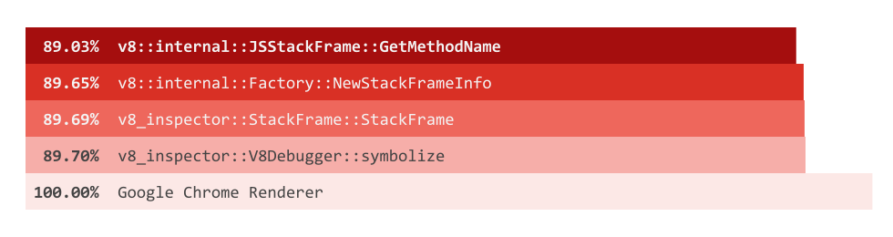
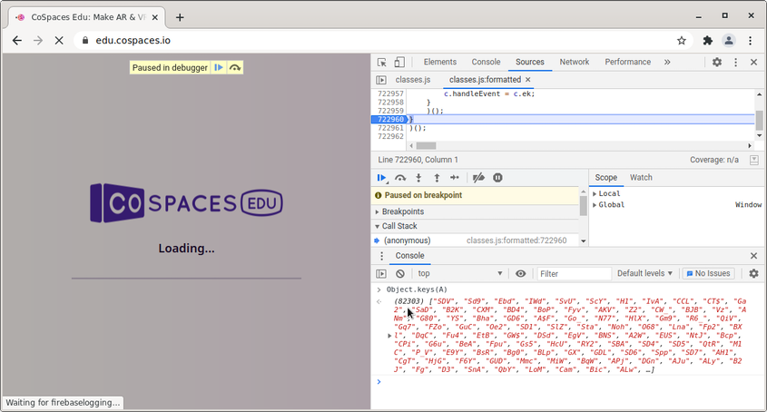
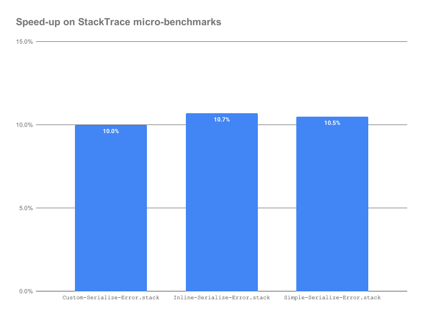
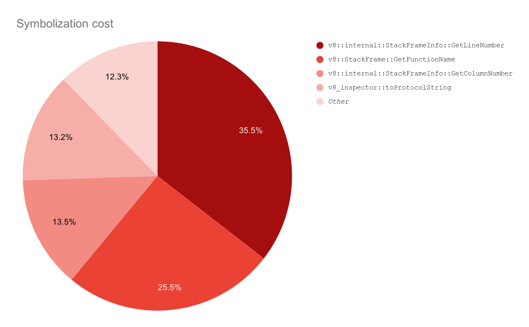

## 正文

Web开发人员期望在调试代码时几乎不会影响性能。但是，这种期望绝不是普遍的。 C ++开发人员永远不会期望其应用程序的调试版本能够达到生产性能，并且在Chrome的早期，仅仅打开DevTools会对页面的性能产生重大影响。


现在已经感觉不到这种性能下降了，这是多年来对DevTools和V8的调试能力投资的结果。尽管如此，我们永远无法将DevTools的性能开销降低到零。设置断点、踏过代码、收集堆栈痕迹、捕获性能跟踪等等，都会在不同程度上影响执行速度。毕竟，观察到的东西会改变它。


但当然，DevTools的开销--像任何调试器一样--应该是合理的。最近我们看到，在某些情况下，DevTools会拖慢应用程序的速度，以至于它不能再使用的报告数量显著增加。下面你可以看到一个来自报告chromium:1069425的并排比较，说明了仅仅打开DevTools的性能开销。


报告chromium:1069425链接点这里:

> https://bugs.chromium.org/p/chromium/issues/detail?id=1069425

可以查看这个视频:


正如你从**视频**中看到的，速度降低了**5-10**倍，这显然是不可接受的。

第一步是要了解所有的时间都去哪儿了，是什么导致了DevTools打开时的巨大速度下降。

在Chrome渲染器进程上使用Linux perf，发现整个渲染器执行时间的分布如下。




虽然我们有点期待看到与收集堆栈痕迹有关的东西，但我们不会想到，整个执行时间的大约90%都用于符号化堆栈帧。

这里的符号化是指从原始堆栈帧中解析函数名和具体的源位置--脚本中的行号和列号的行为。


------


## 方法名推断

更令人惊讶的是，几乎所有的时间都流向了V8中的JSStackFrame::GetMethodName()函数。

尽管我们从以前的调查中知道，JSStackFrame::GetMethodName()在性能问题的土地上并不陌生。

这个函数试图为那些被认为是方法调用的框架（代表obj.func()而不是func()形式的函数调用的框架）计算方法的名称。

快速查看代码发现，它的工作原理是对对象及其原型链进行全面的遍历，并寻找:

- 数据属性，其值是func的闭包
- 访问器属性，其中get或set等同于func闭包。


现在，虽然这本身听起来并不特别便宜，但它也听起来不像是能解释这种可怕的减速。

因此，我们开始挖掘chromium:1069425中报告的例子，我们发现堆栈痕迹是为异步任务以及来自classes.js的日志信息收集的，这是一个10MB的JavaScript文件。

仔细观察发现，这基本上是一个Java运行时，加上编译成JavaScript的应用程序代码。堆栈跟踪包含了几个框架，其中有一些方法被调用到一个对象A上，所以我们认为可能值得了解我们正在处理的是哪种对象。

> chromium:1069425 : https://bugs.chromium.org/p/chromium/issues/detail?id=1069425




显然，从Java到JavaScript的编译器产生了一个对象，上面有高达**82,203**个函数。

这显然开始变得有趣了。接下来我们回到V8的JSStackFrame::GetMethodName()，以了解是否有一些低垂的果实可以被我们采摘。

- 它的工作原理是首先将函数的 "名字 "作为对象的一个属性进行查找，如果找到了，则检查该属性的值是否与该函数相匹配。
- 如果函数没有名字，或者对象没有匹配的属性，它就会通过遍历对象的所有属性及其原型来进行反向查找。


在我们的示例中，所有函数都是**匿名**的，并且具有空的“名称”属性。

```js
A.SDV = function() {
   // ...
};
```


最初的发现是将反向查找分为两个步骤（针对对象本身及其原型链中的每个对象执行）：

- 提取所有可枚举属性的名称，然后
- 对每个名称执行通用属性查找，测试结果属性值是否与我们要查找的闭包相匹配。


这看起来是一个低效的操作，因为提取名字需要走遍所有的属性。与其做两遍--O(N)的名字提取和O(N log(N))的测试，我们可以在单遍中完成所有工作，并直接检查属性值。这使得整个函数的速度提高了2-10倍左右。


**第二个**发现甚至更有趣。虽然这些函数在技术上是匿名函数，但V8引擎还是为它们记录了我们称之为推断的名称。对于以obj.foo = function() {...}形式出现在赋值右侧的函数字面，V8解析器会记住 "obj.foo "作为该函数字面的推断名称。


因此，在我们的例子中，虽然我们没有可以直接查找的正确名称，但我们确实有足够接近的东西。对于上面的A.SDV = function() {...}例子，我们有 "A.SDV "作为推断名称，我们可以通过寻找最后一个点从推断名称中得出属性名称，然后去寻找对象上的属性 "SDV"。


这几乎在所有的情况下都起到了作用，用单一的属性查找取代了昂贵的全面遍历。这两项改进是CL的一部分，大大降低了chromium:1069425中报告的例子的速度下降。

---


## 错误堆栈

我们本可以在这里收工了，但是有些事情是不对劲的，因为DevTools从来不使用堆栈框架的方法名。事实上，C++ API中的v8::StackFrame类甚至没有提供获取方法名称的方法。因此，我们最终会首先调用JSStackFrame::GetMethodName()，这似乎是错误的。

相反，我们使用（和公开）方法名称的唯一地方是在JavaScript堆栈跟踪API中。为了理解这种用法，请考虑下面这个简单的例子**error-methodname.js**:

```js
function foo() {
    console.log((new Error).stack);
}

var object = {bar: foo};
object.bar();
```

这里我们有一个函数foo，它被安装在对象的名称 "bar "下。在Chromium中运行这个片段，会产生以下输出:


```bash
Error
    at Object.foo [as bar] (error-methodname.js:2)
    at error-methodname.js:6
```


在这里，我们看到了方法名查找的作用。最上面的堆栈框架被显示为通过名为bar的方法在Object的实例上调用函数foo。所以非标准的error.stack属性大量使用了JSStackFrame::GetMethodName()，事实上，我们的性能测试也表明，我们的改变使事情大大加快。



---


但回到Chrome DevTools的话题上，即使没有使用**error.stack**，方法名称也被计算出来了，这看起来不对。

这里有一些历史可以帮助我们:

传统上，V8有两种不同的机制来收集和表示上述两种不同的API（C++ v8::StackFrame API和JavaScript stack trace API）的堆栈跟踪。有两种不同的方式来做（大致）相同的事情是容易出错的，并且经常导致不一致和错误，所以在2018年底，我们启动了一个项目，以解决堆栈跟踪捕获的单一瓶颈。


这个项目非常成功，大大减少了与堆栈跟踪收集有关的问题的数量。大部分通过非标准的**error.stack**属性提供的信息也是懒散地计算的，只有在真正需要的时候才会计算，但作为重构的一部分，我们对v8::StackFrame对象采用了同样的技巧。

所有关于堆栈框架的信息都是在任何方法第一次被调用时计算的。

-----

这通常会提高性能，但不幸的是，它被证明与Chromium和DevTools中使用这些C++ API对象的方式有些相反。

特别是由于我们引入了一个新的v8::internal::StackFrameInfo类，它持有关于堆栈框架的所有信息，这些信息通过v8::StackFrame或通过error.stack公开，我们总是计算两个API提供的信息的超集，这意味着对于v8::StackFrame的使用（特别是对于DevTools），我们也将计算方法名称，只要关于堆栈框架的任何信息被请求。事实证明，**DevTools总是立即请求源和脚本信息**。


基于这一认识，我们能够重构并大幅简化堆栈框架的表示，并使其更加懒惰，因此整个V8和Chromium的使用现在只需要支付计算他们所要求的信息的成本。这给DevTools和其他Chromium用例带来了巨大的性能提升，它们只需要关于堆栈框架的一小部分信息（基本上只是脚本名称和以行和列偏移形式存在的源位置），并为更多的性能改进打开了大门。


-----


## 函数名称

随着上述重构的完成，符号化的开销（在v8_inspector::V8Debugger::symbolize中花费的时间）被减少到整个执行时间的15%左右，而且我们可以更清楚地看到V8在（收集和）符号化堆栈帧以便在DevTools中使用时的时间。




第一件引人注目的事情是计算行数和列数的累积成本。

这里昂贵的部分实际上是计算脚本中的字符偏移量（基于我们从V8得到的字节码偏移量），结果发现，由于我们上面的重构，我们做了两次，一次是在**计算行号**时，另一次是在**计算列号**时。

在v8::internal::StackFrameInfo实例上缓存源位置有助于快速解决这个问题，并且完全消除了v8::internal::StackFrameInfo::GetColumnNumber的任何配置文件。


对我们来说，更有趣的发现是，v8::StackFrame::GetFunctionName在我们看的所有配置文件中都出奇地高。深入研究后我们发现，计算我们在DevTools中为堆栈框架中的函数显示的名称是不必要的，成本很高。

- 首先寻找非标准的 "displayName "属性，如果它产生了一个具有字符串值的数据属性，我们就会使用它。
- 否则就返回到寻找标准的 "name "属性，并再次检查该属性是否产生了一个值为字符串的数据属性。
- 并最终返回到由V8解析器推断出的、存储在函数字面上的内部调试名称。

-----


"displayName "属性是为了解决函数实例上的 "name "属性在JavaScript中只读且不可配置的问题而添加的，但它从未被标准化，也没有被广泛使用，因为浏览器的开发工具添加了函数名称推理，在99.9%的情况下都能完成工作。

除此之外，ES2015让Function实例上的 "name "属性变得可配置，完全消除了对特殊 "displayName "属性的需求。

由于 "displayName "的负向查找成本很高，而且并不是真的需要（ES2015是在五年前发布的），我们决定从V8（和DevTools）中删除对非标准的fn.displayName属性的支持。


随着 "displayName "的负向查找的完成，v8::StackFrame::GetFunctionName的一半成本被移除。另一半则用于通用的 "name "属性查询。幸运的是，我们已经有了一些逻辑来避免在（未触及的）Function实例上进行昂贵的 "name "属性查询，我们在不久前的V8中引入了这一逻辑，以使Function.prototype.bind()本身更快。我们移植了必要的检查，允许我们首先跳过昂贵的通用查询，结果是v8::StackFrame::GetFunctionName不再出现在我们考虑的任何配置文件中。


----


## 总结

通过上述改进，我们已经大大减少了DevTools在堆栈跟踪方面的开销。

我们知道仍有各种可能的改进。

例如，使用MutationObservers时的开销仍然很明显，正如chromium:1077657所报告的那样，但就目前而言，我们已经解决了主要的痛点，而且我们将来可能会回来进一步简化调试性能。

> chromium:1077657: https://bugs.chromium.org/p/chromium/issues/detail?id=1077657

