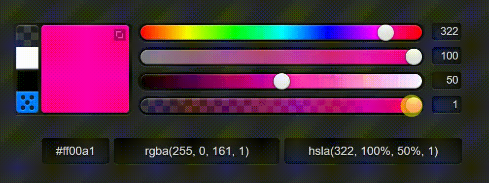

# 设置 CSS 颜色属性的最佳方法是什么？

编者寄语：

> 颜色在网页中起着至关重要的作用。在 CSS 中，我们使用 RGB、Hex 和 HSL 等方法来定义颜色。在本文中，我讨论了用于在 CSS 中设置颜色属性的主要三种方法、它们的区别、它们的优缺点，以及可用于在 CSS 中定义颜色属性的其他替代方法。


如题，在你平常开发中，你设置css常用的方法是哪些方法？

作为一名前端开发，比如你是写业务组件的，可能会涉及到css颜色属性的设置，那你更偏向于哪种呢。

好奇的我，随便打开一个颜色转化的网站:


从我们最常见的**十六进制**颜色值到Hex，RGB，HSL，HSV，再到CMYK等方法，哪些是你比较熟悉的呢。

当然小编我最熟悉的自然是**十六进制**，想起实习的时候，切图的时候，用得最多的就是这个颜色表示法。

本着探索的原则，我们就挑选几个常见的颜色表示法，来看看他们的区别。


## HEX

**十六进制**颜色值是设置 CSS 颜色属性最流行的方法之一，尤其是在开发人员中。几乎所有浏览器都支持它。

我们可以在十六进制颜色代码中定义紫色，如下所示：

```bash
#800080
```

这里的颜色以#RRGGBB 格式指定，其中RR（红色）、GG（绿色）和BB（蓝色）是00 和FF 之间的十六进制整数，表示颜色的强度。


## RGB

**RGB** or **Red/Green/Blue** 是另一种在CSS中用来定义颜色属性的很受欢迎的方法。RGB颜色方案是一种三通道格式，包含红、绿、蓝的数量，是0到255之间的整数。以下是一个RGB颜色的例子:

```bash
rgb(128, 0, 128)
```

这是我们使用上面的十六进制颜色代码指定的相同颜色的 RGB 代码。他们的效果是一样的。

有些时候，十六进制颜色代码更容易记住和输入，那为什么还会有RGB表示法呢？

可能其中一个原因就是：RGB 的美妙之处在于它允许您为颜色添加不透明度。


这就是**RGBA**出现的地方。在 CSS 3 中，RGB 配色方案中添加了一个额外的通道，称为**alpha**以指示颜色的不透明度。


## HSL

**HSL**代表色相饱和度和亮度，是另一种在 CSS 中声明颜色的方式。紫色的 HSL 颜色值可以指定如下：

```bash
hsl(300, 100%, 25.1%)
```

如您所见，第一个参数用于定义**Hue**，它是实际纯色的值，例如红色、黄色、绿色、蓝色、洋红色等，如色轮所示。

值以度为单位，从 0 到 360。这里 0 和 360 度代表红色，120 度代表绿色，240 度代表蓝色。


与 RGB 不同，在 HSL 中，颜色的饱和度和亮度都可以改变。


这些颜色可以是暗淡的，也可以是生动的。颜色越少，它变成灰色的阴影就越多。**饱和度**是混合物中存在多少颜色，它 控制颜色的鲜艳或暗淡程度。

比如我们从下面的网站来看看效果：


如您所见，当 Saturation 值沿线从 100% 变为 0% 时，颜色会从纯色调变为暗色调。


此外，第三个参数**Lightness**也是一个百分比值，从 0% 到 100%，它描述了颜色中存在多少黑色或白色。



这类似于水彩在绘画中的使用。如果你想让颜色更亮，你可以添加白色，如果你想让颜色更深，你可以添加黑色。

因此，100% Lightness 表示完全白色，50% 表示实际色调，0% 表示纯黑色。


类似于RGBA，**HSLA**是HSL 的扩展，它执行名为alpha 的第四个通道来表示颜色的不透明度。不透明度以十进制值指定，就像在 RGBA 中一样，其中 1 表示完全不透明，0 表示完全透明，中间的所有内容都是部分不透明的。


然而，虽然大多数浏览器支持 RGB 和 Hex 颜色代码，但 HSL 颜色主要在基于 HTML5 的浏览器中支持。


## 其他方式

除了上面提到的方法，还有一些其他方法可以用来在 CSS 中设置颜色属性。

- **使用颜色名称**：所有现代浏览器都支持 140 个标准的 CSS 颜色名称。颜色名称是代表特定颜色的关键字，如`coral`.
- **currentcolor **关键字：如果需要引用元素的颜色，可以使用这个关键字。
- **HWB 值：** HWB 代表色相、白度、黑度。虽然目前 HTML 不支持它，但建议将其作为 CSS4 的新标准。
- **CMYK 值**：CMYK 是青色、洋红色、黄色和黑色的组合。尽管计算机屏幕使用 RGB 值来显示颜色，但打印机通常使用 CMYK 颜色值来显示颜色。与 HWB 类似，CMYK 在 HTML 中尚不支持，但建议作为 CSS4 中的新标准。


## 如何选择

在 CSS 中指定颜色的最佳方法是什么？你使用的是哪种方式呢？

如果您习惯于 HTML，您可能更喜欢使用 Hex 颜色值，因为它在 HTML 中被大量使用。但是，如果您具有设计背景，则可能会使用 RGB 表示法，因为它是大多数设计软件（如 Photoshop、Corel 和 Illustrator）中最常用的格式。


但是，如果您是一名纯粹的开发人员并且只想完成您的项目，那怎么让自己高效完成切图呢？

肯定是使用您最熟悉的颜色表示法，**因为浏览器并不真正关心您使用的是哪种颜色格式，即使不同方法之间存在细微的性能变化，但性能差异可以忽略不计。**


### 其他因素

除此之外，如果您担心可用性、决策对开发人员的影响等，让我们看看哪种方法最适合您的情况。

让我们从十六进制表示法开始：

Hex 因其简短而简单的符号而非常有吸引力。许多开发人员发现，与 RGB 和 HSL 相比，Hex 值非常易于阅读并且更容易复制到他们喜欢的文本编辑器中。


但是，Hex 可能并不适用于所有情况。特别是当您需要更改颜色的不透明度级别时，您可能必须考虑其他两种方法之一。他们两个都有自己的优点和缺点:

> 在为颜色设置动画时，RGB 和 HSL 比 Hex 更可取，并且当您想要处理颜色的不透明度时，它们的 alpha 值附加通道会派上用场。

除此之外，RGB 在较旧版本的 Internet Explorer（9 及更早版本）中广为人知并受支持。


**HSL 有哪些特点呢**：

可能它的出现，其中一个原因就是让人理解。HSL 是一种更新且自发的颜色处理方式。

> 与在 Hex 和 RGBA 中你必须使用一些数字来获得你想要的颜色不同，在 HSL 中，我们可以使用 Hue 定义颜色并使用第二和第三个参数百分比来获得你需要的饱和度和亮度级别.


如果我告诉您网页标题需要是`#578557`或`rgb(87, 133, 87)`，您能猜出颜色是什么吗？

 **不，除非你是电脑**。但是，与此同时，如果我给你在HSL颜色：`hsl(120, 21%, 43%)`？现在猜测有点容易了吧？Hue 值为 120°，表示它是纯绿色。接下来，它的饱和度为 61%，表明它距离暗灰色（一种非常不饱和的绿色）还有**" 21个度"**。那么明度 43% 意味着颜色从纯色到较暗的一面有**"7个度"**。

从某种程度来看，**HSL 是一种模仿现实世界的直观颜色符号**。


例如，让我们考虑一张浅蓝色纸。它的三种格式的颜色值是：

```bash
Hex: #ADD8E6;
RGB: rgb(173, 216, 230);
HSL: hsl(195, 53.3%, 79%);
```

但是你突然需要对颜色变化时，比如变暗，你该如何操作呢？

```bash
OLD VALUES                    NEW VALUES 
Hex: #4f2017 ------------------> #2F819D;
RGB: rgb(79, 32, 23) ----------> rgb(47, 129, 157);
HSL: hsl(195, 53.3%, 79%) -----> hsl(195, 53.3%, 50%);
```

从数据中可以看到，Hex 和 RGB 值已经完全改变，而在 HSL 中，只有一个方面发生了变化。毫无疑问，在构建配色方案时，HSL 是最有用的。从基色开始，根据需要调整饱和度和亮度，就是这样子设置一下即可！


## 小结

现在你可能认为 HSL 是最好的颜色表示法。但是，旧版本的 Internet Explorer 不支持 HSL。同样，每种颜色符号都有其优点和缺点。问题是，这并不重要。

> 最重要的是尽可能保持您在项目中使用的类型的一致性，因为它有助于提高生产力。

虽然Hex有不支持透明度和RGBA的限制，但是不使用特定工具来调整颜色是很有挑战性的，而且旧浏览器不支持HSLA；如果提供，则不是特例；你可以使用任何格式。在选择在项目中设置 CSS 颜色属性的最佳方法时，您可以考虑以下因素:

- 使用与开发团队的其他成员相同的格式来简化可维护性。
- 如果您已经熟悉该格式，请使用 RGB。
- 如果您的目标访问者使用严重过时的浏览器来查看您的网站或使用如下后备代码，请使用 Hex：

```css
p { 
    color: #FF0000;
    color: hsla(0, 100%, 50%, 1);
}
```

- 如果前三点没有让您转向任何其他方向，请使用 HSLA。HSLA 允许您像 RGBA 一样具有透明度，以一种人类可以访问的方式。


> 尽管 HSLA 由于其人类可读性而比其他两种方法略有优势，但如果不是针对特定情况，则无关紧要。你可以使用任何你觉得舒服的方式。

看看不同的优点和缺点，每种方法都优于其他方法，总而言之，决定使用哪种方式在 CSS 中设置颜色属性应取决于以下三个因素：

- 可维护性
- 偏爱
- 表现如何


那么，你更喜欢用什么来设置 CSS 中的颜色？十六进制、RGBA、HSLA 或其他什么？为什么？在评论区留下你的想法。