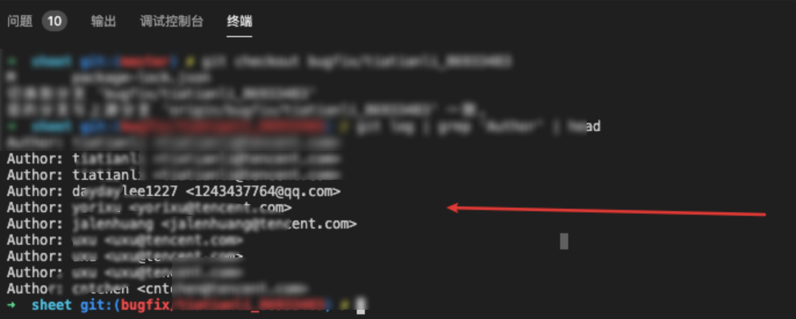

我是如何被git config坑的，CI校验竟然不通过


记录一下我是如何被自己的操作坑的。

---


## 事故由来

当我把bug解决休掉后，顺利跑通后。”愉快“的补完单测，提了个mr，CI校验竟然拦下来了。

​                         

当时我的心情是复杂的，于是我点开了这个Details。

看了半天，没有啥有价值的错误信息，接着索性打开这个流水线，看看蓝盾里面具体是哪个子流失线出现了问题，找了半天后，发现了问题。。。


好离谱，为啥我git email尽然有QQ邮箱。。。

为了验证我这个分支是否存在上述的这个问题，我得排查一下:

```bash
git log | grep 'Author' | head
```

看到结果的时候，我呆滞住了:




居然真的有个commit记录真的是qq邮箱，事情大概清楚了，之前master分支存在问题，我删掉项目，重新拉取一次master分支。

由于我全局配置的git config 是日常邮箱的问题，没有在意这个问题，导致现在CI校验不通过。


那么解决问题的办法就是:

**修改下commit历史**


## 如何解决

于是google一个方案，**修改 git 历史提交 commit 信息(重写历史)**，文档链接:

> https://www.jianshu.com/p/0f1fbd50b4be

大致意思通过 git rebase 命令，来完成操作:

```bash
git rebase -i HEAD~3
// 修改近三次的信息
```

将会得到如下的信息,这里的提交日志是和`git log`倒叙排列的,我们要修改的日志信息位于第一位:

```bash
  1 pick 2275781 should find method from parent
  2 pick 223fc80 unit test case
  3 pick 9ac1179 update test case
  4
  5 # Rebase 79db0bd..9ac1179 onto 79db0bd (3 commands)
  6 #
  7 # Commands:
  8 # p, pick = use commit
  9 # r, reword = use commit, but edit the commit message
 10 # e, edit = use commit, but stop for amending
 11 # s, squash = use commit, but meld into previous commit
 12 # f, fixup = like "squash", but discard this commit's log message
 13 # x, exec = run command (the rest of the line) using shell
 14 # d, drop = remove commit
 15 #
 16 # These lines can be re-ordered; they are executed from top to bottom.
 17 #
 18 # If you remove a line here THAT COMMIT WILL BE LOST.
 19 #
 20 # However, if you remove everything, the rebase will be aborted.
 21 #
 22 # Note that empty commits are commented out
```

我们可以根据**Commands**信息来修改这些信息，来选择我们需要的参数，最后来达到我们的目的。


-------


## 其他思路

想到我修改的代码，跟主干代码master相差的其实很小，那么我可以做到代码回滚，根据我们的id回退到指定的版本，主要通过的命令就是 **git reset**，然后选择对于的参数，也能满足我们的需求。

reset的话，通常有三种命令，找了一个不错的文章，分享一下:

> https://www.jianshu.com/p/c2ec5f06cf1a

一般来说，有**hard**，**soft**，**mixed**，三种模式，根据不同的场景来做选择。

