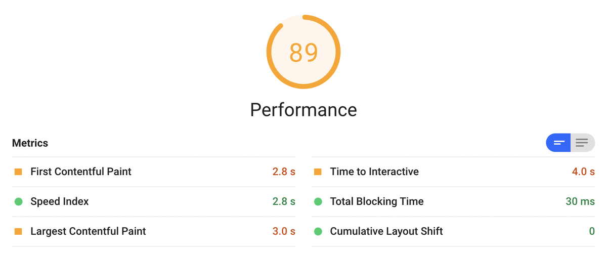
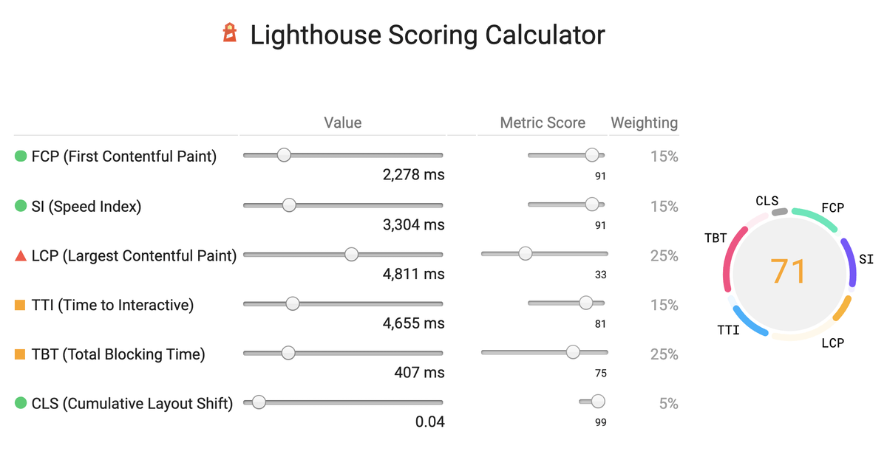

## 前言

最近做性能检测工具，很多知识点不清楚，打算查缺补漏，补一补。

接下来从官方提供的性能检测工具Lighthouse(灯塔)开始我们的学习，简单介绍了下Lighthouse的一些点。


阅读完本文，你可以了解到

- Lighthouse 是什么。
- 如何快速上手Lighthouse (使用入门)。
- Lighthouse中的一些Metrics指标。


## Lighthouse 是什么

官方对它的解读:

> [Lighthouse](https://github.com/GoogleChrome/lighthouse) 是一个开源的自动化工具，用于改进网络应用的质量。 您可以将其作为一个 Chrome 扩展程序运行，或从命令行运行。 您为 Lighthouse 提供一个您要审查的网址，它将针对此页面运行一连串的测试，然后生成一个有关页面性能的报告。


它是如何工作的呢？

如果你跟我一样，翻过它的代码，看过它的介绍肯定很懵逼，它的代码依赖性如下:


感兴趣的可以看看它的仓库，参考链接已经给出。

> https://github.com/GoogleChrome/lighthouse


## 使用入门

运行 Lighthouse 的方式有两种: 作为 Chrome 扩展程序运行，或作为命令行工具运行。 Chrome 扩展程序提供了一个对用户更友好的界面，方便读取报告。 命令行工具允许您将 Lighthouse 集成到持续集成系统。

### Chrome 扩展程序

下载 Google Chrome 52 或更高版本。

安装 [Lighthouse Chrome 扩展程序](https://chrome.google.com/webstore/detail/lighthouse/blipmdconlkpinefehnmjammfjpmpbjk)。

> 地址:https://chrome.google.com/webstore/detail/lighthouse/blipmdconlkpinefehnmjammfjpmpbjk

点击 **Generate report** 按钮以针对当前打开的页面运行 Lighthouse 测试。


### 命令行工具

Node CLI在配置和报告Lighthouse运行情况方面提供了最大的灵活性。如果用户需要更多的高级功能，或者想自动运行Lighthouse，可以使用Node CLI。安装 Lighthouse 作为一个全局节点模块。

安装:

```bash
npm install -g lighthouse
# or use yarn:
# yarn global add lighthouse
```

针对一个页面运行 Lighthouse 审查。

```bash
lighthouse https://www.example.com --view
```

传递 `--help` 标志以查看可用的输入和输出选项。

```bash
lighthouse --help
```

对于一些options不清楚的，可以点击这个链接:

> https://github.com/GoogleChrome/lighthouse#cli-options

假设我们审查后，就会有这么一个结果:





可以看到一共6个Metrics，Lighthouse 6.0在报告中引入了三个新指标。其中两个新的指标--最大内容画（LCP）和累积布局偏移（CLS）--是Core Web Vitals的实验室实现。

那么接下来，我们看看这些Metrics指标的含义。


## 几个Metrics指标


### First Contentful Paint (FCP)

第一次内容丰富的绘画(FCP)指标衡量了从页面开始加载到页面内容的任何部分呈现在屏幕上的时间。对于该指标，"内容 "指的是文本、图像（包括背景图像）、<svg>元素或非白色<canvas>元素。


在上面的负载时间线中，FCP发生在第二帧中，就像呈现给屏幕的第一文本和图像元素时一样。

你会注意到，虽然部分内容已经呈现，但并非所有内容都已呈现。这是First Contentful Paint (FCP)和Largest Contentful Paint (LCP)之间的一个重要区别--LCP的目的是衡量页面的主要内容何时完成加载。


知道了概念，如何衡量FCP呢，我们可以接触的有**Field tools**和**Lab tools** 

要在JavaScript中测量FCP，你可以使用Paint Timing API。下面的例子展示了如何创建一个PerformanceObserver，该PerformanceObserver监听名称为first-contentful-paint的油漆条目，并将其记录到控制台。

```js
new PerformanceObserver((entryList) => {
  for (const entry of entryList.getEntriesByName('first-contentful-paint')) {
    console.log('FCP candidate:', entry.startTime, entry);
  }
}).observe({type: 'paint', buffered: true});

```


### Speed Index 

速度指数是Lighthouse报告中性能部分跟踪的六个指标之一。每项指标都能反映出页面加载速度的某些方面。

那么它是如何检测的呢？

> 速度指数衡量的是内容在页面加载过程中的视觉显示速度。Lighthouse首先会在浏览器中捕获一段页面加载的视频，并计算出各帧之间的视觉进度。然后，Lighthouse使用Speedline Node.js模块来生成速度指数得分。

至于具体的计算，可以参考GitHub里面的代码，这里就不展开了。

那么我们有机会提升它的性能吗？

利用Lighthouse报告中的 "**Opportunities** "部分来确定哪些改进对你的页面最有价值。机会越重要，对性能评分的影响就越大。例如，下面的Lighthouse截图显示，消除渲染阻塞资源将带来最大的改善。


### Largest Contentful Paint (LCP)

最大内容画（LCP）指标报告了在视口中可见的最大图像或文本块的渲染时间，相对于页面首次开始加载的时间。


从图上也能看出来，为了提供良好的用户体验，网站应该努力使最大内容画幅达到2.5秒或更少。

更多信息，请观看Paul Irish对LCP的深度剖析。

> https://www.youtube.com/watch?v=diAc65p15ag


### Cumulative Layout Shift (CLS)

官方对它的解释:

> Cumulative Layout Shift (CLS)是一种视觉稳定性的测量方法，它量化了页面内容在视觉上的移动程度。它量化了一个页面的内容在视觉上移动的程度。

简单理解就是:

CLS测量的是整个页面生命周期内发生的每一次意外布局转变的所有单个布局转变得分的总和。

布局偏移发生在可见元素从一个渲染帧到下一个渲染帧改变其位置的任何时候。关于如何计算单个布局偏移分数，请参见下文）。

> https://web.dev/cls/


从上面的图来看，CLS得分低是给开发者的一个信号，表明他们的用户没有经历不必要的内容移动；CLS得分低于0.10被认为是 "好"。


### Total Blocking Time (TBT) 

我们看看官方对它的解读：

> 总阻塞时间（Total Blocking Time，TBT）量化了负载响应能力，测量了主线程被阻塞的时间长到足以阻止输入响应的总时间。TBT衡量的是第一次有内容的绘画（FCP）和交互时间（TTI）之间的总时间。它是TTI的配套指标，它为量化主线程活动带来了更多的细微差别，这些活动阻碍了用户与您的页面进行交互的能力。

此外，TBT与核心网络生命力的现场指标First Input Delay（FID）有很好的相关性。

需要更多的了解，可以参考链接:

> https://web.dev/tbt/


### 最新评分标准

Lighthouse中的性能得分是由多个指标加权混合计算出来的，总结出一个页面的速度。6.0的性能得分公式如下。

| **Phase**           | **Metric Name**                | **Metric Weight** |
| :------------------ | :----------------------------- | :---------------- |
| Early (15%)         | First Contentful Paint (FCP)   | 15%               |
| Mid (40%)           | Speed Index (SI)               | 15%               |
|                     | Largest Contentful Paint (LCP) | 25%               |
| Late (15%)          | Time To Interactive (TTI)      | 15%               |
| Main Thread (25%)   | Total Blocking Time (TBT)      | 25%               |
| Predictability (5%) | Cumulative Layout Shift (CLS)  | 5%                |


那么你是不是会跟我一样，有疑问，我们不能修改这个权重嘛，当然可以试一试:

> https://googlechrome.github.io/lighthouse/scorecalc/

点击上面的链接，会展示这个一个画面:



这个网站发布了一个评分计算器，帮助你了解性能评分。同时，该计算器还能为你提供Lighthouse 5版和6版的评分比较。当你使用Lighthouse 6.0版本进行审计时，报告中会有一个链接，链接到计算工具，并将结果填入其中。


### 小结

到这里，其实Lighthouse如何使用，以及一些关键的指标也做了说明，你一定会有疑问:

- 我如何通过计算他们具体的值呢，有对应的JavaScript API？
- 既然可以通过Lighthouse来衡量性能并找到加快页面加载的机会，那么我们如何优化呢？

想必看到这里，你遇到的疑惑跟之前一样，那么如何解决呢。

嗯，上面说的部分并没有详细的展开，剩下的部分，尝试去翻一翻官方文档，查一查资料，收获一定很大。


**我是TianTianUp，我们下一期见！！！**


## 参考

[1] **Lighthouse performance scoring**: https://web.dev/performance-scoring/

[2] **GoogleChrome-lighthouse**: https://github.com/GoogleChrome/lighthouse

[3] **What's New in Lighthouse 6.0**: https://web.dev/lighthouse-whats-new-6.0/

[4] **Measure:** https://web.dev/measure/

[5] **How does Lighthouse work?**: https://github.com/GoogleChrome/lighthouse/blob/master/docs/architecture.md

[6] **Largest Contentful Paint (LCP)**: https://web.dev/lcp/

[7] **Total Blocking Time (TBT):** https://web.dev/tbt/

[8] **Cumulative Layout Shift (CLS):** https://web.dev/cls/

[9] **First Contentful Paint (FCP):** https://web.dev/fcp/

[10] **Speed Index:** https://web.dev/speed-index/

