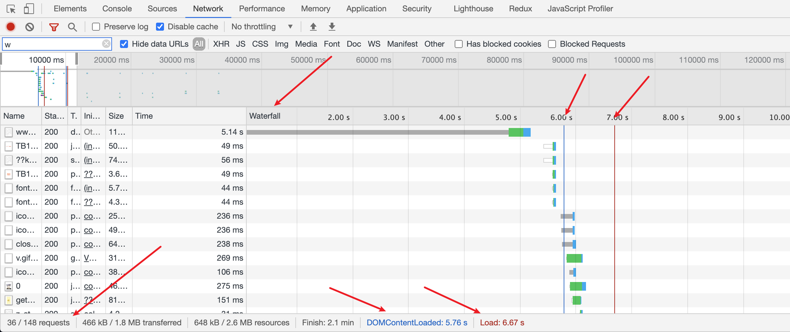
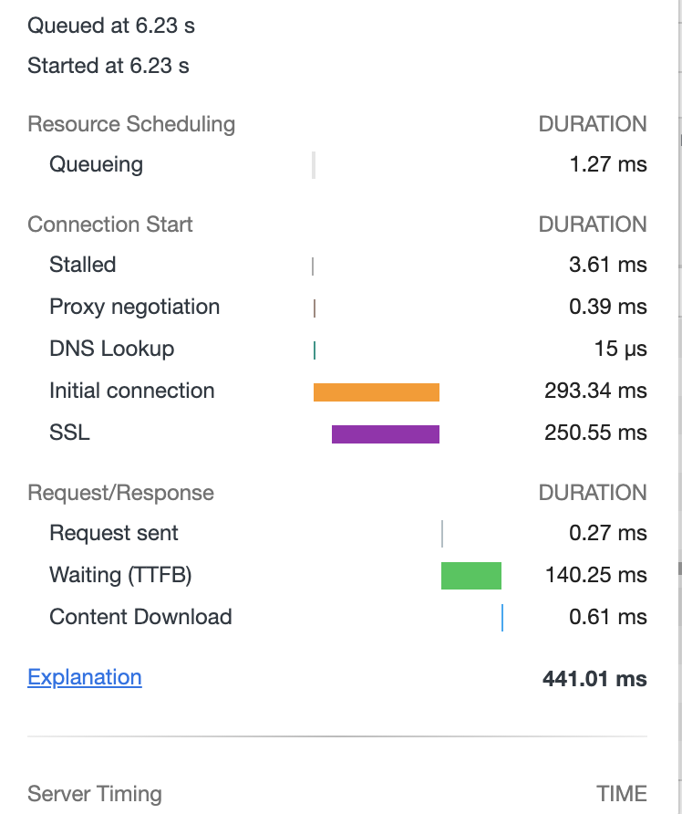

## 前言

最近在面试的过程中，腾讯文档和蚂蚁集团的时候，发现两个公司对于前端性能优化很重视，于是借此机会准备来查缺补漏一下，对前端性能优化有一个完整的知识体系。

性能优化的重要性就不言而言，接下来的一个性能优化系列更多的是从0到1掌握对它的认识。

## 性能优化指标

这里列举了几个因素，可以从以下几个维度来看:

- 响应:用户交互之后快速响应，应该在100ms以内。
- 
  动画：动画或者滚动，应满足1秒钟60帧的速度，即每帧时间不超过16ms，留给帧生成的时间不超过10ms。
- 空闲时间：最大限度的留给主线程时间去处理更多事情，即增加主线程的空闲时间。
- 加载时间：加载时间应在1000ms之内完成。

基于以上的几个点，我们从以下几个点来看⬇️

### 理解加载瀑布图

首先，我们打开开发者工具，找到Network控制面板，找到Waterfall，如下图

- requests: 表示的是首页请求的次数。
- resources: 总资源量。
- DOMContentLoaded: dom加载时间。
- Load:整个资源加载时间。

我们的重点是瀑布图，那么我们如何来解读它呢？

我们从横行来看，每一行代表一个资源，每一个资源都包含不同的色块，那它具体的含义是什么呢？

从这个图上，我们需要介绍几个关键的信息。

> - `Stalled`是浏览器得到要发出这个请求的指令，到请求可以发出的`等待时间`，一般是代理协商、以及等待可复用的TCP连接释放的时间，`不包括`DNS查询、建立TCP连接等时间等
> - `Request sent` 请求第一个字节发出前到最后一个字节发出后的时间，也就是上传时间
> - `Waiting` 请求发出后，到收到响应的第一个字节所花费的时间(Time To First Byte)
> - `Content Download` 收到响应的第一个字节，到接受完最后一个字节的时间，就是下载时间

至于一些其他的信息，比如DNS Lookup表示DNS查询，Intial connection:建立TCP链接的时间。再比如SSL,对于一些域名而言，需要SSL协商。

所以一个资源的请求耗时，可以通过以上的方式来查看。

主要从以下的几个点来总结

- 理解加载瀑布图
- 基于HAR存储与重构性能信息
- 速度指标(Speed Index )
- 重要测量指标

### 重要的测量指标

这里主要介绍的是

- Speed Index 
- TTFB
- 页面加载时间
- 首次渲染

