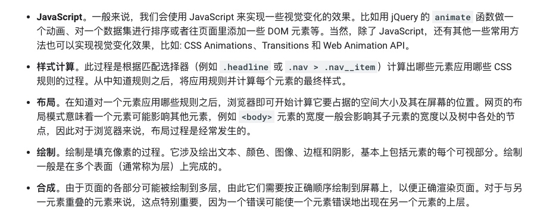
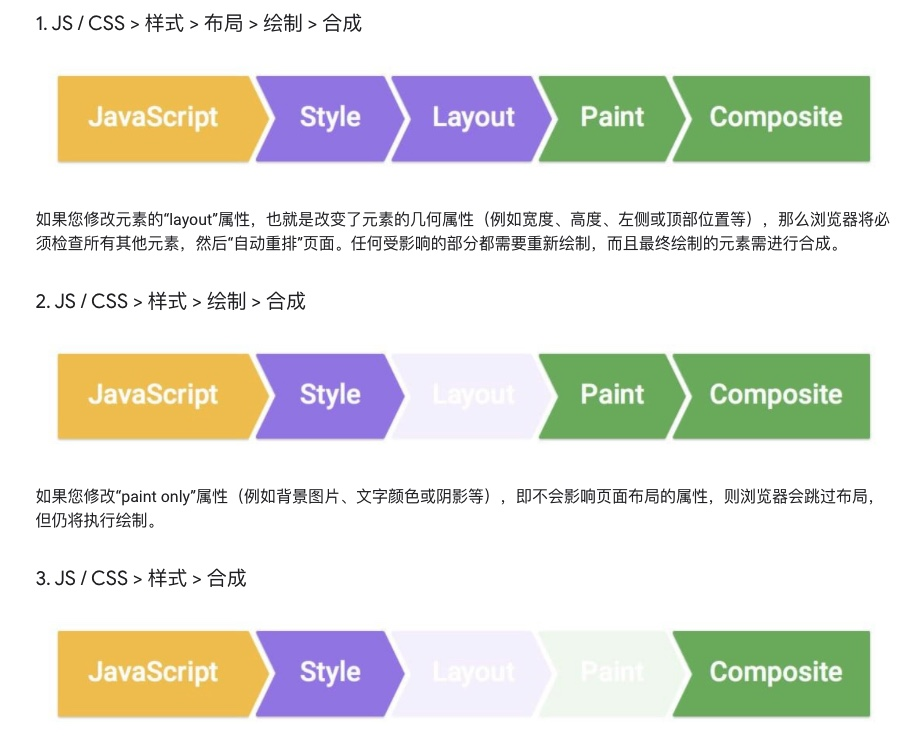
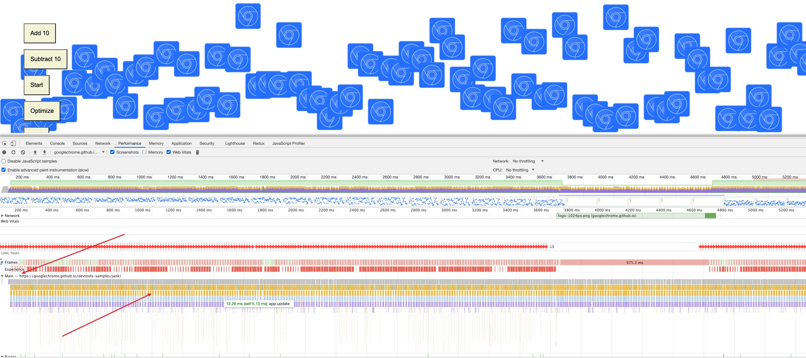
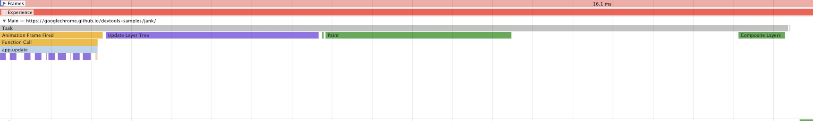
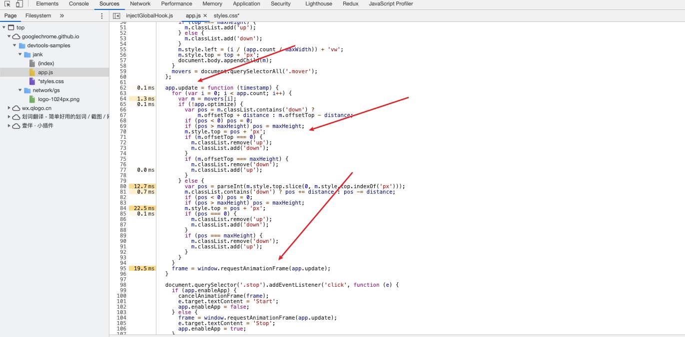
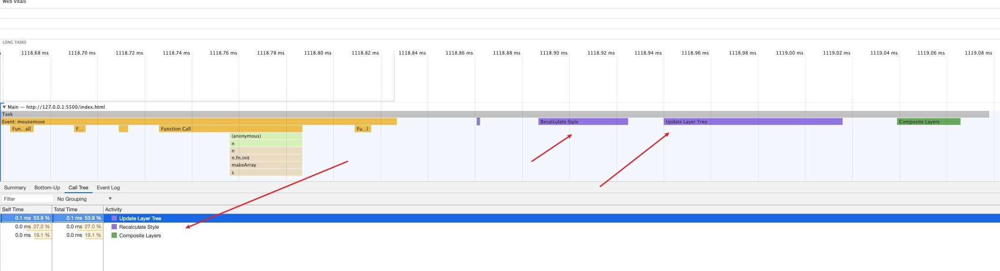
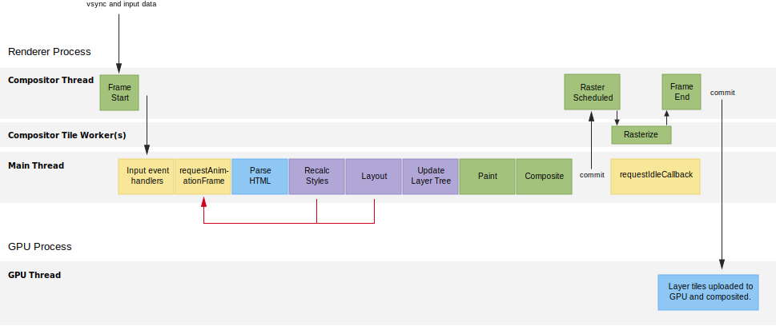
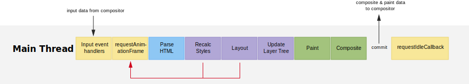

## 前言

本文会介绍浏览器中帧（Frame）的概念，它的流程是怎么样的。

至于写这个文章的出发点在于，我好奇浏览器中像素工作流程是怎么样的，什么时候开始的，最后的结果是什么。

基于这些好奇，查阅了些外文资料，本文提供了些参考，参考链接在文末。

## 缘由

在将帧的概念前，我们得从背景开始看起，也就是渲染页面的这个过程，有哪些关键性的路径呢。

### 五大关键渲染路径

像素输出到页面，肯定经历了很多的过程，那我们作为前端工程师，工作中需要注意的点是哪些呢，这里给出参考:

这五个主要的部分，应该是我们值得去关注的，因为我们拥有最大控制权的部分。至于每一个过程具体是怎么样的呢，不清楚的可以参考下图:

所以在这么一个像素的管道里，每部分都有可能造成卡顿，所以我们需要额外的关注这些，毕竟那一部分不当，都会开了不必要的性能开销。

### 三种输出方式

当时我的疑问是: 难道每一帧都总是会经过管道每个部分的处理嘛，其实不是这样子的，从视觉的角度来说，管道针对指定帧的运行通常有三种方式:

如果我们以第三种方式来更新视图，也就是更改一个既不要布局也不要绘制的属性，则浏览器将跳到只执行合成。

### 跑个demo

为了更加具体的验证上述的过程，可以动手跑一个demo，来验证一下。

> demo地址:https://googlechrome.github.io/devtools-samples/jank/

我们添加多个dom元素进行动画，效果更佳明显，接着我们打开Performance，Record这个过程，我们需要关注的是Main选项卡，也就是主线程，我们在放大里面的Task，就有了下图:

经历的过程，也是很清楚看到，Update Layer Tree -->> Layout -->> Paint -->> Composite Layers。

> 如果你不是很清楚Performance中名称的含义,可以参考下面这篇文章，[点这里](https://mp.weixin.qq.com/s/iodsGPWgYc97yWLb09Xk6A):
>
> https://mp.weixin.qq.com/s/iodsGPWgYc97yWLb09Xk6A

接着，我们按下，Optimize按钮，按照之前的流程走，Record后，发现不对劲，还是这样子步骤，难道是哪里存在问题嘛，好奇的我，打开了Sources面板，然后就发现了:

它的源码优化动画，使用的是rAF,了解过的人一定不会陌生，你可以简单的理解就是:按帧对网页进行重绘。这里就引出了帧的概念，后续会说明。

> rAF的详细介绍，后续会对它进行梳理，可以持续关注。

### 如何避免回流与重绘 

回到前面我们设想的点，我们如何才能保证直接跳到合成过程，避免Layout以及Paint呢，当然有，我们需要对app.js中的uppdate函数进行改造，使用**transform: translateX(0px);**  做动画，做完update函数的处理逻辑后，我们再次Record一下:

从Task子任务中，我们可以发现，**Layout -->> Paint**, 布局和绘制的过程跳过了。这也是为什么我们常说的需要避免回流与重绘。从主线程上来看，能够完全的避免这些过程，避免了很多的运算开销。

这也是为什么经常可以看到这样子的建议:

- 坚持使用 transform 和 opacity 属性更改来实现动画。
- 使用 `will-change` 或 `translateZ` 提升移动的元素。

至于使用will-change和translatez来提升图层，这又是另外知识点了，这里就不张开了。

介绍到这里，我们已经清楚的明白，避免回流和重绘的意义，那么我们提到的**帧**和**rAF** 与 渲染路径有啥关系呢。

## 帧

我做的第一件事情就是google，然后维基百科给出如下定义:

> 在[视频](https://zh.wikipedia.org/wiki/视频)领域，[电影](https://zh.wikipedia.org/wiki/电影)、[电视](https://zh.wikipedia.org/wiki/电视)、[数字视频](https://zh.wikipedia.org/wiki/数字视频)等可视为随时间连续变换的许多张画面，其中**帧**是指每一张画面。

嗯，不是很好理解，知道我找到了这张图，才解答了我的困惑:

这就真的是**一图胜千言**。

这个图，你可以理解成就是像素放到屏幕的完整过程。你肯定对里面的一些关键信息很迷惑，这里作出一些解释。

> 接下来大部分内容都是翻译的，没有更多的总结，感兴趣可以看看原文。

### PROCESSES(进程)

映入眼帘的就是进程:

- **Renderer Process**: 渲染进程。
  - 一个标签的周围容器。
  - 它包含了多个线程，这些线程共同负责让你的页面出现在屏幕上的各个环节。
  - 这些线程是**合成线程**（Compositor）、**图块栅格化线程**（Tile Worker）和主线程。
- **GPU Process**:  GPU进程。
  - 这是服务于所有标签和周围浏览器进程的单一进程。
  - 当帧被提交时，GPU进程将上传任何磁贴和其他数据（如四维顶点和矩阵）到GPU，以便实际将像素推送到屏幕上。
  - GPU进程包含一个单一的线程，称为GPU线程，实际完成工作。

### RENDERER PROCESS THREADS（渲染进程中的线程）

现在我们来看看Renderer Process中的线程。

- **Compositor Thread**(合成线程):
  - 这是第一个被告知vsync事件的线程(这是操作系统告诉浏览器制作新帧的方式)。
  - 它还将接收任何输入事件。
  - 如果可以的话，合成器线程将避免进入主线程，并将尝试将输入（比如说--滚动甩动）转换为屏幕上的运动。它将通过更新图层位置并通过GPU线程直接将帧提交给GPU来实现。
  - 如果因为输入事件处理程序或其他视觉工作而无法做到这一点，那么就需要使用主线程。
- **Main Thread**(**主线程**)：
  - 这是浏览器执行我们都知道和喜欢的任务的地方。JavaScript、样式、布局和绘画。(在未来的[Houdini](https://surma.link/things/houdini-intro/)中，这种情况会有所改变，我们将能够在Compositor线程中运行一些代码。) 
  - 这个线程赢得了 "最有可能导致jank "的奖项，主要是因为这里有很多东西在运行。(jank值得是**页面抖动**)
- **Compositor Tile Worker(s) ** (**合成图块栅格化线程**):
  - 由合成线程派生的一个或多个线程，用于处理栅格化任务。我们稍后再讨论。

在很多方面，你应该把Compositor线程视为 "大老板"。虽然它不运行JavaScript、Layout、Paint或其他任何东西，但它是完全负责启动主线程工作的线程，然后将帧运送到屏幕上。如果它不需要等待输入事件处理程序，它就可以在等待主线程完成工作的同时运送帧。

你也可以想象Service Workers和Web Workers生活在这个过程中，不过我没有把他们包括在内，因为这让事情变得更加复杂。

### THE FLOW OF THINGS(主线程流程)

让我们成主线程开始吧。

让我们一步步走过这个流程，从vsync到像素，并谈谈在事件的 "全胖 "版本中事情是如何进行的。值得记住的是，浏览器不需要执行所有这些步骤，这取决于什么是必要的。例如，如果没有新的HTML要解析，那么解析HTML就不会启动。事实上，很多时候，提高性能的最好方法就是简单地消除部分流程被启动的必要性!

同样值得注意的是，样式和布局下的红色箭头似乎指向了 **requestAnimationFrame**。在你的代码中完全有可能意外地触发这两者。这就是所谓的强制同步布局（或样式，视情况而定），它通常对性能不利。

1. **Frame Start**（**开始新的一帧**）：

   1. 垂直同步信号触发，开始渲染新的一帧图像。

   

2. **Input event handlers** （**输入事件的处理**）。

   1. -输入数据从合成器线程传递给主线程上的任何输入事件处理程序。
   2. 所有的输入事件处理程序（触摸移动、滚动、点击）都应该首先启动，每帧一次，但情况不一定如此。
   3. 调度器会做出最大努力的尝试，其成功率在不同的操作系统中有所不同。在用户交互和事件进入主线程处理之间也有一些延迟。

   

3. **`requestAnimationFrame`**：

   1. 这是对屏幕进行视觉更新的理想位置，因为你有新鲜的输入数据，而且这是你要得到的最接近vsync的地方。
   2. 其他的视觉任务，比如样式计算，都是在这个任务之后进行的，所以它的理想位置是突变元素。
   3. 如果你突变--比如说--100个类，这不会导致100个样式计算；它们将被分批处理，并在后面处理。唯一需要注意的是，你不要查询任何计算过的样式或布局属性（比如el.style.backgroundImage或el.style.offsetWidth）。
   4. 如果你这样做，你会把重新计算的样式、布局或两者都向前带，导致强制的同步布局，或者更糟糕的是，布局打乱。

   

4. **Parse HTML** (**解析 HTML**):

   1. 任何新添加的HTML都会被处理，并创建DOM元素。
   2. 在页面加载过程中或appendChild等操作后，你可能会看到更多的这种情况。

   

5. **Recalc Styles**（**重新计算样式**）:

   1. 样式是为任何新添加或突变的东西计算的，这可能是整个树，也可能是范围，这取决于改变了什么。
   2. 这可能是整个树，也可能是范围缩小，这取决于改变了什么。
   3. 例如，改变主体上的类可能影响深远，但值得注意的是，浏览器已经非常聪明地自动限制了样式计算的范围。

   

6. **Layout**（绘制）: 

   1. 计算每个可见元素的几何信息（每个元素的位置和大小）。它通常对整个文档进行计算，通常使计算成本与DOM大小成正比。

   

7. **Update Layer Tree**（**更新图层树**）:

   1. 创建叠加上下文和深度排序元素的过程。
   2. 

8. **Paint**:

   1. 这是两部分过程中的第一部分：绘制是记录任何新元素或视觉上有变化的元素的绘制调用（在这里填充一个矩形，在那里写文字）。
   2. 第二部分是光栅化（见下文），在这里执行绘图调用，并填充纹理。这一部分是对绘制调用的记录，通常比光栅化快得多，但这两部分通常统称为 "绘画"。

9. **Composite**（**合成**）:

   1. 计算出图层和瓷砖的信息，并传回给合成器线程来处理。
   2. 这将会考虑到，除其他事项外，像will-change，重叠元素，以及任何硬件加速的canvases。

   

10. **Raster Scheduled** （**栅格化规划**）and **Rasterize**（**栅格化**）:

    1. 现在会执行在Paint任务中记录的绘制调用。这是在Compositor Tile Workers中完成的，其数量取决于平台和设备能力。
    2. 例如，在Android上，你通常会发现一个Worker，在桌面上，你有时可以找到四个。栅格化是以图层为单位进行的，每个图层都是由瓷砖组成的。

    

11. **Frame End（帧结束）:**

    1. 当各个图层的磁贴都栅格化后，任何新的磁贴都会和输入数据（可能在事件处理程序中被改变）一起提交给GPU线程。

    

12. **Frame Ships**（**发送帧**）: 

    1. 最后，但绝不是最不重要的，磁贴由GPU线程上传至GPU。GPU使用四边形和矩阵（所有常见的GL好东西）将磁贴绘制到屏幕上。

大致上，整个的过程就是上述。

### **requestIdleCallback**

要说这个的话，我们得拿**requestAnimationFrame**来类比，requestAnimationFrame是在重新渲染屏幕**之前**执行的，上面提到的rAF，当时做的就是优化动画，所以很适合做动画。

requestIdleCallback你通过主线程里面中的Task去查找的话，会发现它是在渲染屏幕**之后**执行，通过查阅文章发现，一般会看浏览器是否空闲。

这里篇幅有限，想要了解这个的话，推荐[一篇文章](https://juejin.cn/post/6844904196345430023):

> https://juejin.cn/post/6844904165462769678

## 总结

最近查阅外文文献，发现要学的东西太多了，如果这篇文章有写的不对，或者翻译不佳的地方，欢迎小伙伴指出。

**我是TianTian，我们下一期见！！！**

## 参考

[1] **w3c-longTasks:** https://github.com/w3c/longtasks

[2] **chrome-fps-meter:** https://developer.chrome.com/docs/devtools/evaluate-performance/reference/#fps-meter

[3] **devtools-samples:** https://googlechrome.github.io/devtools-samples/jank/

[4] **Analyze runtime performance:** https://developer.chrome.com/docs/devtools/evaluate-performance/

[5] **Timeline Event Reference:** https://developer.chrome.com/docs/devtools/evaluate-performance/performance-reference/

[6] **The Anatomy of a Frame:** https://aerotwist.com/blog/the-anatomy-of-a-frame/

[7] **performance-rendering:** https://developers.google.com/web/fundamentals/performance/rendering

[8] **维基百科:** https://zh.wikipedia.org/wiki/

