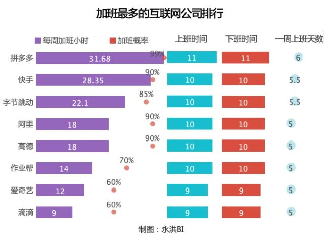

# 「程序人生」在腾讯工作是怎么样的体验

大家好，我是**TianTian**。

最近有读者私信我说，腾讯工作体验如何，有幸是一名腾讯人，借此回答一下。

## 写在前面

我是21届毕业的，4月拿到腾讯offer，提前来实习了。对我之前的经历感兴趣的话，推荐大家阅读这篇文章：

[<阿里腾讯面试梳理&个人成长经历分享>](https://juejin.cn/post/6945625394154307592)

不过也有人问我，**怎么进的腾讯？**

嗯，我只能说**更多是运气，现在的我，肯定进不了腾讯了。**

20年下半年还在**网易实习**，那个时候盯着巨大的压力。你可以想象很多同龄人都斩获满意offer，而我刚刚入门。

在网易的半年，下班会去补知识，周末去公司静下心来做总结，写博客。好在一直危机感蛮强的，特别是在网易这样的大环境中。 我蛮感激那会的自己，因为热爱，努力希望进更好的公司。

努力的意义何在，共勉：

> 拼着一切代价，奔你的前程。

## 从哪里说起

前段时间腾讯上了一波微博热搜，相信大家都看到了：

那我们从加班开始说起吧，正好也是大家关心的点。

从网上流出的加班管理机制表上看，**“双休”确实是双休，但“不加班”却不是通常理解的不加班。只有周三是6点下班，其他工作日则是最晚9点**。

很多人存在质疑，其他部门我不敢保证，但是在我们组，**已经落实了！！！**

每周双休，一日六点。

其实很爽了，很多外人觉得不已为然，那我们来看看其他大厂加班情况。

还是拿数据来说话吧，去年的这统计数据，腾讯连前十都进不去。

> SpringBoot+Prometheus+Grafana实现应用监控和报警

再看看另外的一份互联网大厂的加班排名：

也许有人说，这个事情不值得称赞，他们做了本应该的事情。不可否认从某种意义上来说，确实是这样子。但是在当下的互联网趋势下，其实真的不多，毕竟对比其他大厂后，大家都明白xxxxx

说到这里，提一句，可以来我们组看看机会，投了简历，我会随时跟进**面试反馈**以及后续结果的。

---

## 一天是如何度过的

最近开始养成一个习惯，做好每天规划，类似于：

会按照每日清单，做好时间上的规划，尽可能执行，晚上做好复盘。可能这是提高效率的一种途径吧。

------

### 上午

基本上8点起床，有时候睡个懒觉，出门的时间会在9点左右。

去公司的路上，基本上需要50分钟，一般会**听课**。

一般我会听类似于这样子课程，**理论知识多一些**。要是状态不好的话，会选择听歌，看会儿知乎。

基本上深圳9点以后的一号线，应该人很多的：

偷拍无礼，还望原谅。

可能今天下雨的缘故，人不多。公司早些时候发了邮件，可以居家办公（**挺人性化**），估计大家都在家工作吧。

到公司第一件事情，**干饭**。

腾讯的食堂很不错，好吃又便宜。早餐是免费自助，很多种类什么都有，热干面，虎皮鸡爪，肠粉，等等。

吃完早餐，到工位的话，基本上都10：30。

打开电脑，开始计划今天的任务。

当时没有申请iMac，期待正式入职的**iMac办公**。不过我感觉现在办公设备还不错，要是能再有一个4k显示屏，那体验更加棒。

---

### 中午

上午的任务完成后，接下来就是午饭时间啦～

一般选择在公司食堂吃，偶尔跟同事出去吃顿好的。个人感觉，口味还是挺多的，暂时还没有忌口的，都还吃的习惯，就放张留在相册里面的照片吧：

吃完饭后，偶尔散下步，回到工位基本上12:50，这个时候会**写写文章**，看看公众号文章，准备明天的推文。

不过计划也会变，有时候会跟**同事开黑**，打两把游戏，当午休的一个环节。

打完后，接下来会午休，有行军床，睡起来很爽，比趴着桌子上舒服很多。

一般我们组午休的时间，都会在14:10左右结束。

----

### 下午

主要工作就是跟进技术需求，把今天任务完成。有些时候会被会议突然打断。

下午个人觉得效率是很高的时间段，基本上会充分利用好，尽量不被打扰。

当然啦，与同事讨论问题，是一个互相学习一起进步的过程。

旁边来了位实习生，是个女孩子，挺厉害的。

有时候，会一起讨论下遇到的bug，讨论下一些技术问题，还是挺愉快的，可以互相交流学习下。

----

### 晚上

晚上有夜宵卷，基本上吃饭不花钱或者你也可以拿着夜宵卷去麦当劳。

吃完饭，会出去散步，绕公司走一圈。不同人可能选择是不一样的，有些人会选择去健身。

腾讯还是会提供健身的地方的，滨海大厦就有不错的场所。不过我基本上还没有健身的习惯：

有些人，会选择去打球。比如我们提供对应的**打球场地**。（虽然我还没有去过）

我基本上回工位，继续把今日任务完成。

晚上10点后打滴滴回家公司报销，体验过几次10点回去，基本上整层楼，数得过来为数不多的人，主要我不是卷，我是想在公司搞完任务，回去可以写自己的东西。

不是卷！！！

**深圳的夜晚怎么样？**

有时候，我觉得很璀璨，有时候感觉到一丝丝的绝望。

一切取决于你，是否选择**躺平划水**，还是奋勇前进。

-----

## 感受

平淡的描述我大致一天的做的事情，可能你会觉得真的忙，无聊。

其实我想说，不是这样子的，腾讯的福利也很多，有很多游戏福利，包括XXXXX，很爽。

小组里或者整个团队还会不定时组织团建，而且大多都是工作日去团建哈哈哈。

上次整个大组一起去团建滑雪了。

不仅玩的好，吃得好，住的也是挺不错的。

是啊，我们的生活并不只有**coding**。这么有意思的一个团队，不值得你加入吗！！！

静下心来思考，在腾讯上班，可以用几个点来表达：

**一、太拼命了，自己要多主动。**

这是我的第一印象，大家都很努力。

第一天入职，想着稍微表现下，等大家一起，后来发现有些同事会很晚走。

为了和大家步伐一致，需要自己多主动。

**二、自豪感。**

这点是有切身体会的，跟亲戚朋友说你在腾讯工作，还挺有面的。他们第一反应，可能是“哇，腾讯啊，大公司”。

前女友知道我去腾讯了，后续也找过我好几次。

隔三差五的小福利让你在朋友圈**赚足虚荣心**。

**三、福利待遇好。**

这点对比国内互联网大厂来说，综合性价比来说，还是挺好的。无息贷款90W，各种其他的福利，这里保密了。

如果你部门是很得力的，比如游戏部门。年终奖还真的很可观，10个月以上的还是有的。

再加上可以搞点期权的话，挺有有盼头的，毕竟这些年腾讯股票已经涨了若干若干倍了。

**四、身边人越来越优秀。**

竞争还是蛮激烈的，不管是校招生，还是社招，进来的牛人大把，都是高智商，竞争和比拼的压力还是蛮大的。

同事们的做事能力，抗压能力，管理能力以及与人沟通能力，都是让我挺欣赏的。

学习氛围好，组内技术沉淀氛围好。

**让我深刻体会到了，越是优秀的人，越努力**。

**五、环境越来越好。**

办公环境越来越好，听说每年会有各种**兴趣协会**、**运动培训班**、**嘉年华活动**，走到哪里都有的班车，各种便利的OA等等。

腾讯的HR、行政一直以“**用户体验**”作为目标提升工作。

腾讯的食堂很不错，好吃又便宜。这些都让我觉得，外界条件在往越来越好的地方发展。

**六、上下级，同事之间都很平等。**

这里没有很强烈的上下级概念，都是喊昵称或者xxx哥。

交流问题的话，给我感觉，大家都是平等的，一视同仁。

对于我这个新人来说，初期让我负责一个项目，大家会相信我，放心让我去做。

这点我觉得挺舒服的！！！

-----

如果你是应届生，**腾讯是值得来的**。优秀的同事以及完善的新人培养机制会在职业生涯的初期让你**更快成长**。

> 写这个回答，不去诋毁腾讯，也不是希望你盲目乐观的看待腾讯的工作，里面有快乐也有不快乐，**兼听则明**。

**如果喜欢，双击屏幕~~**

