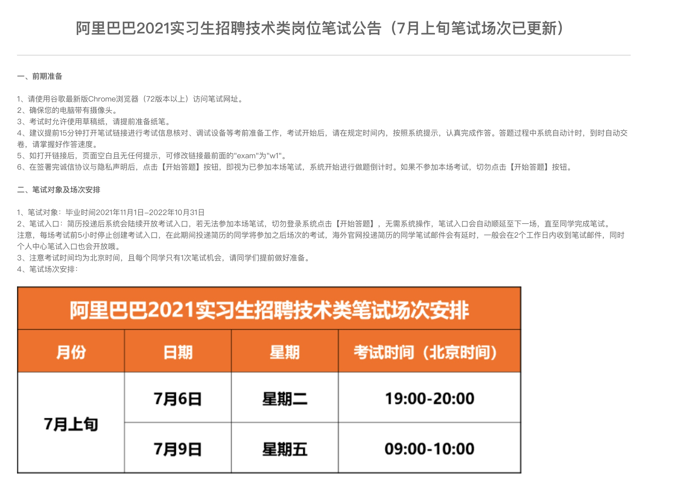
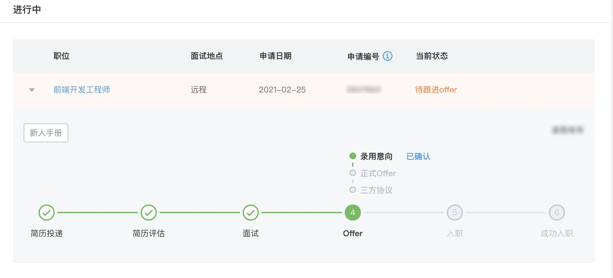
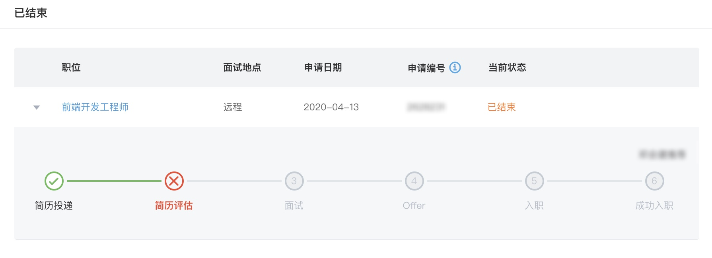

大家好，我是**TianTian**。

如题，如何**卷进阿里**，结合自身的**经历**以及一些思考，有了此文。

主要内容讲述自己面阿里的经历，以及**面试的技巧**。

> 周末写的文章，拖了好久， 觉得写的不错，就点个赞吧！！！

## 写在前面

最近有个读者跑来问我，阿里笔试环节开启了，应该如何准备，才能通过。

我打开阿里招聘的官网，**真卷呐**，果然现在7月初就开启笔试了。

想了好久，如何鼓励读者敢于去尝试呢，我觉得最好的方式是结合**自身经历**来谈。

我打开了自己的招聘记录，当时拿下了**意向书**，投的部门是蚂蚁体验技术部。

当然了，有人会问难道面阿里就很容易，很轻松吗？

其实**不是的**，来看看大三那会我投的记录：

**简历评估都没有过！！！**

所以你应该不用担心，要勇于尝试。

我**这么差的面评**，都敢于**再次尝试**，你还在犹豫啥。

当你敢于迈出这一步的时候，对于面试环节，需要准备啥呢？

## 面试的那些事

知己知彼、百战不殆，面试也是如此。回想我面试这么久以来，会在面试10分钟前很紧张，想必大家也会多多少少这样子。我觉得一部分来自于不自信，对接下来的面试没有把握，导致精神上的过度紧张。

如何做好充分准备，在面试中展现自己，都是为了面试的结果做好了铺垫。

### 招聘目的

团队需要招聘人才，肯定需要优秀的人，至于优秀如何去衡量界定，没有统一的标准。

只有优秀的血液加入团队，才会让团队更加壮大，实现商业目标会更快，完成老板眼中更多的“蓝图”。

### 招什么样的人

既然是招聘优秀的人，那么如何衡量“优秀”二字，可以参考三个方面：

- 技能
- 潜力
- 软实力

#### **技能**

你对专业技能的把握，

#### 潜力

这个概念看起来比较模糊，其实还是比较容易评价的，对计算机相关的专业的知识体系是不是完整，基础是不是扎实，平常是不是喜欢钻研，对这个世界充满好奇心， 这几年走下来，沉淀的速度如何，都是判断一个人的潜力的方式，注意我们看潜力主要是基于候选人的之前的成长经历实事求是来看，**过去的优秀经历才能给未来背书**。潜力和技能的重要性一样重要，我们不能只看眼前，团队是需要不断发展和前进的，所以我们招人应该面向未来。

#### 软实力

软实力这里其实包含了性格，执行力，领导力等方方面面，它代表了候选人是否能快速融入团队，拿到结果，带领团队攻城拔寨，激励和影响身边的人变得更加优秀等等，软实力一般 HR 肯定会考察，虽然技术面不会特别去关注，但是从面试的过程中可以看出候选人的沟通能力，以及性格相关的特点，也值得我们注意。

### 面试的方法

知道了应该怎么做，那具体的提问方法有没有什么技巧呢？在招聘中有一个重要的 STAR 原则，可以跟大家分享。

### STAR 原则

## 其他 Tips