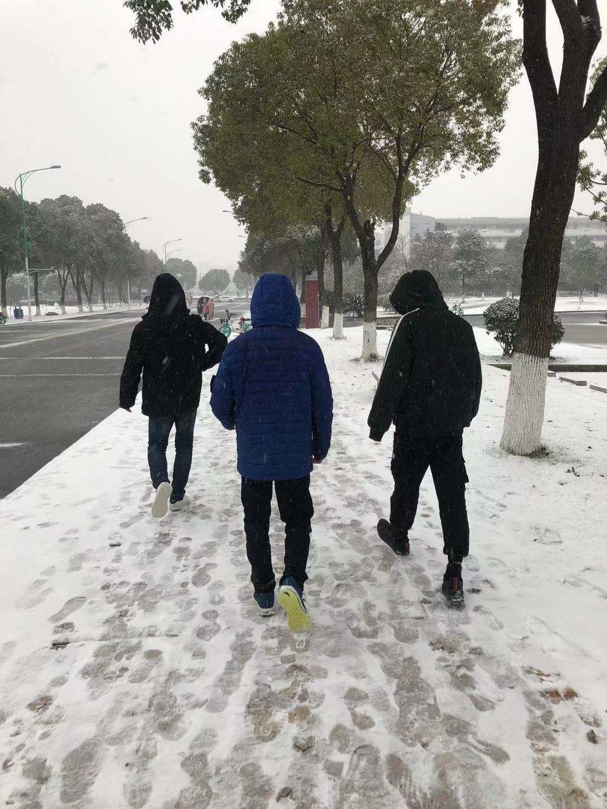

我毕业了

## 前言

是的，我毕业了。

想象了无数次毕业的样子，没有想到最终会是这么草草离场。

写博客也正好快一年了，在这里感谢大家对我的支持，对我之前经历感兴趣的话，可以参考这篇文章：

接下来，记录一些毕业季的琐事。

-----

## 返校

回校那几天，忙完了论文答辩。

和最好的朋友们吃了顿饭，他们对我的第一反应是我变忧郁了，可能是因为工作带给我的压力吧，让我显得没有之前那么阳光了。那天点吃的特别多，我还记得我们吃完饭后，走路都显得十分费劲。

后来跟室友一起计划着出去吃一顿。我还记得那天下着雨，我们打着车，选了一个离我们学校不远的店。我们主食是羊排，点了酒，点了小龙虾，那晚我们吃得都很”开心“。

我们聊得很多，说了下近况，因为大家出去实习的缘故，好久没聚一起了。

那晚，我们都没有喝醉，似乎我们都想开开心心的记下我们这顿散伙饭。躺在寝室的那晚，我还是挺感慨的，如果再有这么好的时光，该多么美好。

在18岁时遇见你们，22岁左右我们分离。人生最美好的光影，我们一 起度过，没有负担没有烦恼，我们把青春互相馈赠。

想起大二的时候，我们在宿舍讨论着上课看到的漂亮妹子，哪个妹子好看，讨论着XXX什么时候脱单，还等着吃脱单饭，到现在，还没有吃到，下次不知道是什么时候了。

我翻开了相册，找了好久，都没有一张是我们四人**完整的合照**，可能我们男孩子就是这样子吧。

找了张下雪时拍的照片，那个时候学校正好下了雪：

我想多年后，看到这个图时，都不会忘记这三个憨憨吧。

不舍的是这段难忘的四年生活，四个小伙伴在**S566宿舍**发生的故事，也许只有在校园里，我们才可以做一个无忧无虑的少年，鲜衣怒马,一日看尽长安花。

**书上说：天下没有不散的宴席。但不要怕，书上还说：人生何处不相逢？**

 愿有前程可奔赴，亦有青春可回首。

-----

## 就业分享

这应该算是给学弟学妹准备的一点点惊喜吧，分享这一年来的成长经历。

分享会的初衷，可能就是希望能在最后离校的时候，给学校留下点什么。

拿下了几家大厂offer后，这一年来的成长，我是很清楚从0到1度过的，自学前端并不是一件容易的事情。我们需要不断的去探索和参试。通过code环节，加强我们的编码能力，选择一个好的学习途径，闲的十分重要。

所以我也想借此机会向学弟学妹分享我的一点经验，希望帮助他们早日找到对的方向。

那场宣传会，坐满了学弟学妹：

整体效果，还是还是不错的，很多学弟学妹后续都找到我，问了些他们比较关心，疑惑的话题。

-----

列举了些大家关心的问题：

问： **学长，有点想了解一下你在腾讯工作的感受**

答：对于我这个新人来说，从整体氛围来说，挺友好的。工作是弹性的，周三下班时间是6点，其他的时间可能是8点也有可能是9点。这个主要看人，工作效率高的，走得早。来腾讯两个月，聚餐次数很多，然后定期组内有技术分享会，学到不少东西。一视同仁，会给你展示自己的机会，让你站在舞台的中央，还是很推荐大家来**腾讯文档**。欢迎活水，欢迎推荐。

------

问：**学长，想知道进大厂的英语水平要到什么程度**

答： 当然水平越高越好，只能说英语四级的水平有的话，应该可能不成问题。加上一些翻译软件，对于日常的开发，应该问题不大。至于面试环节，我觉得这个英语占整个面试的比重不是很大。

------

问： **我想请教一下天天学长是怎么学习前端的**

答：我一直觉得当你不知道学什么的时候，尤其是方向还不明确的时候，可以看看同龄人中优秀的小伙伴是如何学的。可以先把前端的大致方向规划出来，比如一张脑图：

我还是挺推荐大家多去社区看看，比如**掘金**。里面很多文章，我觉得对我来说，真的是帮助巨大的。

大三的暑假，也就是去年的这个时候，才开始系统的学习。学习的方法：书籍+文章+写笔记。

我当时看到同龄的大佬，**三元同学**，看过一些文章后，才知道如何入门前端，应该怎么走。也在那个时候感慨，原来三元同学这么强，可以写小册子，坐拥万粉。

知道**信息差**后，你可以跟着他的学习路线走，什么时候该学什么，怎么学。如何快速掌握，都可以从他们身上学到不少的东西。

我推荐的方式：**书籍 + 文章 + 笔记（输出）**。至于一些辅导性的视频，还是推荐看的，比如之前推荐的这个课

我觉得是我最想推荐的课程。当时学完后，才对前端有了系统认识。（**真的不是广告**）

讲得好课程很多，前期入门，弥补一些知识盲区，我觉得看视频还是很有必要的。（毕竟有些东西，看文章是学不来的）

这里我不推荐**培训机构**，有能力的话，还是希望可以自我规划好学习计划，落实下来即可。

------

问：**学长，学校对你的求职过程中有很大影响吗**

答： 当然有的，作为一个二本专业的同学，深知学校带来的影响，这是一定存在的。至于你说，一定没有面试机会吗，我觉得不一定，大厂还是会给你展示自我的机会。核心部门的话，可能要求会高一些，比如四轮技术面试，要求两轮A+以上，才可能最后会特批。总结的话，我觉得作为一个技术人，掌握好核心技术，把技能运用好，说不定幸运女神真的会**眷顾努力的人**。

-----

问： **学长，有什么好的学习建议吗，比如一些入门经验，比较好的学习书籍**

答： 推荐的书籍，还是推荐**红宝石**吧，这也是我之前学长告诉我的，学习建议的话，扎实基础，有时间可以尝试做总结（写笔记），多写，多想。入门经验的话，可以参考学长的成长路线，比如**三元同学**的博客，当然了，你也可以参考我的博客。掘金寻找：**TianTianUp**

头像是这个**帅气男孩**，里面有算法入门的指引，有一些前端知识的汇总，还有面试的经验分享。

> 有些进入大厂的小伙伴，私信我说，看过我的一些文章，最后顺利进入大厂，还是推荐偶尔翻一翻。

想说的话很多，挤出一点时间来写点东西，现在都很难，下次有时间好好分享一下吧。

-----

## 未来规划

这是之前做的规划，似乎现在进入这个团队后，需要做些改变了。

一年的时间，其实过得很快，去年的这个时候，从入门前端，到现在进入腾讯，走得很艰辛。

似乎要对现在定制合理的计划，结合最近接触的业务，可能未来的规划有几个点：

- 写一本掘金小册子（已经有小方向了）
- 融入团队，争取转正晋升（还是要憧憬一下）
- 坚持每月做总结，写一篇总结（得坚持下来）

希望可以养成一个习惯，想把工作中的思考和沉淀都记录下来吧。

------

其实很多东西想写，也只能这么一笔带过。

所以**词穷致谢**，因为来日方长。

> 在即将跨入社会大门前，我祝愿你们前程似锦，勿忘初心。

