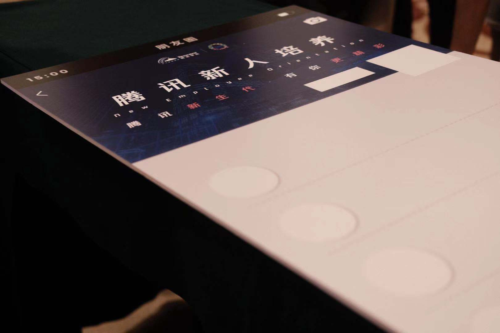
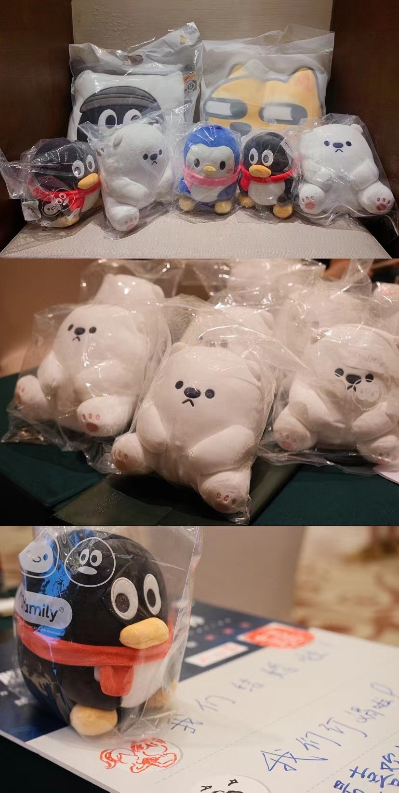

你好，我是**TianTian**。

**新鹅封培结束了，革命友谊开始了。**

现在回忆起来，快乐的时光总是**白驹过隙**。抓住记忆的尾巴，把这份宝贵的记忆写下来。

> 当然了，看完后，你觉得不错的话，欢迎投简历来鹅厂一起共事。

### 第一份大礼

腾讯给我的第一份大礼，应该是毕业入职时**短暂**的七天封培。

同一期的封培会将毕业生分成好几个班，每个班大概五十人左右。接下来的七天培训中，整个班级是一个集体，我们会团结一致，互相学习，围绕我们的课程，主要包括企业文化、基础工作素质培养、办公软件技能、产品方法论等等。

而我有幸，认识到组里面的8位小伙伴。组里有来自不同部门的，比如**微信支付**，**腾讯云**，**光子工作室**，**云架构XXX**，**XXX架构组**。

每个小伙伴都有着不同的职能，负责各种领域的工作，还有专门搞算法的大佬。

我们组每位都**特别厉害**，卖个关子，后面会聊到。

给我感受最大的是，大家很优秀，有来自各种985高校的，也有斯坦福等国外名校。

当然让我印象深刻的，还是一个女孩子，她在做自我介绍的时候，告诉大家毕业于**清华大学**，我还是对她挺钦佩的。毕竟这是我从小就想上的学校啊！

从她的个人谈吐，做事风格，对一些事情的看法分析，一定是以为非常优秀的同事吧。

不过还好，算是不遗憾了，虽然考不上清华大学，但是还能有幸成为同事。

我们组吃饭的时候，也会开玩笑，你挺牛逼的，最后还不是和清华高材生一起做同事嘛！

不过，不知道你有没有听过这么一句话：

> **虽然我们现在是同一个起点，但是我们终点不同。**

你品，你细品。

这应该是一份特别的礼物，让我在七天里跟优秀的同龄人朝夕相处。收获的可能不仅仅是公司的文化吧，还有一份**革命的友谊**。

### 心态转变

其实一开始我对公司这次举行的培训是抱着度假的态度，**带薪休假**。

公司提供的酒店环境挺不错的，同时提供**浴缸**。这应该是我每天最喜欢干的一件事情，呆在浴缸里面。

我应该是一个害怕社交的男孩子，别看我平时**群里话多**，现实中挺不爱发表自己想法的。

现在微信里面有2500个好友，我平时都很少主动联系，一是工作了很少会经常打开手机看消息，二是我嘴笨，基本上聊不来，不知道该说啥。

所以有时候，我可能**很晚**回你的问题，**或者是不回**。后者发生的情况，基本上是我读过你的消息了，但是突然被其他事情打算了，后面就被其他消息给打断了，所以你隔一段时间**抖我几次**，我还是很愿意帮助人的。

> 多提醒我，或者晚上10点联系也可以滴。

回到心态问题，发生转变点是一次团队的游戏，让我们队开始活跃起来，打开话题，我想可能大家都有些**社交排斥症**。

这个游戏叫沙盘？我记性不太好，确实忘记官方的名称了，有小伙伴记得的话，可能评论区cue一下。

可以理解成是一个棋盘游戏，不过每队成员都需要担任不同的身份，有队长，情报员，交易员，气象员，智慧官等。

不同的人担任不同的指责，我们各自发挥的作用是不相同的，在这个过程中，我看到了小伙伴的踊跃参加，每个人都乐在其中，我们会倾诉自己的想法，把各自的责任做好，尽全力的参加它，投入它。

我还清楚的记得当时我们比赛的情况，我们因为走了**王陵**这个场景，装备减半，一度觉得我们不能领的游戏的胜利，好在我们出谋划策，加上赌的运气成分，最后我们顺利到达终点，也就是我们的大本营这个虚拟的场景。

游戏的输赢不需要，重要的是过程，那顺利的队伍能获得到什么奖励呢？

### 小礼物

我们的礼物也是定制款，非常nice，非常可爱，鹅厂的企鹅公仔。

这是其中一个款式，我有幸，跟着团队混了一次，获得一个大公仔：

当然了，有时候我们的小礼物不止是公仔的，比如有些小伙伴获得是：

很可爱吧，这些都是游戏顺利或者ppt展示，或者视频拍摄优胜队伍的奖品，作为激励。有些人就十分的腻害，为什么这么说呢，我看朋友圈就有人发他们收集的奖品，是满满的一堆：

大家都十分的激励，来参加每天的活动，我想大家的收获都很多。

### 有趣 & 认真

认识他们才发现，他们既有趣同时对生活赋予认真的态度。

有趣的是，组里面有位马总，总会抓拍我们的一些图，然后再拿来做表情包，比如我记得我们当时上了一门急救的课程，教会我们如何处理一些突发的情况：

除了理论知识外，还有实践课程，我记得我当时就很尴尬，因为一些原因，没有来得及签到。所以我被单独的在全班表演，也是这个时候，被马总给拍下来了，成为了表情包：

我既是高兴又是难过，不过现在看来，当时有点囧。

小伙伴们也是**十分认真**的。

我还记得我们当时需要完成一个视频的拍摄，我们的**陆导**是这次的主要负责人，从场景的设定，到台词的编写，以及整个视频的拍摄剪辑，他都十分的认真，甚至有时候**精益求精**。

晚上11点，我们还在对剧情，彩排。我们拼尽全力，希望我们能做得更好。

白天我们赶ppt，大家都在查资料，中午大家会减少午休时间，我们组长Jack也挺不住，趴在桌子上休息会。

大家都很**认真对待**，可能我们都在相互影响，一起朝着一个目标，一起前进。

当然了，这里面认识了打算法的大佬，终于遇到了**知音**。没有想到，我们去年就在**icpc南昌站**就打过同一场比赛，不过那时候我们还不认识，没有想到，今天会以这样子一种形式认识。

这就是大佬的记录，打了四场比赛，这可能就是银牌大佬的实力吧。

回顾下自己的大学生活，把时间花在算法上了，后续有时间的话，可以回顾下自己**辛酸的算法路**。

### 收获

认识一群有趣的人，**革命友谊**才刚刚开始。

公司的瑞雪文化，科技向善，这些氛围都不错。

短暂的封培，发生的事情太多了。

**二十鹅立，盛夏缘起。**

